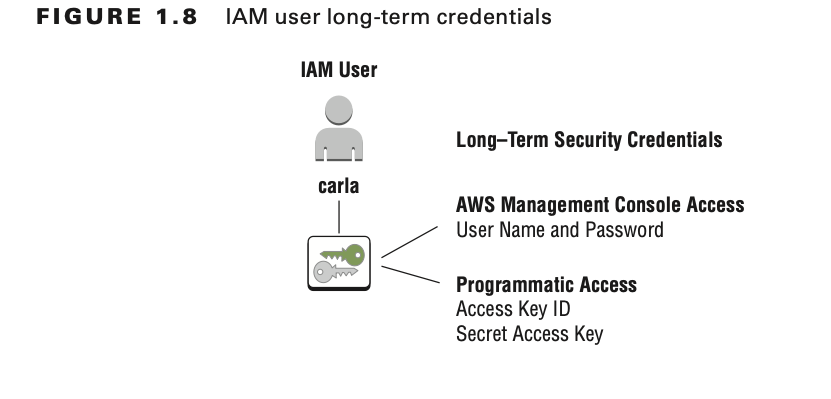
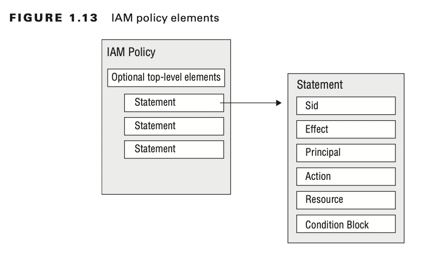

# Introduction to AWS Cloud API

The AWS Cloud provides infrastructure services, such as compute, storage, networking and databases, and a broad set of
platform capabilities such as mobile services, analytics , and machine learning (ML). These services are available on
demand, through the internet, and with pay-as-you-go pricing.

## Getting Started with an AWS Account

To create an account, sign up at https://aws.amazon.com/free

## AWS Management Console

The console is a web interface where you can create, configure, and monitor AWS resources in your account.

https://signin.aws.amazon.com/console

## AWS Software Development Kits

AWS SDKs are available in many popular programming languages such as Java, .NET, JavaScript, PHP, Python, Ruby, Go, and
C++. AWS also provides specialty SDKs such as the AWS Mobile SDK and AWS Internet of Things (IoT) Device SDK.

## AWS CLI Tools

In addition to the AWS Management Console and SDKs, AWS provides tools to manage AWS resources from the command line.
One such tool is the AWS CLI, which is available on Windows, Linux/Unix, and macOS.

https://aws.amazon.com/tools/#cli

# Working with Regions

AWS operates facilities in multiple regions across the world. EachAWS Region is located in a separate geographic area
and maintains its own, isolated copies of AWS services

## Regions Are Highly Available

Each AWS Region contains multiple data centers, grouped together to form Availability Zones.
Regions are composed of multiple Availability Zones, which allows AWS to provide highly available services in a way that
differentiates them from traditional architectures with single or multiple data centers.

Availability Zones are physically separated from each other and are designed to operate independently from each other in
the case of a fault or natural disaster.

Even though they are physically separated, Availability Zones are connected via low-latency, high-throughput redundant
networking.

AWS customers can improve the resilience of their applications by deploying a copy of each application to a second
Availability Zone within the same region. This allows the application to remain available to customers even in the face
of events that could disrupt an entire data center. Similarly, many of the AWS services automatically replicate data
across multiple Availability Zones within an AWS Region to provide high availability and durability of the data.

## Identifying AWS Regions

When working with AWS services, the AWS Management Console refers to regions differently from the parameters used in
the AWS CLI and SDK.

When you interact with these services in the console, the region selector in the upper-right corner of the console
displays "Global."

IAM provides a way to create API credentials, and this means you can use the same set of API credentials to access
resources in different AWS Regions.

## Choosing a Region

One factor for choosing an AWS Region is the availability of the services required by your application. Other aspects to
consider when choosing a region include latency, price, and data residency.

### Selecting an AWS Region

**Service availability**

Choose a region that has all or most of the services you intend to use. Each region exposes its own AWS Cloud service
endpoints, and not all AWS services are available in all regions.

**Proximity and latency**

Choose a region closer to application users, on-premises servers, or your other workloads. This allows you to decrease
the latency of API calls.

**Data residency**

Choose a region that allows you to stay compliant with regulatory or contractual requirements to store data within a
specific geo-graphic region.

**Business continuity**

Choose a pair of regions based on any specific requirements regarding data replication for disaster recovery. For
example, you may select a second AWS Region as a target for replicating data based on its distance from the primary AWS
Region.

**Price**

AWS service prices are set per region. Consider cost when service availability and latency are similar between candidate
regions.

# API Credentials and AWS Identity and Access Management

In AWS, an **access key** is a type of security credential that is associated with an identity. So, to make API calls,
first you will create an identity in AWS Identity and Access Management (IAM).

To manage authentication and authorization for people or applications, IAM provides users, groups, and roles as
identities that you can manage.

To protect your account, do not generate an access key based on the root user. Instead, create an IAM user and generate
an access key for that user.

## Users

IAM users can be assigned long-term security credentials. You might create an IAM user when you have a new team member
or application that needs to make AWS API calls.

After you create an IAM user, you can assign credentials to allow AWS Management Console access, programmatic access, or
both.

## AWS Management Console Access

To sign in to the console, IAM users authenticate with an IAM username and password.
IAM users are prompted to provide either the account ID or alias so that IAM user names only need to be unique within
your account.

## AWS IAM User API Access Keys

For programmatic access to AWS, create an access key for the IAM user. An AWS access key is composed of the following
two distinct parts :

- Access key ID
- Secret access key

Given the importance of the secret access key, you can view or download it only once. If you forget the secret access
key, create a new access key and then revoke the earlier key.

## Other Credentials for IAM Users

In addition to passwords, multifactor devices, and access keys, IAM users can have other types of security credentials.
You can have X.509 certificates, which are used with SOAP APIs, or you can have GIT credentials as either Secure Shell (
SSH) keys or passwords to interact with the AWS CodeCommit service.

## Groups

To help you manage the permissions of collections of IAM users, IAM provides IAM groups.
IAM groups do not have their own credentials, but when an IAM user makes an API call with their access key, AWS looks up
that user's group memberships and finds the relevant permissions policies.

The relationships between IAM users and IAM groups is many-to-many. An individual IAM user can be a member of many IAM
groups, and each IAM group can have many IAM users associated with the group.
IAM users within an IAM group inherit permissions from the policies attached to their group, plus any permissions from
policies that are associated directly with that IAM user.

## Roles

There are situations in which you might not want to create and manage new sets of long-term credentials for team members
or applications.

You may delegate permissions to an AWS service to perform actions on your behalf. One common example of this is when
application code running on an AWS compute service, such as Amazon EC2, needs permissions to make AWS API calls. In this
case, AWS recommends allowing Amazon EC2 to manage the credentials for each instance.

## Choosing IAM Identities

**Scenario: During Development**

IAM users can be a convenient way to share access to an account with your team members or for application code that is
running locally.

**Scenario: When Deploying Code to AWS**

Use IAM roles. AWS compute services can be configured to distribute and rotate the role credentials automatically on
your behalf, making it easier for you to manage credentials securely.

**Scenario: When You Have an Existing External Identity Provider**

When you have an external identity provider, such Active Directory, use IAM roles.

Use roles in cases in which you need to make AWS API calls from untrusted machines because role credentials
automatically expire.

For Code Running on...

- A local development laptop or on-premises server ; IAM user
- An AWS compute environment such as Amazon EC2 ;IAM role
- An IAM user mobile device ; IAM role
- Enterprise environments with an external identity provider; IAM role

## Managing Authorization with Policies

Manage the permissions for each user, group, or role by assigning IAM policies that either allow or deny permissions to
specific API actions.

Any API action is implicitly denied unless there is a policy that explicitly allows it.
If there is a policy that explicitly denies an action, that policy always takes precedence.

When choosing permission policies, AWS recommends that you adopt the principle of least privilege and grant someone the
minimum permissions they need to complete a task.

## Custom Policies

AWS recommends that you use the AWS managed policies whenever possible. However, when you need more control, you can
define custom policies.

IAM policy is a JSON-style document composed of one or more statements. Each statement has an effect that will either
allow or deny access to specific API actions on AWS resources.
A deny statement takes precedence over any allow statements. Use an Amazon Resource Name (ARN) to specify precisely the
resource or resources to which a custom policy applies.

    {
      "Version": "2012-10-17", "Statement": [{
      "Sid": "AllowDeleteForSpecifiedLexicon", "Effect": "Allow",
      "Action": ["polly:DeleteLexicon"],
      "Resource": "arn:aws:polly:us-west-2:123456789012:lexicon/awsLexicon" }
      ] 
    }

An ARN always starts with arn: and can include the following components to identify a particular AWS resource uniquely:

- **Partition :** Usually aws. For some regions, such as in China, this can have a different value.
- **Service :** Namespace of the AWS service.
- **Region :**  The region in which the resource is located. Some resources do not require a region to be specified.
- **Account ID :** The account in which the resource resides. Some resources do not require an account ID to be
  specified.
- **Resource :**  The specific resource within the namespace of the AWS service. For services that have multiple types
  of resources, there may also be a resource type.

These are example formats for an ARN:

- arn:partition:service:region:account-id:resource
- arn:partition:service:region:account-id:resourcetype/resource
- arn:partition:service:region:account-id:resourcetype:resource
- arn:aws:polly:us-west-2:123456789012:lexicon/awsLexicon
- arn:aws:iam::123456789012:user/carla
- arn:aws:s3:::bucket-name/exampleobject.png

Write custom policies manually or use tools like the Visual Policy Editor in the AWS Management Console to generate
policies more easily. To help you test the effects of poli- cies, you can also use the IAM policy simulator
at https://policysim.aws.amazon.com.

# Summary

In this chapter, you learned about the AWS Management Console, the AWS CLI, and the AWS SDKs that AWS uses to configure
and manage your resources. You learned how to make API request calls to the AWS Cloud, use configuration files, select
an AWS Region, manage AWS API credentials, and identify regional API endpoints. The chapter also dis- cussed AWS account
root users, IAM, IAM policies, IAM groups, IAM roles, long-term and short-term credentials, the access key ID, and the
secret access key.

# Exam Essentials

**Know the ways to manage AWS resources.**

Recall that the AWS SDK, AWS CLI, and the AWS Management Console are options for managing the AWS resources within your
account.

**Know the importance of AWS Regions.**

Be able to identify the impact of AWS Region selection on your application code, such as the relationship between region
selection and user latency. Also recognize how region selection impacts API calls and API endpoints.

**Know about IAM users and IAM roles.**

Know when it is appropriate to use IAM users or IAM roles for a given application that needs to make AWS API calls.

**Know how to recognize valid IAM policies.**

Identify valid IAM policies and predict the effects of policy statements.
