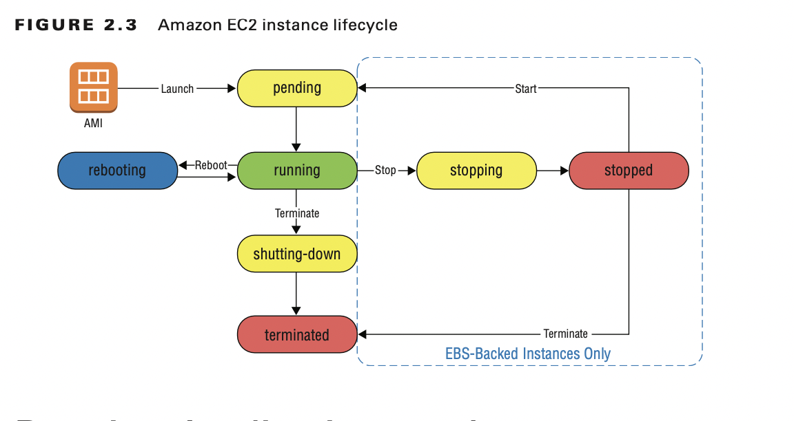
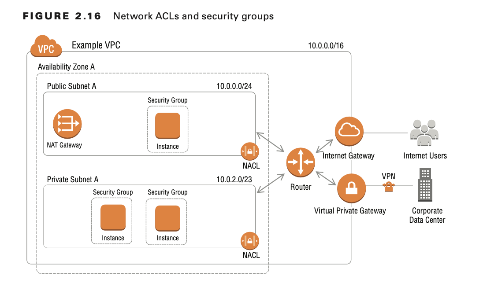

# Introduction to Compute and Networking

AWS provides a broad set of compute options through the following services:

- Amazon Elastic Compute Cloud (Amazon EC2)
- Amazon Lightsail
- AWS Elastic Beanstalk
- Amazon Elastic Container Service (Amazon ECS)
- Amazon Elastic Container Service for Kubernetes (Amazon EKS)
- AWS Lambda

# Amazon Elastic Compute Cloud

Amazon Elastic Compute Cloud (Amazon EC2) enables you to provision computing environments called instances.

An Amazon EC2 instance runs on a host machine within a specific AWS Availability Zone.

## Instance Types

With Amazon EC2, you choose your hardware resources from a broad set of preconfigured options by selecting a specific
instance type and instance size.

Instance types are also grouped into instance families to help you choose the appropriate instance for your application.
Instances within a given family share similar characteristics, such as the ratio of vCPU to RAM or access to different
types of storage options.

## Storage

You can create persistent storage volumes with the Amazon Elastic Block Store (Amazon EBS) service to provide block
storage devices for Amazon EC2 instances.

## Persistent Storage

For Amazon EC2 instances, Amazon EBS provides persistent block storage. Similar to a hard drive, block storage volumes
provide read/write access at a block level and can be formatted with a file system.

While an EBS volume is attached to a particular instance, only that instance can access the data on that volume.
However, you can detach an EBS volume from one instance and then attach that volume to another instance in teh same
Availability Zone.

Although the EC2 instance treats the EBS volume as a local disk, the underlying host machine reads and writes to the EBS
volume over the network.

EBS volumes automatically replicate the data for a particular volume within the same Availability Zone as your Amazon
EC2 instance. To increase durability of your data, you can use Amazon EBS t make point-in-time snapshots of EBS volume.
Data for Amazon EBS snapshots is automatically replicated across multiple Availability Zones within a region, and these
snapshots can be used to create new volumes.

## Temporary Storage

Amazon EC2 instance types also allow you to mount instance store volumes— storage local to the physical host that runs
your Amazon EC2 instance. An instance store volume is a good fit for high-performance storage of caches or temporary
files and for use cases in which your application is already replicating the data to other locations.

This storage can have a high read/write performance because it is physically attached to the host machine that runs the
instance.

## Software Images

An Amazon Machine Image (AMI) provides the template for the OS and applications on the root volume of your instance.
AMIs also provide a block device mapping that can specify additional volumes to mount when an instance launches.

Each AWS Region maintains its own listing of AMIs. Any AMIs that you create are available only within a specific region
unless you copy them to other regions.

## Network Interfaces

Virtual network interfaces called elastic network interfaces provide networking for your Amazon EC2 instances. Elastic
network interfaces are associated with a software-defined network provided by Amazon VPC. Each Amazon EC2 instance is
assigned a primary network interface that is associated with a subnet within an Amazon VPC. By default,
if you omit the network configuration, Amazon EC2 assigns the instance to one of the subnets within the default VPC.

A security group protects the traffic entering and exiting the network interface. Security groups act as a stateful
firewall. To make network connections to your instance, you must set security group rules to allow the connection.

## Accessing Instances

By default, Linux Amazon EC2 instances provide remote access through SSH, and Windows Amazon EC2 instances provide
remote access through the Remote Desktop Protocol (RDP). To connect to these services, you must have the appropriate
inbound rules on the security group for the instance.

## Default User

The default user for Amazon Linux instances is ec2-user. For other Linux operating systems, this default user may vary
depending on the AMI provider. For example, the default user for Ubuntu Linux is ubuntu.
For Windows instances, the default user is Administrator.

## Amazon EC2 Key Pairs

An Amazon EC2 key pair has a name, and it is composed of a public key and a private key.
You are responsible for storing the private key file securely. You will not be able to download it again after it is
created.

Amazon EC2 key pairs are regional scope, so you need key pairs in each region where you launch EC2 instances.

## Instance Lifecycle

An Amazon EC2 instance has three primary states: running ,stopped, and terminated.
Additionally, there are intermediate states of pending, stopping, shutting down.

# Running Applications on Instances

## Connecting to Amazon EC2 Instances

By default, to connect a Linux instance, you can directly use the private key from the Amazon EC2 key pair with an SSH
client.

## Customizing Software with User Data

For Linux instances, user data can be a shell script or a cloud-init directive.
By default, commands supplied to user data execute only at first boot of the instance.

## Assigning AWS API Credentials

You can assign an IAM role to an Amazon EC2 instance. The AWS Software Development Kit (SDK) and AWS Command Line
Interface (AWS CLI) can automatically discover these credentials through the Amazon EC2 metadata service.

When you assign an IAM role to an instance, it is assigned indirectly, through an instance profile, which is a container
for an IAM role.

When an instance profile with an IAM role is associated with an instance, the Amazon EC2 service makes the necessary
calls to the AWS Security Token Service(AWS STS) automatically to generate short-term credentials for that instance.

## Monitoring Instances

The results of these status checks are available in Amazon CloudWatch.
For each of your instances, the Amazon EC2 service automatically collects metrics related to CPU utilization, disk reads
and writes, and network utilization and makes them available in CloudWatch.

# Customizing the Network

## Amazon Virtual Private Cloud

Amazon Virtual Private Cloud (Amazon VPC) provides logically isolated networks within your AWS account.
You define an Amazon VPC with one or more blocks of address specified in the Classless Inter-Domain Routing (CIDR)
notation.

## Connecting to Other Networks

By default, an Amazon VPC is an isolated network. Instances within an Amazon VPC cannot communicate with the internet or
other networks until you explicitly create connections.

**Internet Gateway**

A highly available connection that allows outbound and inbound requests to the internet from your Amazon VPC.

**Egress Only Internet Gateway**

A special type of internet gateway for IPv6 that allows outbound traffic and corresponding responses but blocks inbound
connections.

**Virtual Private Gateway**

Allows you to establish a private connection to your corporate network by using a VPN connection or through Direct
Connect (DX).

**Amazon VPC Endpoints**

Allows traffic from your Amazon VPC to go to specific AWS services or third-party SaaS services without traversing an
internet gateway.

**Amazon VPC Peering**

Privately routes traffic from one Amazon VPC to another Amazon VPC by establishing a peer relationship between this VPC
and another VPC.

**AWS Transit Gateway**

Allows you to centrally manage connectivity between many VPCs and an on-premises environment using a single gateway.

## IP Addresses

When working with Amazon VPC, all instances placed within a particular VPC are assigned one or more IP addresses.

### Private IP Addresses

Private IP addresses are IPv4 addresses that are not reachable from the internet. These addresses are unique within a
VPC and used for traffic that is to be routed internally within the VPC, for private communication with corporate
networks, or for private communication with other VPCs.

### Public IP Addresses

Whether an EC2 instance is assigned public IP addresses automatically, in addition to the private IP address, depends on
the following factors:

- Configuration passed when launching the instance
- Options for the subnet in which that instance is launched

Unlike the private IP address, the public IP address is an IPv4 address that is reachable from the internet.
You cannot manually associate or disassociate public IP addresses from an instance.

### Elastic IP Addresses

An Elastic IP address is similar to a public IP address in that it is an IPv4 address that is reachable from the
internet. However, unlike public IP addresses, you manage the association between instances and Elastic IP addresses.

### IPv6 Addresses

In addition to IPv4 addresses, you can associate an Amazon-provided block of IPv6 addresses to your VPC. When you enable
IPv6 in your VPC, the network operates in dual-stack mode, meaning that IPv4 and IPv6 commutations are independent of
each other.

## Subnets

A subnet is associated with a specific Availability ZOne within the region containing the Amazon VPC. Each subnet has
its own block of private IP addresses defined using CIDR notation.

Typically, you create at least two types of configurations for subnets in a VPC.

The first is for subnets in which you place instances that you want to reach directly from the internet. This could be
an instance running as a web server, for example. Subnets of this type are known as public subnets.

The second type of configuration is usually a subnet that backend instances use that must be accessible to your other
instances but should not be directly accessible from the internet. Subnets of this type are known as private subnets.

## Route Tables

Network traffic exiting a subnet is controlled with routes that are defined in a route table.
Route define how the implicit router in the Amazon VPC routes IP traffic from a subnet to destinations outside that
subnet. Each route table includes a rule called the local route.

This rule or route is what allows traffic from instances in one subnet within the Amazon VPC to send traffic to
instances in any other subnets within the same Amazon VPC. A route is composed of two parts: a destination and a target
for the network traffic.

Unless explicitly associated with a specific route table, subnets associate with a default route table called the main
route table. By default, the main route table includes only the local route. This means that subnets that are associated
with the default route table have no connection to the internet.

## Security Groups

Security groups act as a stateful firewall for your Amazon EC2 instances.
When you define security group rules, you specify the source or destination of the network traffic in addition to the
protocols and ports that you allow. If you change the security group rules, that change propagates to any instances
associated with that security group.

By using inbound security group rules, you can control the source, protocol, and ports of allowed network traffic.
Security groups include a default outbound rule that allows all outbound requests on all protocols and ports to all
destinations.

Security groups only support rules to allow traffic. Therefore, if you assign multiple security groups to your instance,
the security group rules combine in the most permissive way; each group contributes to opening up more access to the
instance.

## Network Access Control Lists

In addition to routes, network access control lists (network ACLs) allow an administrator to control traffic that
enters and leaves a subnet.

A network ACL consists of inbound and outbound rules that you can associate with multiple subnets within a specific
Amazon VPC. Network ACLs act as a stateless firewall for traffic to or from a specific subnet.

Whereas security group rules provide only the capability to allow traffic, network ACL rules support the ability to
allow specific types or traffic and to deny specific traffic.

However, unlike security groups, network ACLs are stateless and do not track connections and their replies. This means
that to allow for a particular traffic flow, both inbound and outbound rules must allow it for that network ACL.

If you do not specify a network ACL, the subnet is associated with the default network ACL for the Amazon VPC. 

