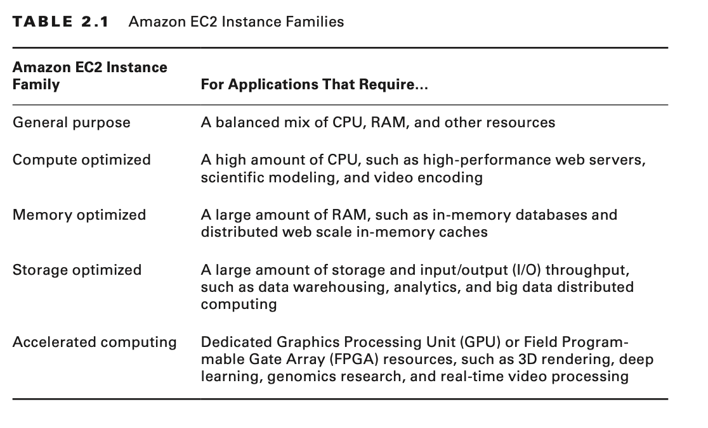

# Introduction to Compute and Networking

AWS provides a broad set of compute options through the following services:

- Amazon Elastic Compute Cloud (Amazon EC2)
- Amazon Lightsail
- AWS Elastic Beanstalk
- Amazon Elastic Container Service (Amazon ECS)
- Amazon Elastic Container Service for Kubernetes (Amazon EKS)
- AWS Lambda

# Amazon Elastic Compute Cloud

Amazon Elastic Compute Cloud (Amazon EC2) enables you to provision computing environments called instances.

An Amazon EC2 instance runs on a host machine within a specific AWS Availability Zone.

## Instance Types

With Amazon EC2, you choose your hardware resources from a broad set of preconfigured options by selecting a specific
instance type and instance size.

Instance types are also grouped into instance families to help you choose the appropriate instance for your application.
Instances within a given family share similar characteristics, such as the ratio of vCPU to RAM or access to different
types of storage options.

## Storage

You can create persistent storage volumes with the Amazon Elastic Block Store (Amazon EBS) service to provide block
storage devices for Amazon EC2 instances.

## Persistent Storage

For Amazon EC2 instances, Amazon EBS provides persistent block storage. Similar to a hard drive, block storage volumes
provide read/write access at a block level and can be formatted with a file system.

While an EBS volume is attached to a particular instance, only that instance can access the data on that volume.
However, you can detach an EBS volume from one instance and then attach that volume to another instance in teh same
Availability Zone.

Although the EC2 instance treats the EBS volume as a local disk, the underlying host machine reads and writes to the EBS
volume over the network.

EBS volumes automatically replicate the data for a particular volume within the same Availability Zone as your Amazon
EC2 instance. To increase durability of your data, you can use Amazon EBS t make point-in-time snapshots of EBS volume.
Data for Amazon EBS snapshots is automatically replicated across multiple Availability Zones within a region, and these
snapshots can be used to create new volumes.

## Temporary Storage

Amazon EC2 instance types also allow you to mount instance store volumes— storage local to the physical host that runs
your Amazon EC2 instance. An instance store volume is a good fit for high-performance storage of caches or temporary
files and for use cases in which your application is already replicating the data to other locations.

This storage can have a high read/write performance because it is physically attached to the host machine that runs the
instance.

## Software Images

An Amazon Machine Image (AMI) provides the template for the OS and applications on the root volume of your instance.
AMIs also provide a block device mapping that can specify additional volumes to mount when an instance launches.

Each AWS Region maintains its own listing of AMIs. Any AMIs that you create are available only within a specific region
unless you copy them to other regions.

## Network Interfaces

Virtual network interfaces called elastic network interfaces provide networking for your Amazon EC2 instances. Elastic
network interfaces are associated with a software-defined network provided by Amazon VPC. Each Amazon EC2 instance is
assigned a primary network interface that is associated with a subnet within an Amazon VPC. By default,
if you omit the network configuration, Amazon EC2 assigns the instance to one of the subnets within the default VPC.

A security group protects the traffic entering and exiting the network interface. Security groups act as a stateful
firewall. To make network connections to your instance, you must set security group rules to allow the connection.