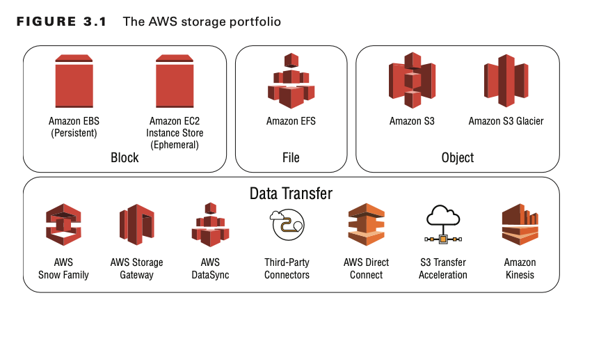
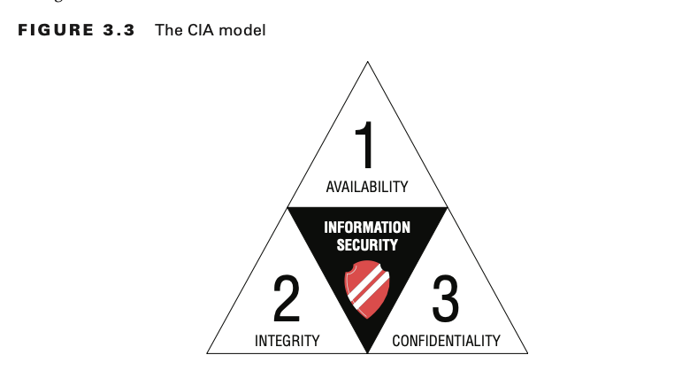
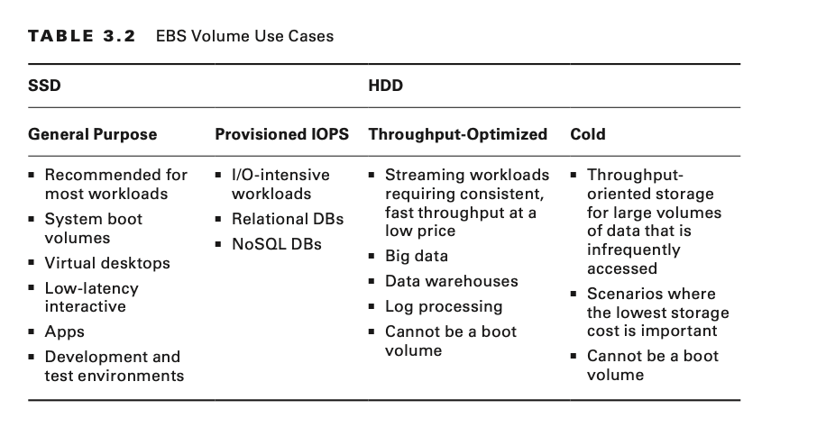
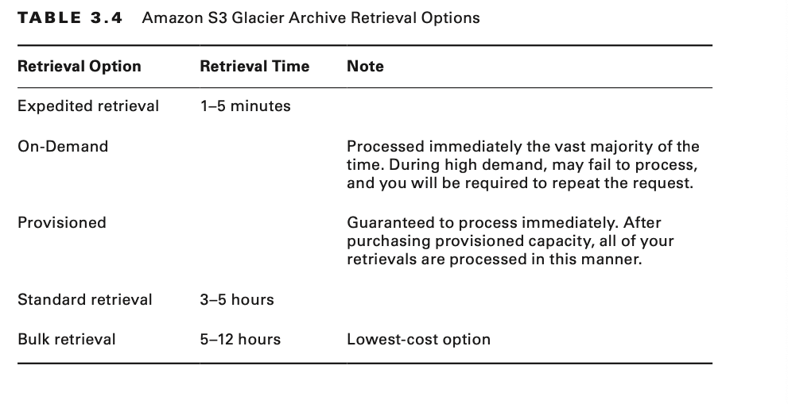
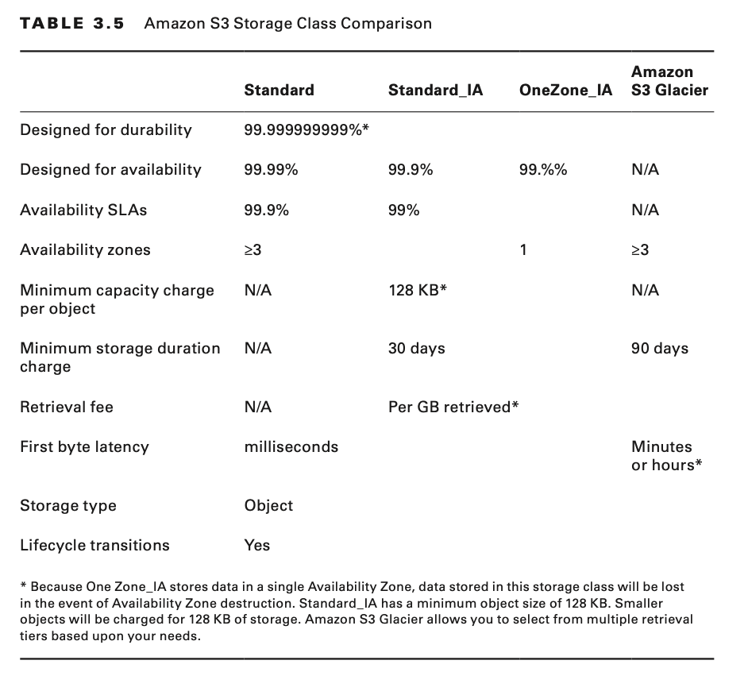
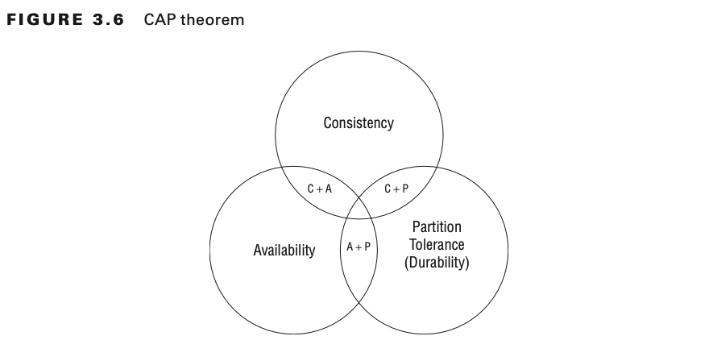
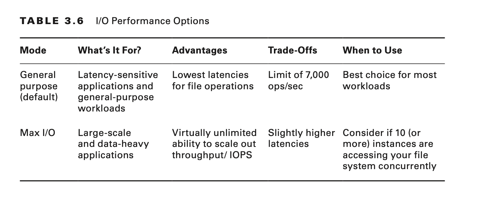
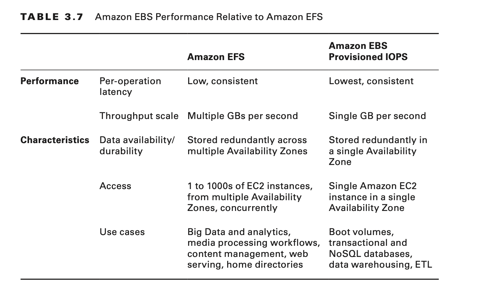

# Hello, Storage

# Introduction to AWS Storage

The AWS Cloud is a reliable, scalable, and secure location for your data. Cloud storage is typically more reliable,
scalable, and secure than traditional, on-premises storage systems.

AWS offers object storage, file storage, block storage and data transfer services.

# Storage Fundamentals

- For block storage, Amazon has Amazon Elastic Block Store (Amazon EBS).
- For file storage, AWS has Amazon Elastic File System (Amazon EFS).
- For object storage, AWS has Amazon Simple Storage Services(Amazon S3) and Amazon S3 glacier.

## Velocity, Variety, and Volume

The first dimension to consider comprises the three Vs of big data: velocity, variety, and volume. These concepts are
applicable to more than big data. It is important to identify these traits for any data that you are using in your
applications.

**Velocity** is the speed at which data is being read or written, measured in reads per second (RPS) or writes per
second (WPS). The velocity can be based on batch processing, periodic, near-real-time, or real-time speeds.

**Variety** determines how structured the data is and how many different structures exist in the data. This can range
from highly structured to loosely structured, unstructured, or binary large object (BLOB) data.

**Volume** is the total size of the dataset. There are two main uses for data: developing valuable insight and storage
for later use.

## Storage Temperature

Data temperature is another useful way of looking at data to determine the right storage for your application. It helps
us understand how "lively" the data is: how much is being written or read and how soon it needs to be available.

**Hot** data is being worked on actively; that is, new ingests, updates, and transformations are actively contributing
to it.

**Warm** data is still being actively accessed, but less frequently than hot data. Often, items can be as small as in
hot
workloads but are updated and read in sets. Speed of access, while important, is not as crucial as with hot data. Warm
data is more balanced across the velocity and volume dimensions.

**Cold** data still needs to be accessed occasionally, but updates to this data are rare, so reads can tolerate higher
latency. Items tend to be large (tens of hundreds of megabytes or gigabytes). Items are often written and read
individually. High durability and low cost are essential. Cold data tends to be high-volume and low-velocity.

**Frozen** data needs to be preserved for business continuity or for archival or regulatory reasons, but it is not being
worked on actively. While new data is regularly added to this data store, existing data is never updated. Reads are
extremely infrequent (known as "write once, read never") and can tolerate very high latency. Frozen data tends to be
extremely high-volume and extremely low-velocity.

## Data Value

To optimize cost and/or performance further, segment data within each workload by value and temperature, and consider
different data storage options for different segments.

**Transient data** is often short-lived. The loss of some subset of transient data does not have significant impact on
the system as a whole.

**Reproducible data** contains a copy of useful information that is often created to improve performance or simplify
consumption, such as adding more structure or altering a structure to match consumption patterns.

**Authoritative data** is the source of truth. Losing this data will have significant business impact because it will be
difficult, or even impossible, to restore or replace it. For this data, we are willing to invest in additional
durability.

**Critical/Regulated data** is data that a business must retain at almost any cost. This data tends to be stored for
long periods of time and needs to be protected from accidental and malicious changes—not just data loss or corruption.
Therefore, in addition to durability, cost and security are equally important factors.

## One Tool Does Not Fit All

Likewise, there is no one-size-fits-all solution for data storage. Analyze your data and understand the dimensions that
we have discussed.

For the exam, know the availability, level of durability, and cost factors for each storage option and how they compare.

## Block, Object, and File Storage

### Block Storage

Some enterprise applications, like databases or enterprise resource planning systems (ERP systems), can require
dedicated, low-latency storage for each host. This is analogous to direct-attached storage (DAS) or a storage area
network (SAN). Block-based cloud storage solutions like Amazon EBS are provisioned with each Amazon Elastic Compute
Cloud (Amazon EC2) instance and offer the ultra-low latency required for high-performance workloads.

### Object Storage

Object storage solutions like Amazon S3 are ideal for building modern applications from scratch that require scale and
flexibility and can also be used to import existing data stores for analytics, backup, or archive. Cloud object storage
makes it possible to store virtually limitless amounts of data in its native format.

### File Storage

File storage solutions like Amazon EFS are ideal for use cases such as large content repositories, development
environments, media stores, or user home directories.

## AWS Shared Responsibility Model and Storage

AWS is responsible for securing the storage services. As a developer and customer, you are responsible for securing
access to and using encryption on the artifacts you create or objects you store.

It is a best practice always to use the principle of least privilege as part of your responsibility for using AWS Cloud
storage.

## Confidentiality, Integrity, Availability Model

The confidentiality, integrity, availability model (CIA model) forms the fundamentals of information security, and you
can apply the principles of the CIA model to AWS storage. Confidentiality can be equated to the privacy level of your
data. It refers to levels of your data.

Confidentiality can be equated to the privacy level of your data. It refers to levels of encryption or access policies
for your storage or individual files.

Integrity refers to whether your data is trustworthy and accurate.

Restrict permission of who can modify data and enable backup and versioning.

Availability refers to the availability of a service on AWS for storage, where an authorized party can gain reliable
access to the resource.

Restrict permission of who can delete data, enable multi-factor authentication (MFA) for Amazon S3 delete operation,
and enable backup and versioning.

# AWS Block Storage Services

## Amazon Elastic Block Store

Amazon EBS presents your data to your Amazon EC2 instance as a disk volume, providing the lowest-latency access to your
data from single Amazon EC2 instances.

Each Amazon EBS volume is automatically replicated within its Availability Zone to protect your information from
component failure, offering high availability and durability.

Typical use cases for Amazon EBS ;

- Boot volumes on Amazon EC2 instances.
- Relational and NoSQL databases.
- Stream and log processing applications.
- Data warehousing applications.
- Big data analytics engines (like Hadoop/HDFS Amazon EMR)

Amazon EBS is designed to achieve the following:

- Availability of 99.999 percent
- Durability of replication within a single availability zone
- Annual failure rate (AFR) of between 0.1 and 0.2 percent

## Amazon EBS Volumes

Amazon EBS volumes persist independently from the running life of an Amazon EC2 instance. After a volume is attached to
an instance, use it like any other physical hard drive.

**Solid-state drive (SSD)** –backed volumes are optimized for transactional workloads involving frequent read/write
operations with small I/O size, where the dominant performance attribute is IOPS.

**Hard disk drive (HDD)** –backed volumes are optimized for large streaming workloads where throughput (measured in
MiB/s) is a better performance measure than IOPS.

## Elastic Volumes

Elastic Volumes is a feature of Amazon EBS that allows you to increase capacity dynamically, tune performance, and
change the type of volume live. This can be done with no downtime or performance impact and with no changes to your
application.

## Amazon EBS Snapshots

You can protect your data by creating point-in-time snapshots of Amazon EBS volumes, which are backed up to Amazon S3
for long-term durability. The volume does not need to be attached to a running instance to take a snapshot.

Snapshots are incremental backups, meaning that only the blocks on the volume that have changed after your most recent
snapshot are saved, making this a cost-effective way to back up your block data.
For example, if you have a volume with 100 GiB of data, but only 5 GiB of data have changed since your last snapshot,
only the 5 GiB of modified data is written to Amazon S3.

## Amazon EBS Optimization

Recall that Amazon EBS volumes are network-attached and not directly attached to the host like instance stores.
On instances without support for Amazon EBS–optimized throughput, network traffic can contend with traffic between your
instance and your Amazon EBS volumes. On Amazon EBS–optimized instances, the two types of traffic are kept separate.

## Amazon EBS Encryption

For simplified data encryption, create encrypted Amazon EBS volumes with the Amazon EBS encryption feature.
All Amazon EBS volume types support encryption, and you can use encrypted Amazon EBS volumes to meet a wide range of
data-at-rest encryption requirements for regulated/audited data and applications.

Amazon EBS encryption uses 256-bit Advanced Encryption Standard (AES-256) algorithms and an Amazon-managed key
infrastructure called AWS Key Management Service (AWS KMS).

You can encrypt using an AWS KMS–generated key, or you can choose to select a customer master key (CMK) that you create
separately using AWS KMS.

You can also encrypt your files prior to placing them on the volume. Snapshots of encrypted Amazon EBS volumes are
automatically encrypted. Amazon EBS volumes that are restored from encrypted snapshots are also automatically encrypted.

## Amazon EBS Performance

**Use Amazon EBS-optimized instances**

The dedicated network throughput that you get when you request Amazon EBS–optimized support will make volume performance
more predictable and consistent, and your Amazon EBS volume network traffic will not have to contend with your other
instance traffic because they are kept separate.

**Understand how performance is calculated**

When you measure the performance of your Amazon EBS volumes, it is important to understand the units of measure involved
and how performance is calculated.

**Understand your workload**

There is a relationship between the maximum performance of your Amazon EBS volumes, the size and number of I/O
operations, and the time it takes for each action to complete. Each of these factors affects the others, and different
applications are more sensitive to one factor or another.

**Be aware of the performance penalty when initializing volumes from snapshots**

New Amazon EBS volumes receive their maximum performance the moment that they are available and do not require
initialization (formerly known as pre-warming).

**Factors that can degrade HDD performance**

When you create a snapshot of a Throughput-Optimized HDD or Cold HDD volume, performance may drop as far as the volume’s
baseline value while the snapshot is in progress. This behavior is specific only to these volume types.

**Increase read-ahead for high-throughput, read-heavy workloads**

Some workloads are read-heavy and access the block device through the operating system page cache (for example, from a
file system). In this case, to achieve the maximum throughput, we recommend that you configure the read-ahead setting to
1 MiB. This is a per-block-device setting that should be applied only to your HDD volumes.

**Use RAID 0 to maximize utilization of instance resources**

Some instance types can drive more I/O throughput than what you can provision for a single Amazon EBS volume. You can
join multiple volumes of certain instance types together in a RAID 0 configuration to use the available bandwidth for
these instances.

**Track performance with Amazon CloudWatch**

Amazon CloudWatch, a monitoring and management service, provides performance metrics and status checks for your Amazon
EBS volumes.

## Amazon EBS Troubleshooting

If you are using an Amazon EBS volume as a boot volume, your instance is no longer accessible, and you cannot use SSH
or Remote Desktop Protocol (RDP) to access that boot volume.

If you have an Amazon EC2 instance based on an Amazon Machine Image (AMI), you may just choose to terminate the instance
and create a new one.

If you do need access to that Amazon EBS boot volume, perform the following steps to make it accessible:

- Create a new Amazon EC2 instance with its own boot volume (a micro instance is great for this purpose).
- Detach the root Amazon EBS volume from the troubled instance.
- Attach the root Amazon EBS volume from the troubled instance to your new Amazon EC2 instance as a secondary volume.
- Connect to the new Amazon EC2 instance, and access the files on the secondary volume.

## Instance Store

Amazon EC2 instance store is another type of block storage available to your Amazon EC2 instances.
It provides temporary block-level storage, and the storage is located on disks that are physically attached to the host
computer (unlike Amazon EBS volumes, which are network-attached).

### Instance Store Volumes

Instance store should not be used for persistent storage needs. It is a type of ephemeral (short-lived) storage that
does not persist if the instance fails or is terminated.

After you launch an instance, the instance store volumes are available to the instance, but you cannot access them until
they are mounted.

Do not use instance store for any production data.

### Instance Store–Backed Amazon EC2 Instances

With Amazon EC2, you can use both instance store–backed storage volumes and Amazon EBS–backed storage volumes with your
instances, meaning you can have your instance boot off instance store; however, you would want this configured so that
you are using an AMI and that new instances will be created if one fails.

Instance store–backed Amazon EC2 instances cannot be stopped and cannot take advantage of the auto recovery feature for
Amazon EC2 instances.

# AWS Object Storage Services

An object is a piece of data like a document, image, or video that is stored with some metadata in a flat structure.

## Amazon Simple Storage Service

Building a web application, which delivers content to users by retrieving data via making API calls over the internet,
is not a difficult task with Amazon S3. Amazon Simple Storage Service (Amazon S3) is storage for the internet.

### Buckets

A bucket is a container for objects stored in Amazon S3. Every object is contained in a bucket.

### Limitations

The following are limitations of which you should be aware when using Amazon S3 buckets:

- Do not use buckets as folders, because there is a maximum limit of 100 buckets per account.
- You cannot create a bucket within another bucket.
- A bucket is owned by the AWS account that created it, and bucket ownership is not transferable.
- A bucket must be empty before you can delete it.
- After bucket is deleted , that name becomes available to reuse, but the name might not be available for you to reuse
  for various reasons, such as someone else taking the name after you release it when deleting the bucket. If you expect
  to use same bucket name, do not delete the bucket.

You can only create up to 100 buckets per account. Do not use buckets as folders or design your application in a way
that could result in more than 100 buckets as your application or data grows.

### Universal Namespace

A bucket name must be unique across all existing bucket names in Amazon S3 across all of AWS.
Not just within your account or within your chosen AWS Region. You must comply with Domain Name System (DNS) naming
conventions when choosing a bucket name.

The rules for DNS-compliant bucket names are as follows:

- Bucket names must be at least 3 and no more than 63 characters long.
- A bucket name must consist of a series of one or more labels, with adjacent labels separated by a single period (.).
- A bucket name must contain lowercase letters, numbers, and hyphens.
- Each label must start and end with a lowercase letter or number.
- Bucket names must not be formatted like IP addresses (for example, 192.168.5.4).
- AWS recommends that you do not use periods (.) in bucket names. When using virtual hosted-style buckets with Secure
  Sockets Layer (SSL), the SSL wildcard certificate only matches buckets that do not contain periods. To work around
  this, use HTTP or write your own certificate verification logic.

AWS S3 bucket names must be universally unique.

### Versioning

Versioning is a means of keeping multiple variants of an object in the same bucket. You can use versioning to preserve,
retrieve, and restore every version of every object stored in your Amazon S3 bucket, including recovering deleted
objects.

There are several reasons that developers will turn on versioning of files in Amazon S3, including the following:

- Protecting from accidental deletion.
- Recovering an earlier version.
- Retrieving deleted objects.

Versioning is turned off by default. When you turn on versioning, Amazon S3 will cre- ate new versions of your object
every time you overwrite a particular object key. Every time you update an object with the same key, Amazon S3 will
maintain a new version of it.

Amazon S3 versioning tracks the changes over time.

Amazon S3 versioning also protects against unintended deletes. If you issue a delete command against an object in a
versioned bucket, AWS places a delete marker on top of that object, which means that if you perform a GET on it, you
will receive an error as if the object does not exist. However, an administrator, or anyone else with the necessary
permissions, could remove the delete marker and access the data.

Versioning-enabled buckets let you recover objects from accidental deletion or overwrite. Your bucket’s versioning
configuration can also be MFA Delete–enabled for an additional layer of security.

It is easy to set up a lifecycle policy to control the amount of data that’s being retained when you use versioning on a
bucket.

Once you enable versioning on a bucket, it can never return to an unversioned state. You can, however, suspend
versioning on that bucket.

### Region

Amazon S3 creates buckets in a region that you specify. You can choose any AWS Region that is geographically close to
you to optimize latency, minimize costs, or address regulatory requirements.

Objects belonging to a bucket that you create in a specific AWS Region never leave that region unless you explicitly
transfer them to another region.

### Operations on Buckets

There are a number of different operations (API calls) that you can perform on Amazon S3 buckets.

## Object

You can store an unlimited number of objects within Amazon S3, but an object can only be between 1 byte to 5 TB in size.
If you have objects larger than 5 TB, use a file splitter and upload the file in chunks to Amazon S3. Then reassemble
them if you download the file parts for later use.

The largest object that can be uploaded in a single PUT is 5 GB. For objects larger than 100 MB, you should consider
using multipart upload.For any objects larger than 5 GB, you must use multipart upload.

### Object Facets

An object consists of the following facets:

**Key**

The key is the name that you assign to an object, which may include a simulated folder structure. Each key must be
unique within a bucket (unless the bucket has versioning turned on).

Amazon S3 URLs can be thought of as a basic data map between “bucket + key + version” and the web service endpoint. For
example, in the URL http://doc.s3.amazonaws.com/ 2006-03-01/AmazonS3.wsdl, doc is the name of the bucket and
2006-03-01/AmazonS3.wsdl is the key.

**Version ID**

Within a bucket, a key and version ID uniquely identify an object. If versioning is turned off, you have only a single
version. If versioning is turned on, you may have multiple versions of a stored object.

**Value**

The value is the actual content that you are storing. An object value can be any sequence of bytes, and objects can
range in size from 1 byte up to 5 TB.

**Metadata**

Metadata is a set of name-value pairs with which you can store information regarding the object. You can assign
metadata, referred to as user-defined metadata, to your objects in Amazon S3. Amazon S3 also assigns system metadata to
these objects, which it uses for managing objects.

**Subresources**

Amazon S3 uses the subresource mechanism to store additional object-specific information. Because subresources are
subordinates to objects, they are always associated with some other entity such as an object or a bucket.

**Access Control Information**

You can control access to the objects you store in Amazon S3. Amazon S3 supports both resource-based access control,
such as an ACL and bucket policies, and user-based access control.

### Object Tagging

Object tagging enables you to categorize storage. Each tag is a key-value pair.

Note the following limitations when working with tagging:

- You can associate 10 tags with an object, and each tag associated with an object must have unique tag keys.
- A tag key can be up to 128 Unicode characters in length, and tag values can be up to 256 Unicode characters in length.
- Keys and values are case sensitive.

### Cross-Origin Resource Sharing

Cross-Origin Resource Sharing (CORS) defines a way for client web applications that are loaded in one domain to interact
with resources in a different domain. With CORS support in Amazon S3, you can build client-side web applications with
Amazon S3 and selectively allow cross-origin access to your Amazon S3 resources while avoiding the need to use a proxy.

Suppose that you host a web font from your Amazon S3 bucket. Browsers require a CORS check (also referred as a preflight
check) for loading web fonts, so you would configure the bucket that is hosting the web font to allow any origin to make
these requests.

## Storage Classes

There are several different storage classes from which to choose when using Amazon S3. Your choice will depend on your
level of need for durability, availability, and performance for your application.

### Amazon S3 Standard

Amazon S3 Standard offers high-durability, high-availability, and performance- object storage for frequently accessed
data. Amazon S3 Standard is ideal for a wide variety of use cases, including the following:

- Cloud applications
- Dynamic websites
- Content distribution
- Mobile and gaming applications
- Big data analytics

Amazon S3 Standard is designed to achieve durability of 99.999999999 percent of objects (designed to sustain the loss of
data in two facilities) and availability of 99.99 percent over a given year (which is backed by the Amazon S3 Service
Level Agreement).

### Reduced Redundancy Storage

Reduced Redundancy Storage (RRS) (or Reduced_Redundancy) is an Amazon S3 storage option that enables customers to store
noncritical, reproducible data at lower levels of redundancy than Amazon S3 Standard storage. It provides a highly
available solution for distributing or sharing content that is durably stored elsewhere or for objects that can easily
be regenerated, such as thumbnails or transcoded media.

### Amazon S3 Standard-Infrequent Access

Amazon S3 Standard-Infrequent Access (Standard_IA) is an Amazon S3 storage class for data that is accessed less
frequently but requires rapid access when needed.

The ideal use cases for using Standard_IA include the following:

- Long-term storage
- Backups
- Data stores for disaster recovery

Standard_IA is set at the object level and can exist in the same bucket as Amazon S3 Standard, allowing you to use
lifecycle policies to transition objects automatically between storage classes without any application changes.

Standard_IA is designed to achieve availability of 99.9 percent (but low retrieval time) and durability of 99.999999999
percent of objects over a given year (same as Amazon S3 Standard).

### Amazon S3 One Zone-Infrequent Access

Amazon S3 One Zone-Infrequent Access (OneZone_IA) is similar to Amazon S3 Standard-IA. The difference is that the data
is stored only in a single Availability Zone instead of a minimum of three Availability Zones. Because of this, storing
data in OneZone_IA costs 20 percent less than storing it in Standard_IA.

### Amazon Simple Storage Service Glacier

Amazon Simple Storage Service Glacier (Amazon S3 Glacier) is a secure, durable, and extremely low-cost storage service
for data archiving that offers the same high durability as Amazon S3. Unlike Amazon S3 Standard’s immediate retrieval
times, Amazon S3 Glacier’s retrieval times run from a few minutes to several hours.

### Vaults

Amazon S3 Glacier uses vaults as containers to store archives. You can view a list of your vaults in the AWS Management
Console and use the AWS software development kits (SDKs) to perform a variety of vault operations, such as the
following:

- Create Vault
- Delete Vault
- Lock Vault
- ...

## Vaults Lock

Amazon S3 Glacier Vault Lock allows you to deploy and enforce compliance controls easily on individual Amazon S3 Glacier
vaults via a lockable policy.

You can specify controls such as Write Once Read Many (WORM) in a Vault Lock policy and lock the policy from future
edits.

## Archives

An archive is any object, such as a photo, video, or document that you store in a vault. It is a base unit of storage in
Amazon S3 Glacier. Each archive has a unique ID and optional description.

Amazon S3 Glacier provides a management console to create and delete vaults. However, all other interactions with Amazon
S3 Glacier require that you use the AWS CLI or write code.

To upload archives into your vaults, you must either use the AWS CLI or write code to make requests, using either the
REST API directly or the AWS SDKs.

### Maintaining Client-Side Archive Metadata

Except for the optional archive description, Amazon S3 Glacier does not support any additional metadata for the
archives. When you upload an archive, Amazon S3 Glacier assigns an ID.

If you maintain client-side archive metadata, note that Amazon S3 Glacier maintains a vault inventory that includes
archive IDs and any descriptions that you provided during the archive upload.

### Using the AWS SDKs with Amazon S3 Glacier

AWS provides SDKs for you to develop applications for Amazon S3 Glacier in various programming languages.

The AWS SDKs for Java and .NET offer both high-level and low-level wrapper libraries.

### Encryption

All data in Amazon S3 Glacier will be encrypted on the server side using key management and key protection, which Amazon
S3 Glacier handles using AES-256 encryption. If you want, you can manage your own keys and encrypt the data prior to
uploading.

### Restoring objects from Amazon S3 Glacier

Objects in the Amazon S3 Glacier storage class are not immediately accessible and cannot be retrieved via copy/paste
once they have been moved to Amazon S3 Glacier.

Remember that Amazon S3 Glacier charges a retrieval fee for retrieving objects. When you restore an archive, you pay for
both the archive and the restored copy. Because there is a storage cost for the copy, restore objects only for the
duration that you need them.

### Archive Retrieval Options

There are several different options for restoring archived objects from Amazon S3 Glacier to Amazon S3;

Do not use Amazon S3 Glacier for backups if your RTO is shorter than the lowest Amazon S3 Glacier retrieval time for
your chosen retrieval option. For example, if your RTO requires data retrieval of two hours in a disaster recovery
scenario, then Amazon S3 Glacier standard retrieval will not meet your RTO.

### Storage Class Comparison

This is an important table for the certification exam. Many storage decision questions on the exam center on the level
of durability, availability, and cost. The table’s comparisons can help you make the right choice for a question, in
addition to understanding trade-offs when choosing a data store for an application.

### Data Consistency Model

When deciding whether to choose Amazon S3 or Amazon EBS for your application, one important aspect to consider is the
consistency model of the storage option.

Amazon EBS provides read-after-write consistency for all operations, whereas Amazon S3 provides read-after-write
consistency only for PUTs of new objects.

Amazon S3 offers eventual consistency for overwrite PUTs and DELETEs in all regions, and updates to a single key are
atomic. For example, if you PUT an object to update an existing object and immediately attempt to read that object, you
may read either the old data or the new data.

For PUT operations with new objects not yet in Amazon S3, you will experience read- after-write consistency. For PUT
updates when you are overwriting an existing file or DELETE operations, you will experience eventual consistency.

Amazon S3 does not currently support object locking. If two PUT requests are simultaneously made to the same key, the
request with the latest time stamp wins. If this is an issue, you will be required to build an object lock- ing
mechanism into your application.

You may be wondering why Amazon S3 was designed with this style of consistency. The consistency, availability, and
partition tolerance theorem (CAP theorem) states that you can highly achieve only two out of the three dimensions for a
particular storage design.

Think of partition tolerance in this equation as the storage durability. Amazon S3 was designed for high availability
and high durability (multiple copies across multiple facilities), so the design trade-off is the consistency.

### Concurrent Applications

If your application requires read-after-write consistency on all operations, then Amazon S3 is not going to be the
right choice for that application. If you are working with concurrent applications, it is important to know how your
application performs PUT, GET, and DELETE operations concurrently to know whether eventual consistency will not be the
right choice for your application.

If you need a strongly consistent data store, choose a different data store than Amazon S3 or code consistency checks
into your application.

## Presigned URLs

A presigned URL is a way to grant access to an object. One way that developers use presigned URLs is to allow users to
upload or download objects without granting them direct access to Amazon S3 or the account.

For example, if you need to send a document hosted in an Amazon S3 bucket to an external reviewer who is outside of your
organization, you do not want to grant them access using IAM to your bucket or objects. Instead, generate a presigned
URL to the object and send that to the user to download your file.

Amazon S3 presigned URLs cannot be generated within the AWS Management Console, but they can be generated using the
AWS CLI or AWS SDKs.

## Encryption

Data protection refers to protecting data while in transit (as it travels to and from Amazon S3) and at rest (while it
is stored on Amazon S3 infrastructure). As a best practice, all sensitive data stored in Amazon S3 should be
encrypted, both at rest and in transit.

You can protect data in transit by using Amazon S3 SSL API endpoints, which ensures that all data sent to and from
Amazon S3 is encrypted using the HTTPS protocol while in transit.

For data at rest in Amazon S3, you can encrypt it using different options of Server-Side Encryption (SSE). Your objects
in Amazon S3 are encrypted at the object level as they are written to disk in the data centers and then decrypted for
you when you access the objects using AES-256.

You can also use client-side encryption, with which you encrypt the objects before uploading to Amazon S3 and then
decrypt them after you have downloaded them. Some customers, for some workloads, will use a combination of both
server-side and client-side encryption for extra protection.

### Server-Side Encryption (SSE)

You have 3 , mutually exclusive options for how you choose to manage your encryption keys when using SSE with Amazon S3.

**SSE-S3 (Amazon S3 managed keys)**

You can set an API flag or check a box in the AWS Management Console to have data encrypted before it is written to disk
in Amazon S3. Each object is encrypted with a unique data key. As an additional safeguard, this key is encrypted with a
periodically-rotated master key managed by Amazon S3. AES-256 is used for both object and master keys. This feature is
offered at no additional cost beyond what you pay for using Amazon S3.

**SSE-C (Customer-provided keys)**

You can use your own encryption key while uploading an object to Amazon S3. This encryption key is used by Amazon S3
to encrypt your data using AES-256. After the object is encrypted, the encryption key you supplied is deleted from the
Amazon S3 system that used it to encrypt your data. When you retrieve this object from Amazon S3, you must provide the
same encryption key in your request. Amazon S3 verifies that the encryption key matches, decrypts the object, and
returns the object to you. This feature is also offered at no additional cost beyond what you pay for using Amazon S3.

**SSE-KMS (AWS KMS managed encryption keys)**

You can encrypt your data in Amazon S3 by defining an AWS KMS master key within your account to encrypt the unique
object key (referred to as a data key) that will ultimately encrypt your object. When you upload your object, a request
is sent to AWS KMS to create an object key.

AWS KMS generates this object key and encrypts it using the master key that you specified earlier.
Then, AWS KMS returns this encrypted object key along with the plaintext object key to Amazon S3. The Amazon S3 web
server encrypts your object using the plaintext object key and stores the now encrypted object (with the encrypted
object key) and deletes the plaintext object key from memory.

For maximum simplicity and ease of use, use SSE with AWS managed keys (SSE-S3 or SSE-KMS). Also, know the difference
between SSE-S3, SSE-KMS, and SSE-C for SSE.

### Client-Side Encryption

Client-side encryption refers to encrypting your data before sending it to Amazon S3. You have two options for using
data encryption keys.

#### Client-Side Master Key

The first option is to use a client-side master key of your own. When uploading an object, you provide a client-side
master key to the Amazon S3 encryption client.

The client-side master key that you provide can be either a symmetric key or a public/private key pair.

#### AWS KMS-Managed Customer Master Key (CMK)

The second option is to use an AWS KMS managed customer master key (CMK). This process is similar to the process
described earlier for using KMS-SSE, except that it is used for data at rest instead of data in transit. There is an
Amazon S3 encryption client in the AWS SDK for Java.

Know the difference between CMK and client-side master keys for client-side encryption.

## Access Control

By default, all Amazon S3 resources—buckets, objects, and related sub-resources (for example, lifecycle configuration
and website configuration)—are private. Only the resource owner, an account that created it, can access the resource.
The resource owner can optionally grant access permissions to others by writing an access policy.

Access policies that you attach to your resources (buckets and objects) are referred to as resource-based policies.

You can also attach access policies to users in your account. These are called user policies.

### Using Bucket Policies and User Policies

Bucket policy and user policy are two of the access policy options available for you to grant permissions to your Amazon
S3 resources. Both use a JSON-based access policy language, as do all AWS services that use policies.

A bucket policy is attached only to Amazon S3 buckets, and it specifies what actions are allowed or denied for whichever
principals on the bucket to which the bucket policy is attached (for instance, allow user Alice to PUT but not DELETE
objects in the bucket).

A user policy is attached to IAM users to perform or not perform actions on your AWS resources.

### Managing Access with Access Control Lists

Access with access control lists (ACLs) are resource-based access policies that you can use to manage access to your
buckets and objects, including granting basic read/write permissions to other accounts.

There are limits to managing permissions using ACLs. For example, you can grant permissions only to other accounts; you
cannot grant permissions to users in your account. You cannot grant conditional permissions, nor can you explicitly deny
permissions using ACLs.

ACLs are suitable only for specific scenarios (for example, if a bucket owner allows other accounts to upload objects),
and permissions to these objects can be managed only using an object ACL by the account that owns the object.

You can only grant access to other using ACLs , not users in your own account.

### Defense in Depth - Amazon S3 Security

Amazon S3 provides comprehensive security and compliance capabilities that meet the most stringent regulatory
requirements, and it gives you flexibility in the way that you manage data for cost optimization, access control, and
compliance. With this flexibility, however, comes the responsibility of ensuring that your content is secure.

You can use an approach known as defense in depth in Amazon S3 to secure your data. This approach uses multiple layers
of security to ensure redundancy if one of the multiple layers of security fails.

To meet defense in depth requirements on Amazon S3:

- Data must be encrypted at rest and during transit.
- Data must be accessible only by a limited set of public IP addresses.
- Data must not be publicly accessible directly from an Amazon S3 URL.
- A domain name is required to consume the content.

### Query String Authentication

You can provide authentication information using query string parameters. Using query parameters to authenticate
requests is useful when expressing a request entirely in a URL. This method is also referred to as presigning a URL.

With presigned URLs, you can grant temporary access to your Amazon S3 resources.

### Hosting a Static Website

If your website contains static content and optionally client-side scripts, then you can host your static website
directly in Amazon S3 without the use of web-hosting servers.

To host a static website, you configure an Amazon S3 bucket for website hosting
and upload your website content to the bucket. The website is then available at the AWS Region–specific website endpoint
of the bucket in one of the following formats:

    <bucket-name>.s3-website-<AWS-region>.amazonaws.com
    <bucket-name>.s3-website.<AWS-region>.amazonaws.com

Static websites can be hosted in Amazon S3.

### MFA Delete

MFA is another way to control deletes on your objects in Amazon S3. It does so by adding another layer of protection
against unintentional or malicious deletes, requiring an authorized request against Amazon S3 to delete the object.
MFA also requires a unique code from a token or an authentication device (virtual or hardware).

### Cross-Region Replication

Cross-Region Replication (CRR) is a bucket-level configuration that enables automatic, asynchronous copying of objects
across buckets in different AWS Regions. We refer to these buckets as the source bucket and destination buckets.
These buckets can be owned by different accounts.

To activate this feature, add a replication configuration to your source bucket to direct Amazon S3 to replicate objects
according to the configuration.

You can replicate objects from a source bucket to only one destination bucket. After Amazon S3 replicates an object, the
object cannot be replicated again. For example, even after you change the destination bucket in an existing replication
configuration, Amazon S3 will not replicate it again.

After Amazon S3 replicates an object using CRR, the object cannot be rep- licated again (such as to another destination
bucket).

Requirements for CRR include the following:

- Versioning is enabled for both the source and destination buckets.
- Source and destination buckets must be in different AWS Regions.
- Amazon S3 must be granted appropriate permissions to replicate files.

### VPC Endpoints

A Virtual Private Cloud (VPC) endpoint enables you to connect your VPC privately to Amazon S3 without requiring an
internet gateway, network address translation  (NAT) device, virtual private network (VPN) connection or AWS Direct
Connect connection.

Instances in your VPC do not require public IP addresses to communicate with the resources in the service.

Amazon S3 uses a gateway type of VPC endpoint. The gateway is a target for a specified route in your route table, used
for traffic destined for a supported AWS service. These endpoints are easy to configure, are highly reliable, and
provide a secure connection to Amazon S3 that does not require a gateway or NAT instance.

### Using the AWS SDKs, AWS CLI, and AW

You can use the AWS SDKs when developing applications with Amazon S3. The AWS SDKs simplify your programming tasks by
wrapping the underlying REST API.
You can also use the AWS CLI to manage Amazon S3 buckets and objects.
AWS has deprecated SOAP support over HTTP, but it is still available over HTTPS.

### Data Lake

A data lake is an architectural approach that allows you to store massive amounts of data in a central location for
consumption by multiple applications.

Amazon S3 is a common component of a data lake solution on the cloud, and it can complement your other storage
solutions.

### Performance

There are a number of actions that Amazon S3 takes by default to help you achieve high levels of performance. Amazon S3
automatically scales to thousands of requests per second per prefix based on your steady state traffic. Amazon S3 will
automatically partition your prefixes within hours, adjusting to increases in request rates.

### Consideration for Workloads

To optimize the use of Amazon S3 mixed or GET-intensive workloads, you must become familiar with best practices for
performance optimization.

**Mixed request types** If your requests are typically a mix of GET, PUT, DELETE, and GET Bucket (list objects),
choosing
appropriate key names for your objects ensures better performance by providing low-latency access to the Amazon S3
index.

**GET-intensive workloads** If the bulk of your workload consists of GET requests, you may want to use Amazon
CloudFront, a
content delivery service.

### Amazon S3 Transfer Acceleration

Amazon S3 Transfer Acceleration is a feature that optimizes throughput when transferring larger objects across larger
geographic distances. Amazon S3 Transfer Acceleration uses Amazon CloudFront edge locations to assist you in uploading
your objects more quickly in cases where you are closer to an edge location than to the region to which you are
transferring your files.

AWS has edge locations around the world, and you upload your data to the edge location closest to your location.

### Multipart Uploads

When uploading a large object to Amazon S3 in a single-threaded manner, it can take a significant amount of time to
complete. The multipart upload API enables you to upload large objects in parts to speed up your upload by doing so in
parallel.

To use multipart upload, you first break the object into smaller parts, parallelize the upload, and then submit a
manifest file telling Amazon S3 that all parts of the object have been uploaded. Amazon S3 will then assemble all of
those individual pieces to a single Amazon S3 object.

Multipart upload can be used for objects ranging from 5 MB to 5 TB in size.

### Range GETs

Range GETs are similar to multipart uploads, but in reverse. If you are downloading a large object and tracking the
offsets, use range GETs to download the object as multiple parts instead of a single part. You can then download those
parts in parallel and potentially see an improvement in performance.

### Amazon CloudFront

Using a CDN like Amazon CloudFront, you may achieve lower latency and higher-throughput performance. You also will not
experience as many requests to Amazon S3 because your content will be cached at the edge location. Your users will also
experience the performance improvement of having cached storage through Amazon CloudFront versus going back to Amazon S3
for each new GET on an object.

### TCP Window Scaling

Transmission Control Protocol (TCP) window scaling allows you to improve network throughput performance between your
operating system, application layer, and Amazon S3 by supporting window sizes larger than 64 KB.

### TCP Selective Acknowledgment

TCP selective acknowledgment is designed to improve recovery time after a large number of packet losses. It is supported
by most newer operating systems, but it might have to be enabled

### Pricing

With Amazon S3, you pay only for what you use. There is no minimum fee, and there is no charge for data transfer into
Amazon S3.

You pay for the following :

- The storage that you use
- TThe API calls that you make (PUT, COPY, POST, LIST, GET)
- Data transfer out of Amazon S3

Amazon S3 pricing differs from the pricing of Amazon EBS volumes in that if you create an Amazon EBS volume and store
nothing on it, you are still paying for the storage space of the volume that you have allocated. With Amazon S3, you pay
for the storage space that is being used—not allocated.

## Object Lifecycle Management

A lifecycle configuration is a set of rules that defines actions that Amazon S3 applies to a group of objects.

**Transition actions**

Transition actions define when objects transition to another storage class. For example, you might choose to transition
objects to the STANDARD_IA storage class 30 days after you created them or archive objects to the GLACIER storage class
one year after creating them.

**Expiration actions**

Expiration actions define when objects expire. Amazon S3 deletes expired objects on your behalf.

### Configuring a Lifecycle

A lifecycle configuration (an XML file) comprises a set of rules with predefined actions that you need Amazon S3 to
perform on objects during their lifetime. Amazon S3 provides a set of API operations for managing lifecycle
configuration on a bucket, and it is stored by Amazon S3 as a lifecycle subresource that is attached to your bucket.

You can also configure the lifecycle by using the Amazon S3 console, the AWS SDKs, or the REST API.

# AWS File Storage Services

AWS offers Amazon Elastic File System (Amazon EFS) for file storage to enable you to share access to files that reside
on the cloud.

## Amazon Elastic File System

Amazon Elastic File System (Amazon EFS) provides scalable file storage and a standard file system interface for use with
Amazon EC2. You can create an Amazon EFS file system, configure your instances to mount the file system, and then use
an Amazon EFS file system as a common data source for workloads and application running on multiple instances.

Amazon EFS can be mounted to multiple Amazon EC2 instances simultaneously.

Consider using Amazon EFS instead of Amazon S3 or Amazon EBS;

- Multi-attach
- GB/s throughput
- Multi-AZ availability/durability
- Automatic scaling (growing/shrinking of storage)

Customers use Amazon EFS for the following use cases today:

- Web Servings
- Database backups
- Container storage
- Home directories
- Content Management
- Analytics
- Media and entertainment workflows
- Workflow management
- Shared state management

Amazon EFS is not supported on Windows instances.

## Creating your Amazon EFS File System

### File System

The Amazon EFS file system is the primary resource in Amazon EFS, and it is where you store your files and directories.
You can create up to 125 file systems per account.

### Mount Target

To access your file system from within a VPC, create mount targets in the VPC. A mount target is a Network File System (
NFS) endpoint within your VPC that includes an IP address and a DNS name, both of which you use in your mount command.

### Accessing an Amazon EFS File System

There are several different ways that you can access an Amazon EFS file system, including using Amazon EC2 and AWS
Direct Connect.

#### Using Amazon Elastic Compute Cloud

To access a file system from an Amazon Elastic Compute Cloud (Amazon EC2) instance, you must mount the file system by
using the standard Linux mount command.

A file system belongs to a region, and your Amazon EFS file system spans all Availability Zones in that region. Once you
have mounted your file system, data can be accessed from any Availability Zone in the region within your VPC while
maintaining full consistency.

#### Using AWS Direct Connect

You can also mount your on-premises servers to Amazon EFS in your Amazon VPC using AWS Direct Connect. With AWS Direct
Connect, you can mount your on-premises servers to Amazon EFS using the same mount command used to mount in Amazon
EC2.

### Syncing Files Using AWS DataSync

AWS DataSync can synchronize your file data and also file system metadata such as ownership, time stamps, and access
permissions.

To do this, download and deploy a sync agent from the Amazon EFS console as either a virtual machine (VM) image or an
AMI.

### Performance

Amazon EFS is designed for a wide spectrum of performance needs, including the following:

- High throughput and parallel I/O
- Low latency and serial I/O

**General purpose (default)**

General-purpose mode is the default mode, and it is used for latency-sensitive applications and general-purpose
workloads, offering the lowest latencies for file operations. While there is a trade-off of limiting operations to 7,000
per second, general-purpose mode is the best choice for most workloads.

**Max I/O**

If you are running large-scale and data-heavy applications, then choose the max I/O performance option, which provides
you with a virtually unlimited ability to scale out throughput and IOPS, but with a trade-off of slightly higher
latencies. Use max I/O when you have 10 or more instances accessing your file system concurrently.

The distributed architecture of Amazon EFS results in a small increase in latency for each operation, as the data that
you are storing gets pushed across multiple servers in multiple Availability Zones.

Amazon EBS can provide lower latency than Amazon EFS, but at the cost of some durability. With Amazon EBS, you provision
the size of the device, and if you reach its maximum limit, you must increase its size or add more volumes, whereas
Amazon EFS scales automatically.

## Security

You can implement security in multiple layers with Amazon EFS by controlling the following:

- Network traffic to and from file systems (mount targets) using the following:
    - VPC security groups
    - Network ACLs
- File and directory access by using POSIX permissions
- Administrative access (API access) to file systems by using IAM. Amazon EFS supports:
    - Action-level permissions
    - Resource-level permissions