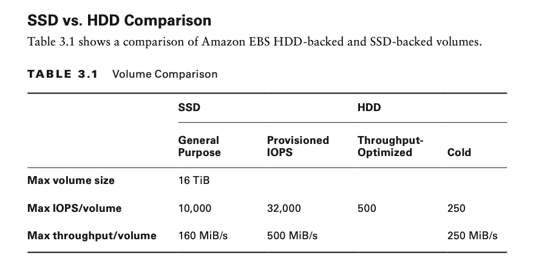

# Hello, Storage

# Introduction to AWS Storage

The AWS Cloud is a reliable, scalable, and secure location for your data. Cloud storage is typically more reliable,
scalable, and secure than traditional, on-premises storage systems.

AWS offers object storage, file storage, block storage and data transfer services.

# Storage Fundamentals

- For block storage, Amazon has Amazon Elastic Block Store (Amazon EBS).
- For file storage, AWS has Amazon Elastic File System (Amazon EFS).
- For object storage, AWS has Amazon Simple Storage Services(Amazon S3) and Amazon S3 glacier.

## Velocity, Variety, and Volume

The first dimension to consider comprises the three Vs of big data: velocity, variety, and volume. These concepts are
applicable to more than big data. It is important to identify these traits for any data that you are using in your
applications.

**Velocity** is the speed at which data is being read or written, measured in reads per second (RPS) or writes per
second (WPS). The velocity can be based on batch processing, periodic, near-real-time, or real-time speeds.

**Variety** determines how structured the data is and how many different structures exist in the data. This can range
from highly structured to loosely structured, unstructured, or binary large object (BLOB) data.

**Volume** is the total size of the dataset. There are two main uses for data: developing valuable insight and storage
for later use.

## Storage Temperature

Data temperature is another useful way of looking at data to determine the right storage for your application. It helps
us understand how "lively" the data is: how much is being written or read and how soon it needs to be available.

**Hot** data is being worked on actively; that is, new ingests, updates, and transformations are actively contributing
to it.

**Warm** data is still being actively accessed, but less frequently than hot data. Often, items can be as small as in
hot
workloads but are updated and read in sets. Speed of access, while important, is not as crucial as with hot data. Warm
data is more balanced across the velocity and volume dimensions.

**Cold** data still needs to be accessed occasionally, but updates to this data are rare, so reads can tolerate higher
latency. Items tend to be large (tens of hundreds of megabytes or gigabytes). Items are often written and read
individually. High durability and low cost are essential. Cold data tends to be high-volume and low-velocity.

**Frozen** data needs to be preserved for business continuity or for archival or regulatory reasons, but it is not being
worked on actively. While new data is regularly added to this data store, existing data is never updated. Reads are
extremely infrequent (known as "write once, read never") and can tolerate very high latency. Frozen data tends to be
extremely high-volume and extremely low-velocity.

## Data Value

To optimize cost and/or performance further, segment data within each workload by value and temperature, and consider
different data storage options for different segments.

**Transient data** is often short-lived. The loss of some subset of transient data does not have significant impact on
the system as a whole.

**Reproducible data** contains a copy of useful information that is often created to improve performance or simplify
consumption, such as adding more structure or altering a structure to match consumption patterns.

**Authoritative data** is the source of truth. Losing this data will have significant business impact because it will be
difficult, or even impossible, to restore or replace it. For this data, we are willing to invest in additional
durability.

**Critical/Regulated data** is data that a business must retain at almost any cost. This data tends to be stored for
long periods of time and needs to be protected from accidental and malicious changes—not just data loss or corruption.
Therefore, in addition to durability, cost and security are equally important factors.

## One Tool Does Not Fit All

Likewise, there is no one-size-fits-all solution for data storage. Analyze your data and understand the dimensions that
we have discussed.

For the exam, know the availability, level of durability, and cost factors for each storage option and how they compare.

## Block, Object, and File Storage

### Block Storage

Some enterprise applications, like databases or enterprise resource planning systems (ERP systems), can require
dedicated, low-latency storage for each host. This is analogous to direct-attached storage (DAS) or a storage area
network (SAN). Block-based cloud storage solutions like Amazon EBS are provisioned with each Amazon Elastic Compute
Cloud (Amazon EC2) instance and offer the ultra-low latency required for high-performance workloads.

### Object Storage

Object storage solutions like Amazon S3 are ideal for building modern applications from scratch that require scale and
flexibility and can also be used to import existing data stores for analytics, backup, or archive. Cloud object storage
makes it possible to store virtually limitless amounts of data in its native format.

### File Storage

File storage solutions like Amazon EFS are ideal for use cases such as large content repositories, development
environments, media stores, or user home directories.

## AWS Shared Responsibility Model and Storage

AWS is responsible for securing the storage services. As a developer and customer, you are responsible for securing
access to and using encryption on the artifacts you create or objects you store.

It is a best practice always to use the principle of least privilege as part of your responsibility for using AWS Cloud
storage.

## Confidentiality, Integrity, Availability Model

The confidentiality, integrity, availability model (CIA model) forms the fundamentals of information security, and you
can apply the principles of the CIA model to AWS storage. Confidentiality can be equated to the privacy level of your
data. It refers to levels of your data.

Confidentiality can be equated to the privacy level of your data. It refers to levels of encryption or access policies
for your storage or individual files.

Integrity refers to whether your data is trustworthy and accurate.

Restrict permission of who can modify data and enable backup and versioning.

Availability refers to the availability of a service on AWS for storage, where an authorized party can gain reliable
access to the resource.

Restrict permission of who can delete data, enable multi-factor authentication (MFA) for Amazon S3 delete operation,
and enable backup and versioning.

# AWS Block Storage Services

## Amazon Elastic Block Store

Amazon EBS presents your data to your Amazon EC2 instance as a disk volume, providing the lowest-latency access to your
data from single Amazon EC2 instances.

Each Amazon EBS volume is automatically replicated within its Availability Zone to protect your information from
component failure, offering high availability and durability.

Typical use cases for Amazon EBS ;

- Boot volumes on Amazon EC2 instances.
- Relational and NoSQL databases.
- Stream and log processing applications.
- Data warehousing applications.
- Big data analytics engines (like Hadoop/HDFS Amazon EMR)

Amazon EBS is designed to achieve the following:

- Availability of 99.999 percent
- Durability of replication within a single availability zone
- Annual failure rate (AFR) of between 0.1 and 0.2 percent

## Amazon EBS Volumes

Amazon EBS volumes persist independently from the running life of an Amazon EC2 instance. After a volume is attached to
an instance, use it like any other physical hard drive.

**Solid-state drive (SSD)** –backed volumes are optimized for transactional workloads involving frequent read/write
operations with small I/O size, where the dominant performance attribute is IOPS.

**Hard disk drive (HDD)** –backed volumes are optimized for large streaming workloads where throughput (measured in
MiB/s) is a better performance measure than IOPS.

## Elastic Volumes

Elastic Volumes is a feature of Amazon EBS that allows you to increase capacity dynamically, tune performance, and
change the type of volume live. This can be done with no downtime or performance impact and with no changes to your
application.

## Amazon EBS Snapshots

You can protect your data by creating point-in-time snapshots of Amazon EBS volumes, which are backed up to Amazon S3
for long-term durability. The volume does not need to be attached to a running instance to take a snapshot.

Snapshots are incremental backups, meaning that only the blocks on the volume that have changed after your most recent
snapshot are saved, making this a cost-effective way to back up your block data.
For example, if you have a volume with 100 GiB of data, but only 5 GiB of data have changed since your last snapshot,
only the 5 GiB of modified data is written to Amazon S3.

## Amazon EBS Optimization

Recall that Amazon EBS volumes are network-attached and not directly attached to the host like instance stores.
On instances without support for Amazon EBS–optimized throughput, network traffic can contend with traffic between your
instance and your Amazon EBS volumes. On Amazon EBS–optimized instances, the two types of traffic are kept separate.

## Amazon EBS Encryption

For simplified data encryption, create encrypted Amazon EBS volumes with the Amazon EBS encryption feature.
All Amazon EBS volume types support encryption, and you can use encrypted Amazon EBS volumes to meet a wide range of
data-at-rest encryption requirements for regulated/audited data and applications.

Amazon EBS encryption uses 256-bit Advanced Encryption Standard (AES-256) algorithms and an Amazon-managed key
infrastructure called AWS Key Management Service (AWS KMS).

You can encrypt using an AWS KMS–generated key, or you can choose to select a customer master key (CMK) that you create
separately using AWS KMS.

You can also encrypt your files prior to placing them on the volume. Snapshots of encrypted Amazon EBS volumes are
automatically encrypted. Amazon EBS volumes that are restored from encrypted snapshots are also automatically encrypted.

## Amazon EBS Performance

**Use Amazon EBS-optimized instances**

The dedicated network throughput that you get when you request Amazon EBS–optimized support will make volume performance
more predictable and consistent, and your Amazon EBS volume network traffic will not have to contend with your other
instance traffic because they are kept separate.

**Understand how performance is calculated**

When you measure the performance of your Amazon EBS volumes, it is important to understand the units of measure involved
and how performance is calculated.

**Understand your workload**

There is a relationship between the maximum performance of your Amazon EBS volumes, the size and number of I/O
operations, and the time it takes for each action to complete. Each of these factors affects the others, and different
applications are more sensitive to one factor or another.

**Be aware of the performance penalty when initializing volumes from snapshots**

New Amazon EBS volumes receive their maximum performance the moment that they are available and do not require
initialization (formerly known as pre-warming).

**Factors that can degrade HDD performance**

When you create a snapshot of a Throughput-Optimized HDD or Cold HDD volume, performance may drop as far as the volume’s
baseline value while the snapshot is in progress. This behavior is specific only to these volume types.

**Increase read-ahead for high-throughput, read-heavy workloads**

Some workloads are read-heavy and access the block device through the operating system page cache (for example, from a
file system). In this case, to achieve the maximum throughput, we recommend that you configure the read-ahead setting to
1 MiB. This is a per-block-device setting that should be applied only to your HDD volumes.

**Use RAID 0 to maximize utilization of instance resources**

Some instance types can drive more I/O throughput than what you can provision for a single Amazon EBS volume. You can
join multiple volumes of certain instance types together in a RAID 0 configuration to use the available bandwidth for
these instances.

**Track performance with Amazon CloudWatch**

Amazon CloudWatch, a monitoring and management service, provides performance metrics and status checks for your Amazon
EBS volumes.

## Amazon EBS Troubleshooting

If you are using an Amazon EBS volume as a boot volume, your instance is no longer accessible, and you cannot use SSH
or Remote Desktop Protocol (RDP) to access that boot volume.

If you have an Amazon EC2 instance based on an Amazon Machine Image (AMI), you may just choose to terminate the instance
and create a new one.

If you do need access to that Amazon EBS boot volume, perform the following steps to make it accessible:

- Create a new Amazon EC2 instance with its own boot volume (a micro instance is great for this purpose).
- Detach the root Amazon EBS volume from the troubled instance.
- Attach the root Amazon EBS volume from the troubled instance to your new Amazon EC2 instance as a secondary volume.
- Connect to the new Amazon EC2 instance, and access the files on the secondary volume.

## Instance Store

Amazon EC2 instance store is another type of block storage available to your Amazon EC2 instances.
It provides temporary block-level storage, and the storage is located on disks that are physically attached to the host
computer (unlike Amazon EBS volumes, which are network-attached).

### Instance Store Volumes

Instance store should not be used for persistent storage needs. It is a type of ephemeral (short-lived) storage that
does not persist if the instance fails or is terminated.

After you launch an instance, the instance store volumes are available to the instance, but you cannot access them until
they are mounted.

Do not use instance store for any production data.

### Instance Store–Backed Amazon EC2 Instances

With Amazon EC2, you can use both instance store–backed storage volumes and Amazon EBS–backed storage volumes with your
instances, meaning you can have your instance boot off instance store; however, you would want this configured so that
you are using an AMI and that new instances will be created if one fails.

Instance store–backed Amazon EC2 instances cannot be stopped and cannot take advantage of the auto recovery feature for
Amazon EC2 instances.

# AWS Object Storage Services

An object is a piece of data like a document, image, or video that is stored with some metadata in a flat structure.

## Amazon Simple Storage Service

Building a web application, which delivers content to users by retrieving data via making API calls over the internet,
is not a difficult task with Amazon S3. Amazon Simple Storage Service (Amazon S3) is storage for the internet.

### Buckets

A bucket is a container for objects stored in Amazon S3. Every object is contained in a bucket.

### Limitations

The following are limitations of which you should be aware when using Amazon S3 buckets:

- Do not use buckets as folders, because there is a maximum limit of 100 buckets per account.
- You cannot create a bucket within another bucket.
- A bucket is owned by the AWS account that created it, and bucket ownership is not transferable.
- A bucket must be empty before you can delete it.
- After bucket is deleted , that name becomes available to reuse, but the name might not be available for you to reuse
  for various reasons, such as someone else taking the name after you release it when deleting the bucket. If you expect
  to use same bucket name, do not delete the bucket.

You can only create up to 100 buckets per account. Do not use buckets as folders or design your application in a way
that could result in more than 100 buckets as your application or data grows.

### Universal Namespace

A bucket name must be unique across all existing bucket names in Amazon S3 across all of AWS.
Not just within your account or within your chosen AWS Region. You must comply with Domain Name System (DNS) naming
conventions when choosing a bucket name.

The rules for DNS-compliant bucket names are as follows:

- Bucket names must be at least 3 and no more than 63 characters long.
- A bucket name must consist of a series of one or more labels, with adjacent labels separated by a single period (.).
- A bucket name must contain lowercase letters, numbers, and hyphens.
- Each label must start and end with a lowercase letter or number.
- Bucket names must not be formatted like IP addresses (for example, 192.168.5.4).
- AWS recommends that you do not use periods (.) in bucket names. When using virtual hosted-style buckets with Secure
  Sockets Layer (SSL), the SSL wildcard certificate only matches buckets that do not contain periods. To work around
  this, use HTTP or write your own certificate verification logic.

AWS S3 bucket names must be universally unique.

### Versioning

Versioning is a means of keeping multiple variants of an object in the same bucket. You can use versioning to preserve,
retrieve, and restore every version of every object stored in your Amazon S3 bucket, including recovering deleted
objects.

There are several reasons that developers will turn on versioning of files in Amazon S3, including the following:

- Protecting from accidental deletion.
- Recovering an earlier version.
- Retrieving deleted objects.

Versioning is turned off by default. When you turn on versioning, Amazon S3 will cre- ate new versions of your object
every time you overwrite a particular object key. Every time you update an object with the same key, Amazon S3 will
maintain a new version of it.

Amazon S3 versioning tracks the changes over time.

Amazon S3 versioning also protects against unintended deletes. If you issue a delete command against an object in a
versioned bucket, AWS places a delete marker on top of that object, which means that if you perform a GET on it, you
will receive an error as if the object does not exist. However, an administrator, or anyone else with the necessary
permissions, could remove the delete marker and access the data.

Versioning-enabled buckets let you recover objects from accidental deletion or overwrite. Your bucket’s versioning
configuration can also be MFA Delete–enabled for an additional layer of security.

It is easy to set up a lifecycle policy to control the amount of data that’s being retained when you use versioning on a
bucket.

Once you enable versioning on a bucket, it can never return to an unversioned state. You can, however, suspend
versioning on that bucket.

### Region

Amazon S3 creates buckets in a region that you specify. You can choose any AWS Region that is geographically close to
you to optimize latency, minimize costs, or address regulatory requirements.

Objects belonging to a bucket that you create in a specific AWS Region never leave that region unless you explicitly
transfer them to another region.

### Operations on Buckets

There are a number of different operations (API calls) that you can perform on Amazon S3 buckets.

## Object

You can store an unlimited number of objects within Amazon S3, but an object can only be between 1 byte to 5 TB in size.
If you have objects larger than 5 TB, use a file splitter and upload the file in chunks to Amazon S3. Then reassemble
them if you download the file parts for later use.

The largest object that can be uploaded in a single PUT is 5 GB. For objects larger than 100 MB, you should consider
using multipart upload.For any objects larger than 5 GB, you must use multipart upload.

### Object Facets

An object consists of the following facets:

**Key**

The key is the name that you assign to an object, which may include a simulated folder structure. Each key must be
unique within a bucket (unless the bucket has versioning turned on).

Amazon S3 URLs can be thought of as a basic data map between “bucket + key + version” and the web service endpoint. For
example, in the URL http://doc.s3.amazonaws.com/ 2006-03-01/AmazonS3.wsdl, doc is the name of the bucket and
2006-03-01/AmazonS3.wsdl is the key.

**Version ID**

Within a bucket, a key and version ID uniquely identify an object. If versioning is turned off, you have only a single
version. If versioning is turned on, you may have multiple versions of a stored object.

**Value**

The value is the actual content that you are storing. An object value can be any sequence of bytes, and objects can
range in size from 1 byte up to 5 TB.

**Metadata**

Metadata is a set of name-value pairs with which you can store information regarding the object. You can assign
metadata, referred to as user-defined metadata, to your objects in Amazon S3. Amazon S3 also assigns system metadata to
these objects, which it uses for managing objects.

**Subresources**

Amazon S3 uses the subresource mechanism to store additional object-specific information. Because subresources are
subordinates to objects, they are always associated with some other entity such as an object or a bucket.

**Access Control Information**

You can control access to the objects you store in Amazon S3. Amazon S3 supports both resource-based access control,
such as an ACL and bucket policies, and user-based access control.

### Object Tagging

Object tagging enables you to categorize storage. Each tag is a key-value pair.

Note the following limitations when working with tagging:

- You can associate 10 tags with an object, and each tag associated with an object must have unique tag keys.
- A tag key can be up to 128 Unicode characters in length, and tag values can be up to 256 Unicode characters in length.
- Keys and values are case sensitive.

### Cross-Origin Resource Sharing

Cross-Origin Resource Sharing (CORS) defines a way for client web applications that are loaded in one domain to interact
with resources in a different domain. With CORS support in Amazon S3, you can build client-side web applications with
Amazon S3 and selectively allow cross-origin access to your Amazon S3 resources while avoiding the need to use a proxy.

Suppose that you host a web font from your Amazon S3 bucket. Browsers require a CORS check (also referred as a preflight
check) for loading web fonts, so you would configure the bucket that is hosting the web font to allow any origin to make
these requests.

## Storage Classes

There are several different storage classes from which to choose when using Amazon S3. Your choice will depend on your
level of need for durability, availability, and performance for your application.

### Amazon S3 Standard

Amazon S3 Standard offers high-durability, high-availability, and performance- object storage for frequently accessed
data. Amazon S3 Standard is ideal for a wide variety of use cases, including the following:

- Cloud applications
- Dynamic websites
- Content distribution
- Mobile and gaming applications
- Big data analytics

Amazon S3 Standard is designed to achieve durability of 99.999999999 percent of objects (designed to sustain the loss of
data in two facilities) and availability of 99.99 percent over a given year (which is backed by the Amazon S3 Service
Level Agreement).

### Reduced Redundancy Storage

Reduced Redundancy Storage (RRS) (or Reduced_Redundancy) is an Amazon S3 storage option that enables customers to store
noncritical, reproducible data at lower levels of redundancy than Amazon S3 Standard storage. It provides a highly
available solution for distributing or sharing content that is durably stored elsewhere or for objects that can easily
be regenerated, such as thumbnails or transcoded media.

### Amazon S3 Standard-Infrequent Access

Amazon S3 Standard-Infrequent Access (Standard_IA) is an Amazon S3 storage class for data that is accessed less
frequently but requires rapid access when needed.

The ideal use cases for using Standard_IA include the following:

- Long-term storage
- Backups
- Data stores for disaster recovery

Standard_IA is set at the object level and can exist in the same bucket as Amazon S3 Standard, allowing you to use
lifecycle policies to transition objects automatically between storage classes without any application changes.

Standard_IA is designed to achieve availability of 99.9 percent (but low retrieval time) and durability of 99.999999999
percent of objects over a given year (same as Amazon S3 Standard).

### Amazon S3 One Zone-Infrequent Access

Amazon S3 One Zone-Infrequent Access (OneZone_IA) is similar to Amazon S3 Standard-IA. The difference is that the data
is stored only in a single Availability Zone instead of a minimum of three Availability Zones. Because of this, storing
data in OneZone_IA costs 20 percent less than storing it in Standard_IA.

### Amazon Simple Storage Service Glacier

Amazon Simple Storage Service Glacier (Amazon S3 Glacier) is a secure, durable, and extremely low-cost storage service
for data archiving that offers the same high durability as Amazon S3. Unlike Amazon S3 Standard’s immediate retrieval
times, Amazon S3 Glacier’s retrieval times run from a few minutes to several hours.

### Vaults

Amazon S3 Glacier uses vaults as containers to store archives. You can view a list of your vaults in the AWS Management
Console and use the AWS software development kits (SDKs) to perform a variety of vault operations, such as the
following:

- Create Vault
- Delete Vault
- Lock Vault
- ...

