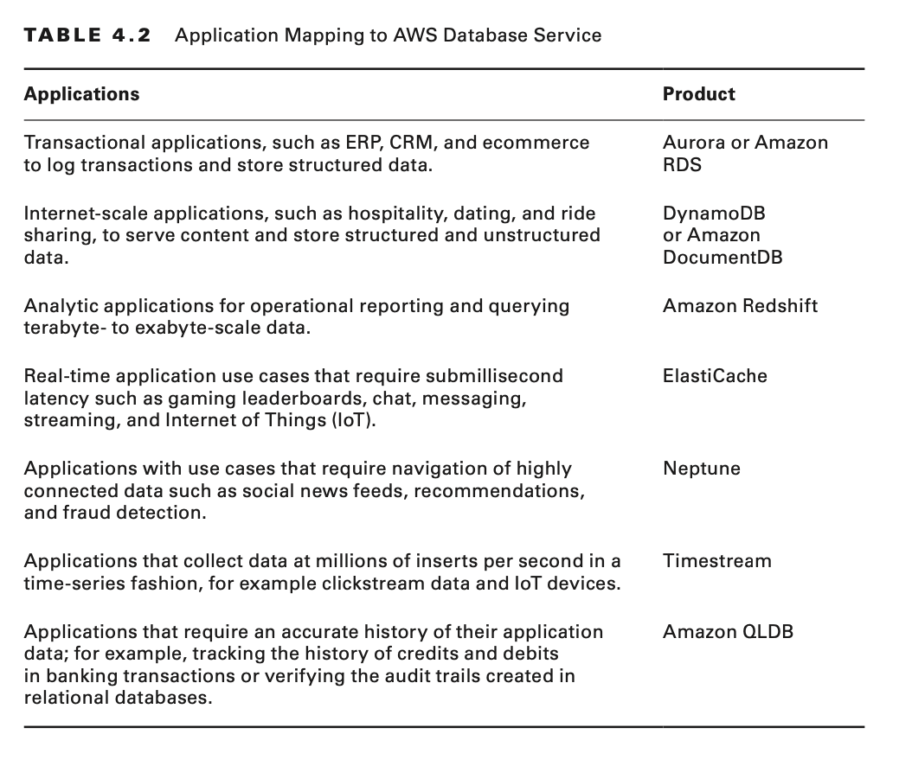
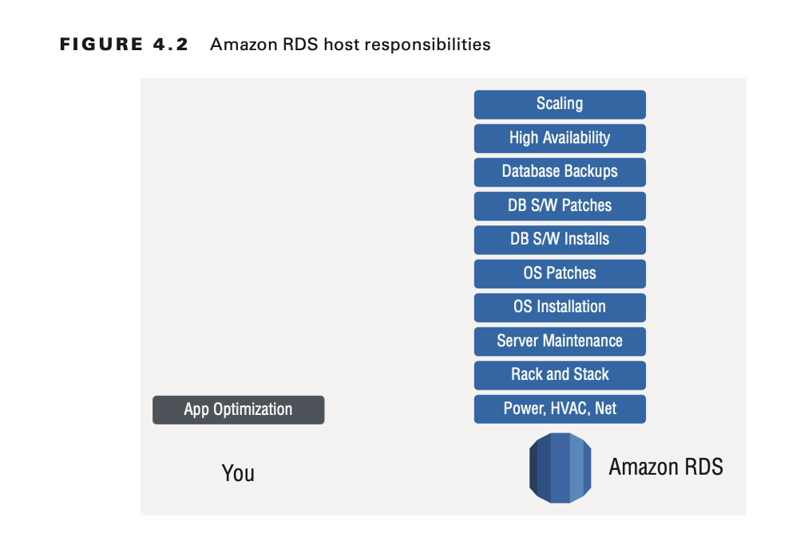
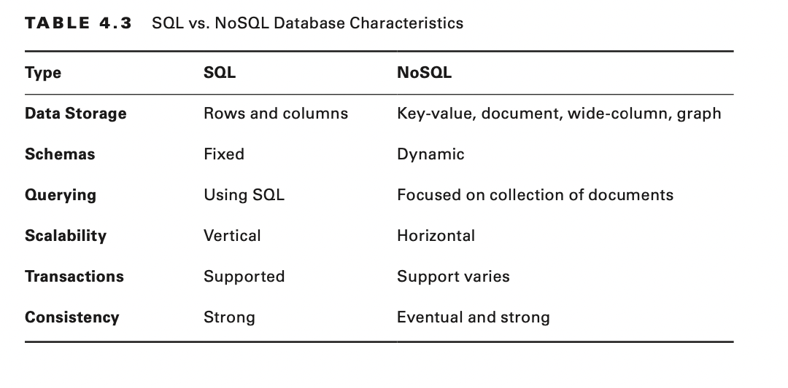
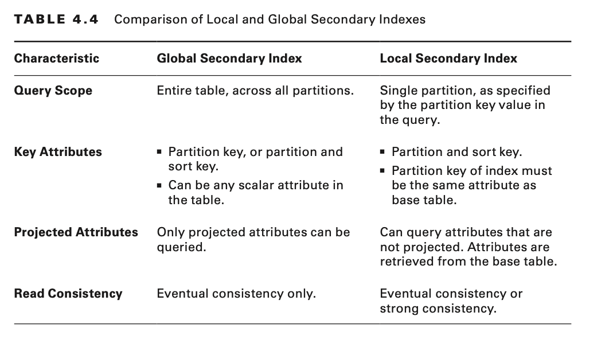
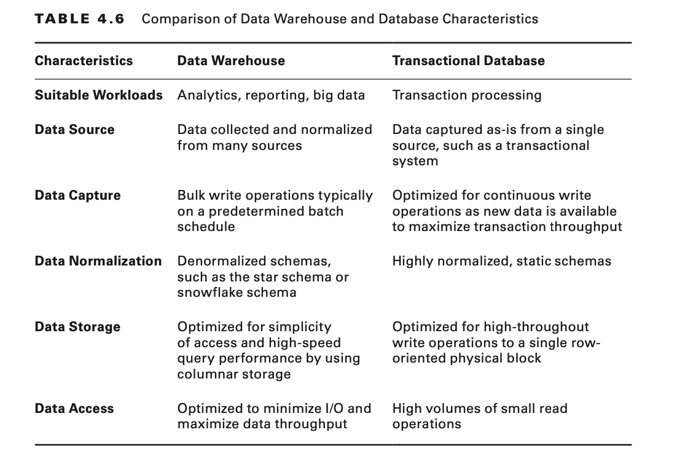

# Hello, Databases

# Introduction to Databases

AWS offers a broad range of databases purposely built for your specific application use cases. You can also set up your
own database platform on the Amazon Elastic Compute Cloud (Amazon EC2). You can easily migrate your existing databases
with the AWS Database Migration Service (AWS DMS) in a cost-effective manner.

AWS Cloud offerings include the following databases:

- Managed relational databases - For transactional applications
- Nonrelational databases—For internet-scale applications
- Data warehouse databases—For analytics
- In-memory data store databases—For caching and real-time workloads
- Time-series databases—For efficiently collecting, synthesizing, and deriving insights from time-series data
- Ledger databases—For when you need a centralized, trusted authority to maintain a scalable, complete, and
  cryptographically verifiable record of transactions
- Graph databases—For building applications with highly connected data

**AWS Database Service Mapping to Database Type**

**Amazon Aurora , Relational Database**

A MySQL- and PostgreSQL-compatible relational database built for the cloud that combines the performance and
availability of traditional enterprise databases with the simplicity and cost-effectiveness of open source databases.

**Amazon Relational Database Service, Amazon RDS, Relational database**

A managed relational database for MySQL, PostgreSQL, Oracle, SQL Server, and MariaDB. Easy to set up, operate, and scale
a relational database in the cloud quickly.

**Amazon DynamoDB , NoSQL Database**

A serverless, managed NoSQL database that delivers consistent single-digit millisecond latency at any scale. Pay only
for the throughput and storage you use.

**Amazon Redshift , Data Warehouse**

A fast, fully managed, petabyte-scale data warehouse at one-tenth the cost of traditional solutions. Simple and
cost-effective solution to analyze data by using standard SQL and your existing business intelligence (BI) tools.

**Amazon ElastiCache , In-memory Data Store**

To deploy, operate, and scale an in-memory data store based on Memcached or Redis in the cloud.

**Amazon Neptune , Graph Database**

A fast, reliable, fully managed graph database to store and manage highly connected datasets.

**Amazon Document DB (with MongoDB compatibility) , Non-relational database**

A fast, scalable, highly available, and fully managed document database service that supports MongoDB workloads.

**Amazon Timestream, Time series database**

A fast, scalable, fully managed time series database service for IoT and operational applications that makes it easy to
store and analyze trillions of events per day at one-tenth the cost of relational databases.

**Amazon Quantum Ledger Database (Amazon QLDB) , Ledger Database**

A fully managed ledger database that provides a transparent, immutable, and cryptographically verifiable transaction log
owned by a central trusted authority.

**AWS Database Migration Service (AWS DMS) , Database Migration**

Help migrate your databases to AWS easily and inexpensively with minimal downtime.

# Relational Databases

A relational database is a collection of data items with predefined relationships between them. These items are
organized as a set of tables with columns and rows. Tables store information about the objects to be represented in the
database.

## Characteristics of Relational Databases

Relational databases include four important characteristics: Structured Query Language, data integrity, transactions,
and atomic, consistent, isolated, and durable compliance.

**Structured Query Language**

Structured query language (SQL) is the primary interface that you use to communicate with relational databases.
The standard American National Standards Institute (ANSI) SQL is supported by all popular relational database engines.
Some of these engines have extensions to ANSI SQL to support functionality that is specific to that engine.

**Data Integrity**

Data integrity is the overall completeness, accuracy, and consistency of data. Relational databases use a set of
constraints to enforce data integrity in the database. These include primary keys, foreign keys, NOT NULL constraints,
unique constraint, default constraints, and check constraints.

**Transactions**

A database transaction is one or more SQL statements that execute as a sequence of operations to form a single logical
unit of work. Transactions provide an all-or-nothing proposition, meaning that the entire transaction must complete as
a single unit and be written to the database, or none of the individual components of the transaction will continue. In
relational database terminology, a transaction results in a COMMIT or a ROLLBACK. Each transaction is treated in a
coherent and reliable way, independent of other transactions.

**ACID Compliance**

All database transactions must be atomic, consistent, isolated, and durable (ACID)– compliant or be atomic, consistent,
isolated, and durable to ensure data integrity.

**Atomicity** requires that the transaction as a whole executes successfully, or if a part of the transaction
fails, then the entire transaction is invalid.

**Consistency** mandates that the data written to the database as part of the transaction must adhere to all defined
rules
and restrictions, including constraints, cascades, and triggers.

**Isolation** is critical to achieving concurrency control, and it makes sure that each transaction is independent unto
itself.

**Durability** requires that all of the changes made to the database be permanent when a transaction is successfully
completed.

## Managed vs. Unmanaged Databases

Managed database services on AWS, such as Amazon RDS, enable you to offload the administrative burdens of operating and
scaling distributed databases to AWS so that you don’t have to worry about the following tasks:

- Hardware provisioning
- Setup and configuration
- Throughput capacity planning
- Replication
- Software patching
- Cluster Scaling

AWS provides a number of database alternatives for developers. As a managed database, Amazon RDS enables you to run a
fully featured relational database while off-loading database administration. By contrast, you can run unmanaged
databases on Amazon EC2, which gives you more flexibility on the types of databases that you can deploy and configure;
however, you are responsible for the administration of the unmanaged databases.

## Amazon Relational Database Service

With Amazon Relational Database Service (Amazon RDS), you can set up, operate, and scale a relational database in the
AWS Cloud. It provides cost-efficient, resizable capacity for open-standard relational database engines. Amazon RDS is
easy to administer, and you do not need to install the database software. Amazon RDS manages time-consuming database
administration tasks, which frees you up to focus on your applications and business. For example, Amazon RDS
automatically patches the database software and backs up your database.

Amazon RDS assumes many of the difficult or tedious management tasks of a relational database:

**Procurement, configuration, and backup tasks**

**Security and availability**

## Relational Database Engines on Amazon RDS

Amazon RDS provides six familiar database engines: Amazon Aurora, Oracle, Microsoft SQL Server, PostgreSQL, MySQL, and
MariaDB. Because Amazon RDS is a managed ser- vice, you gain a number of benefits and features built right into the
Amazon RDS service.

- Automatic software patching
- Easy vertical scaling
- Easy storage scaling
- Read replicas
- Automatic backups
- Database snapshots
- Multi-AZ deployments
- Encryption
- IAM DB authentication
- Monitoring and metrics with Amazon CloudWatch.

### Automatic Software Patching

Periodically, Amazon RDS performs maintenance on Amazon RDS resources. Maintenance mostly involves patching the Amazon
RDS database underlying operating system (OS)or database engine version. Because this is a managed service, Amazon RDS
handles the patching for you.

### Vertical Scaling

If your database needs to handle a bigger load, you can vertically scale your Amazon RDS instance. At the time of this
writing, there are 40 available DB instance classes, which enable you to choose the number of virtual CPUs and memory
available.

### Easy Storage Scaling

Storage is a critical component for any database. Amazon RDS has the following three storage types:

**General Purpose SSD (gp2)**

This storage type is for cost-effective storage that is ideal for a broad range of workloads. Gp2 volumes deliver
single-digit millisecond latencies and the ability to burst to 3,000 IOPS for extended periods of time. The volume’s
size determines the performance of gp2 volumes.

**Provisioned IOPS (io1)**

This storage type is for input/output-intensive workloads that require low input/output (I/O) latency and consistent I/O
throughput.

**Magnetic Storage**

This storage type is designed for backward compatibility, and AWS recommends that you use General Purpose SSD or
Provisioned IOPS for any new Amazon RDS workloads.

### Read Replicas (Horizontal Scaling)

There are two ways to scale your database tier with Amazon RDS: vertical scaling and horizontal scaling. Vertical
scaling takes the primary database and increases the amount of memory and vCPUs allocated for the primary database.
Alternatively, use horizontal scaling (add another server) to your database tier to improve the performance of
applications that are read-heavy as opposed to write-heavy.

Read replicas create read-only copies of your master database, which allow you to offload any reads (or SQL SELECT
statements) to the read replica. The replication from the master database to the read replica is asynchronous. As a
result, the data queried from the read replica is not the latest data. If your application requires strongly consistent
reads, consider an alternative option.

At the time of this writing, Amazon RDS MySQL, PostgreSQL, and MariaDB support up to five read replicas, and Amazon
Aurora supports up to 15 read replicas. Microsoft SQL Server and Oracle do not support read replicas.

## Backing Up Data with Amazon RDS

Amazon RDS has two different ways of backing up data of your database instance: auto-mated backups and database
snapshots (DB snapshots).

### Automated Backups (Point-in-Time)

With Amazon RDS, automated backups offer a point-in-time recovery of your database. When enabled, Amazon RDS performs a
full daily snapshot of your data that is taken during your preferred backup window.

You can perform a restore up to the specific second, as long as it’s within your retention period. The default retention
period is seven days, but it can be a maximum of up to 35 days.

### Database Snapshots (Manual)

Unlike automated backups, database snapshots with Amazon RDS are user-initiated and enable you to back up your database
instance in a known state at any time. You can also restore to that specific snapshot at any time.

## Multi-AZ Deployments

In a Multi-AZ configuration, you have a primary and a standby DB instance. Updates to the primary database replicate
synchronously to the standby replica in a different Availability Zone.

The primary benefit of Multi-AZ is realized during certain types of planned maintenance, or in the unlikely event of a
DB instance failure or an Availability Zone failure.

Amazon RDS automatically fails over to the standby so that you can resume your workload as soon as the standby is
promoted to the primary.This means that you can reduce your downtime in the event of a failure.
Because Amazon RDS is a managed service, Amazon RDS handles the fail to the standby. When there is a DB instance
failure, Amazon RDS automatically promotes the standby to the primary—you will not interact with the standby directly.

Amazon RDS Multi-AZ configuration provides the following benefits:

- Automatic failover; no administration required.
- Increased durability in the unlikely event of component failure
- Increased availability in the unlikely event of an Availability Zone failure
- Increased availability for planned maintenance (automated backups; I/O activity is no longer suspended)

## Encryption

For encryption at rest, Amazon RDS uses the AWS Key Management Service (AWS KMS) for AES-256 encryption.
You can use a default master key or specify your own for the Amazon RDS DB instance. Encryption is one of the few
options that must be configured when the DB instance is created.
You cannot modify an Amazon RDS database to enable encryption. You can, however, create a DB snapshot and then restore
to an encrypted DB instance or cluster.

Amazon RDS supports using the Transparent Data Encryption (TDE) for Oracle and SQL Server.

For encryption in transit, Amazon RDS generates an SSL certificate for each database instance that can be used to
connect your application and the Amazon RDS instance.

## IAM DB Authentication

You can authenticate to your DB instance by using IAM. By using IAM, you can manage access to your database resources
centrally instead of storing the user credentials in each database. The IAM feature also encrypts network traffic to and
from the database by using SSL.

IAM DB authentication is supported only for MySQL and PostgreSQL.

## Monitoring with Amazon CloudWatch

Use Amazon CloudWatch to monitor your database tier. You can create alarms to notify database administrators when there
is a failure.

By default, CloudWatch provides some built-in metrics for Amazon RDS with a granularity of 5 minutes (600 seconds).

Amazon RDS integrates with CloudWatch to send it the following database logs:

- Audit log
- Error log
- General log
- Slow query log

## Amazon Aurora

Amazon Aurora is a MySQL- and PostgreSQL-compatible relational database engine that combines the speed and availability
of high-end commercial databases with the simplicity and cost-effectiveness of open source databases.

### Amazon Aurora DB Clusters

The integration of Aurora with Amazon RDS means that time-consuming administration tasks, such as hardware
provisioning, database setup, patching, and backups, are automated.

Aurora features a distributed, fault-tolerant, self-healing storage system that automatically scales up to 64 TiB per
database instance.

Aurora delivers high performance and availability with up to 15 low-latency read replicas, point-in-time recovery,
continuous backup to Amazon Simple Storage Service (Amazon S3), and replication across three Availability Zones.

When you create an Aurora instance, you create a DB cluster.
A DB cluster consists of one or more DB instances and a cluster volume that manages the data for those instances.

An Aurora cluster volume is a virtual database storage volume that spans multiple Availability Zones, and each
Availability Zone has a copy of the DB cluster data.

An Aurora DB cluster has two types of DB instances:

**Primary Instance**

Supports read and write operations and performs all of the data modifications to the cluster volume. Each Aurora DB
cluster has one primary instance.

**Amazon Aurora Replica**

Supports read-only operations. Each Aurora DB cluster can have up to 15 Amazon Aurora Replicas in addition to the
primary instance. Multiple Aurora Replicas distribute the read workload, and if you locate Aurora Replicas in separate
Availability Zones, you can also increase database availability.

Aurora is engineered and architected for the cloud. The primary difference is that there is a separate storage layer,
called the cluster volume, which is spread across multiple Availability Zones in a single AWS Region. This means that
the durability of your data is increased.

### Amazon Aurora Global Databases

With Aurora, you can also create a multiregional deployment for your database tier.
In this configuration, the primary AWS Region is where your data is written.

The secondary AWS Region is used for reading data only. Aurora replicates the data to the secondary AWS Region with
typical latency of less than a second. Furthermore, you can use the secondary AWS Region for disaster recovery purposes.

- US East (N. Virginia)
- US East (Ohio)
- US West (Oregon)
- EU (Ireland)

Additionally, at the time of this writing, Aurora global databases are available only for MySQL 5.6.

### Amazon Aurora Serverless

Aurora Serverless is an on-demand, automatic scaling configuration for Aurora.
With Aurora Serverless, the database will automatically start up, shut down, and scale capacity up or down based on your
application’s needs. T

## Best Practices for Running Databases on AWS

**Follow Amazon RDS basic operational guidelines.**

The Amazon RDS Service Level Agreement requires that you follow these guidelines:

- Monitor your memory, CPU, and storage usage. Amazon CloudWatch can notify you when usage patterns change or when you
  approach the capacity of your deployment so that you can maintain system performance and availability.
- Scale up your DB instance when you approach storage capacity limits. Have some buffer in storage and memory to
  accommodate unforeseen increases in demand from your applications.
- Enable automatic backups, and set the backup window to occur during the daily low in write IOPS.
- If your database workload requires more I/O than you have provisioned, recovery after a failover or database failure
  will be slow. To increase the I/O capacity of a DB instance, do any or all of the following:
    - Migrate to a DB instance class with high I/O capacity.
    - Convert from standard storage either to General Purpose or Provisioned IOPS storage, depending on how much of an
      increase you need.
    - If you are already using Provisioned IOPS storage, provision additional throughput capacity.
- If your client application is caching the Domain Name Service (DNS) data of your DB instances, set a time-to-live (
  TTL) value of less than 30 seconds. Because the underlying IP address of a DB instance can change after a failover,
  caching the DNS data for an extended time can lead to connection failures if your application tries to connect to an
  IP address that no longer is in service.

**Allocate sufficient RAM to the DB instance.**

An Amazon RDS performance best practice is to allocate enough RAM so that your working set resides almost completely in
memory. Check the ReadIOPS metric by using CloudWatch while the DB instance is under load to view the working set. The
value of ReadIOPS should be small and stable. Scale up the DB instance class until ReadIOPS no longer drops dramatically
after a scaling operation or when ReadIOPS is reduced to a small amount.

**Implement Amazon RDS security.**

Use IAM accounts to control access to Amazon RDS API actions, especially actions that create, modify, or delete Amazon
RDS resources, such as DB instances, security groups, option groups, or parameter groups, and actions that perform
common administrative actions, such as backing up and restoring DB instances, or configuring Provisioned IOPS storage.

- Assign an individual IAM account to each person who manages Amazon RDS resources. Do not use an AWS account user to
  manage Amazon RDS resources; create an IAM user for everyone, including yourself.
- Grant each user the minimum set of permissions required to perform his or her duties.
- Use IAM groups to manage permissions effectively for multiple users.
- Rotate your IAM credentials regularly.

**Use enhanced monitoring to identify OS issues.**

Amazon RDS provides metrics in real time for the OS on which your DB instance runs. You can view the metrics for your DB
instance by using the console or consume the Enhanced Monitoring JSON output from CloudWatch Logs in a monitoring system
of your choice.

**Use metrics to identify performance issues.**

To identify performance issues caused by insufficient resources and other common bottlenecks, you can monitor the
metrics available for your Amazon RDS DB instance.

**Tune queries.**

One of the best ways to improve DB instance performance is to tune your most commonly used and most resource-intensive
queries to make them less expensive to run.

You can use the Database Engine Tuning Advisor to get potential index improvements for your DB instance.

**Use DB parameter groups.**

AWS recommends that you apply changes to the DB parameter group on a test DB instance before you apply parameter group
changes to your production DB instances.

**Use read replicas.**

Use read replicas to relieve pressure on your master node with addi- tional read capacity. You can
bring your data closer to applications in different regions and promote a read replica to a master for faster recovery
in the event of a disaster.

You can use the AWS Database Migration Service (AWS DMS) to migrate or replicate your existing databases easily to
Amazon RDS.

# Nonrelational Databases

Nonrelational databases are commonly used for internet-scale applications that do not require any complex queries.

## NoSQL Database

NoSQL databases are nonrelational databases optimized for scalable performance and schema-less data models. NoSQL
databases are also widely recognized for their ease of development, low latency, and resilience.

## When to Use a NoSQL Database

NoSQL databases are a great fit for many big data, mobile, and web applications that require greater scale and higher
responsiveness than traditional relational databases. Because of simpler data structures and horizontal scaling, NoSQL
databases typically respond faster and are easier to scale than relational databases.

## Comparison of SQL and NoSQL Databases

Relational database management systems (RDBMS) and nonrelational (NoSQL) databases have different strengths and
weaknesses. In a RDBMS, data can be queried flexibly, but queries are relatively expensive and do not scale well in
high-traffic situations.

## NoSQL Database Types

There are four types of NoSQL databases: columnar, document, graph, and in-memory key-value. Generally, these databases
differ in how the data is stored, accessed, and structured, and they are optimized for different use cases and
applications.

**Columnar databases**

Columnar databases are optimized for reading and writing columns of data as opposed to rows of data. Column-oriented
storage for database tables is an important factor in analytic query performance because it drastically reduces the
overall disk I/O requirements and reduces the amount of data that you must load from disk.

**Document databases**

Document databases are designed to store semi-structured data as documents, typically in JSON or XML format. Unlike
traditional relational databases, the schema for each NoSQL document can vary, giving you more flexibility in organizing
and storing application data and reducing storage required for optional values.

**Graph databases**

Graph databases store vertices and directed links called edges. Graph databases can be built on both SQL and NoSQL
databases. Vertices and edges can each have properties associated with them.

**In-memory key-value stores**

In-memory key-value stores are NoSQL databases optimized for read-heavy application workloads (such as social
networking, gaming, media sharing, and Q&A portals) or compute-intensive workloads (such as a recommendation engine).

## Amazon DynamoDB

Amazon DynamoDB is a fast and flexible NoSQL database service for all applications that need consistent, single-digit
millisecond latency at any scale. It is a fully managed cloud database, and it supports both document and key-value
store models. Its flexible data model, reliable performance, and automatic scaling of throughput capacity make it a
great fit for the following:

- Mobile
- Gaming
- Adtech
- Internet of Things
- Applications that do not require complex queries

## Core Components of Amazon DynamoDB

In DynamoDB, tables, items and attributes are the common components with which you work.
A table is a collection of items, and each item is a collection of attributes.
DynamoDB uses partition keys to identify uniquely each item in a table. Secondary indexes can be used to provide more
querying flexibility. YOu can use DynamoDB streams to capture data modification events in DynamoDB tables.

## Tables

Similar to other databases systems , DynamoDB stores data in tables. A table is a collection of items.
For example, a table called People could be used to store personal contact information about friends, family, or anyone
else of interest.

## Items

An item in DynamoDB is similar in many ways to rows, records, or tuples in other database systems. Each DynamoDB table
contains zero or more items. An item is a collection of attributes that is uniquely identifiable for each record in that
table.

## Attributes

Each item is composed of one or more attributes. Attributes in DynamoDB are similar in many ways to fields or columns in
other database systems.

Some of the items have a nested attribute. DynamoDB supports nested attributes up to 32 levels deep.

## Primary Key

When you create a table, at a minimum, you are required to specify the table name and pri- mary key of the table. The
primary key uniquely identifies each item in the table. No two items can have the same key within a table.

DynamoDB supports two different kinds of primary keys: partition key and partition key and sort key.

**Partition Key(Hash Key)**

A simple primary key, composed of one attribute, is known as the partition key. DynamoDB uses the partition key’s value
as an input to an internal hash function. The output from the hash function determines the partition (physical storage
internal to DynamoDB) in which the item is stored

**Partition key and sort key (range attribute)**

A composite primary key is composed of two attributes: partition key and the sort key.

The sort key of an item is also known as its range attribute. The term range attribute derives from the way that
DynamoDB stores items with the same partition key physically close together, in sorted order, by the sort key value.

## Secondary Indexes

If you want to perform queries on attributes that are not part of the table’s primary key, you can create a secondary
index. By using a secondary index, you can query the data in the table by using an alternate key, in addition to
querying against the primary key.

A secondary index contains the following:

- Primary key attributes
- Alternate key attributes
- (Optional) A subset of other attributes from the base table (projected attributes)

DynamoDB supports two types of secondary indexes: local secondary indexes and global secondary indexes. You can define
up to five global secondary indexes and five local secondary indexes per table.

### Local Secondary Index

A local secondary index is an index that has the same partition key as the base table, but a different sort key.

### Global Secondary Index

A global secondary index is an index with a partition key and a sort key that can be different from those on the base
table.

You can create a global secondary index, not a local secondary index, after table creation.

### Comparison of Local Secondary Indexes and Global Secondary Indexes

## Amazon DynamoDB Streams

Amazon DynamoDB Streams is an optional feature that captures data modification events in DynamoDB tables. The data about
these events appears in the stream in near real time and in the order that the events occurred.

In addition to triggers, DynamoDB Streams enables other powerful solutions that devel- opers can create, such as the
following:

- Data replication within and across AWS regions
- Materialized views of data in DynamoDB tables
- Data analysis by using Amazon Kinesis materialized views

## Read Consistency

DynamoDB replicates data among multiple Availability Zones in a region. When your application writes data to a DynamoDB
table and receives an HTTP 200 response (OK), all copies of the data are updated.

### Eventually Consistent Reads

When you read data from a DynamoDB table immediately after a write operation, the response might not reflect the results
of a recently completed write operation. The response might include some stale data. If you repeat your read request
after a short time, the response should return the latest data. DynamoDB uses eventually consistent reads, unless you
specify otherwise.

### Strongly Consistent Reads

When querying data, you can specify whether DynamoDB should return strongly consis- tent reads. When you request a
strongly consistent read, DynamoDB returns a response with the most up-to-date data, reflecting updates from all prior
write operations that were successful. A strongly consistent read might not be available if there is a network delay or
outage.

## Read and Write Throughput

When you create a table or index in DynamoDB, you must specify your capacity requirements for read and write activity.
By defining your throughput capacity in advance, DynamoDB can reserve the necessary resources to meet the read and write
activity your application requires, while ensuring consistent, low-latency performance.

DynamoDB provides the following mechanisms for managing throughput as it changes:

**Amazon DynamoDB Auto Scaling**

DynamoDB automatic scaling actively manages throughput capacity for tables and global secondary indexes. With automatic
scaling, you define a range (upper and lower limits) for read and write capacity unit

**Provisioned throughput**

If you aren’t using DynamoDB auto scaling, you have to define your throughput requirements manually.

**Reserved capacity**

You can purchase reserved capacity in advance, where you pay a one-time upfront fee and commit to a
minimum usage level over a period of time. You may realize significant cost savings compared to on-demand provisioned
throughput settings.

**On-demand**

With On-Demand mode, your DynamoDB table will automatically scale up or down to any previously reached traffic level. If
a workload’s traffic level reaches a new peak, DynamoDB rapidly adapts to accommodate the workload.

## Retrieving Data from DynamoDB

Two primary methods are used to retrieve data from DynamoDB: Query and Scan.

In DynamoDB, you perform Query operations directly on the table or index. To run the Query command, you must specify, at
a minimum, a primary key.

You can also perform Scan operations on a table or index. The Scan operation returns one or more items and item
attributes by accessing every item in a table or a secondary index.

## Global Tables

Global tables build upon the DynamoDB global footprint to provide you with a fully managed, multi region, and
multi-master database that provides fast, local, read-and-write performance for massively scaled, global applications

A global table is a collection of one or more DynamoDB tables, all owned by a single AWS account, identified as replica
tables.

## Object Persistence Model

The DynamoDB object persistence model enables you to map client-side classes to DynamoDB tables. The instances of these
classes (objects) map to items in a DynamoDB table.

You can use the object persistence programming interface to connect to DynamoDB; perform create, read, update, and
delete operations (CRUD); execute queries; and implement optimistic locking with a version number.

## Amazon DynamoDB Local

DynamoDB Local is the downloadable version of DynamoDB that lets you write and test applications by using the Amazon
DynamoDB API without accessing the DynamoDB web service.

## IAM and Fine-Grained Access Control

You can use AWS IAM to grant or restrict access to DynamoDB resources and API actions.

## Backup and Restore

You can create on-demand backups and enable point-in-time recovery for your DynamoDB tables.

On-demand backups create full backups of your tables or restore them on-demand at any time. These actions execute with
zero impact on table performance or availability and without consuming any provisioned throughput on the table.

Point-in-time recovery helps protect your DynamoDB tables from accidental write or delete operations. For example,
suppose that a test script accidentally writes to a production DynamoDB table. With point-in-time recovery, you can
restore that table to any point in time during the last 35 days. DynamoDB maintains incremental backups of your table.
These operations will not affect performance or latency.

## Encryption with Amazon DynamoDB

DynamoDB offers fully managed encryption at rest, and it is enabled by default. DynamoDB uses AWS KMS for encrypting the
objects at rest. By default, DynamoDB uses the AWS-owned customer master key (CMK); however, you can also specify your
own AWS KMS CMK key that you have created.

## Amazon DynamoDB Best Practices

Amazon DynamoDB Partition Key Recommended Strategies

- User ID, where the application has many users , GOOD
- Status code, where there are only a few possible status codes , BAD
- Item creation date, rounded to the nearest time period (for example, day, hour, or minute) , BAD
- Device ID, where each device accesses data at relatively similar intervals , GOOD
- Device ID, where even if there are many devices being tracked, one is by far more popular than all the others , BAD

# Data Warehouse

If you are performing analytics, you may want to use a data warehouse. A data warehouse is a central repository of
information that you can analyze to make better-informed decisions.

## Data Warehouse Architecture

A data warehouse architecture consists of three tiers.

- The bottom tier of the architecture is the database server, where data is loaded and stored.
- The middle tier consists of the analytics engine that is used to access and analyze the data.
- The top tier is the front-end client that presents results through reporting, analysis, and data mining tools.

## Data Warehouse Benefits

Benefits of using a data warehouse include the following:

- Better decision-making
- Consolidation of data from many sources
- Data quality, consistency, and accuracy
- Historical intelligence
- Analytics processing that is separate from transactional databases, improving the performance of both systems

## Comparison of Data Warehouses and Databases

A data warehouse is specially designed for data analytics, which involves reading large amounts of data to understand
relationships and trends across the data. A database is used to capture and store data, such as recording details of a
transaction.

## Comparison of Data Warehouses and Data Lakes

A data warehouse uses a predefined schema that is optimized for analytics. In a data lake, the schema is not defined,
enabling additional types of analytics, such as big data analytics, full text search, real-time analytics, and machine
learning.

## Comparison of Data Warehouses and Data Marts

A data mart is a data warehouse that serves the needs of a specific team or business unit, such as finance, marketing,
or sales. It is smaller, is more focused, and may contain summaries of data that best serve its community of users.

## Amazon RedShift

Amazon Redshift is a fast, fully managed, petabyte-scale data warehouse that makes it simple and cost-effective to
analyze all your data by using standard SQL and your existing BI tools.

With Amazon Redshift, you can run complex analytic queries against petabytes of structured data using sophisticated
query optimization, columnar storage on high- performance local disks, and massively parallel query execution.

### Architecture

An Amazon Redshift data warehouse is a collection of computing resources called nodes, which are organized into a group
called a cluster. Each cluster runs an Amazon Redshift engine and contains one or more databases.

### Client Applications

Amazon Redshift integrates with various data loading and extract, transform, and load (ETL) tools and BI reporting, data
mining, and analytics tools. It is based on open standard PostgreSQL, so mosty existing SQL client applications will
integrate with Amazon Redshift with only minimal changes.

### Leader Node

The leader node acts as the SQL endpoint and receives queries from client applications, parses the queries, and develops
query execution plans. The leader node then coordinates a parallel execution of these plans with the compute nodes and
aggregates the intermediate results from these nodes.

### Compute Nodes

Compute nodes execute the query execution plan and transmit data among themselves to serve these queries. The
intermediate results are sent to the leader node for aggregation before being sent back to the client applications.

### Node Slices

A compute node is partitioned into slices. Each slice is allocated a portion of the node's memory and disk space, where
it processes a portion of the workload assigned to the node.

The leader node manages distributing data to the slices and allocates the workload for any queries or other database
operations to the slices.

### Databases

A cluster contains one or more databases. User data is stored on the compute nodes.

### Hardware Platform Options

When you launch a cluster, one option you specify is the node type. The node type deter- mines the CPU, RAM, storage
capacity, and storage drive type for each node.

### Table Design

Each database within an Amazon Redshift cluster can support many tables. Like most SQL-based databases, you can create a
table using the CREATE TABLE command.

### Compression Encoding

Amazon Redshift uses data compression as one of the key performance optimizations. When you load data for the first time
into an empty table, Amazon Redshift samples your data automatically and selects the best compression scheme for each
column.

## Distribution Strategy

When creating a table, you can choose among one of the three distribution styles: EVEN, KEY, or ALL.

**Even distribution**

Rows are distributed across the slices in a round-robin fashion, regardless of the values in any particular column. It
is an appropriate choice when a table does not participate in joins or when there is not a clear choice between KEY
distribution or ALL distribution. EVEN is the default distribution type

**KEY distribution**

Rows are distributed according to the values in one column. The leader node attempts to place matching values on the
same node slice. Use this style when you will be querying heavily against values of a specific column.

**ALL distribution**

A copy of the entire table is distributed to every node. This ensures that every row is collocated for every join in
which the table participates. This multiplies the storage required by the number of nodes in the cluster, and it takes
much longer to load, update, or insert data into multiple tables. Use this style only for relatively slow-moving tables
that are not updated frequently or extensively.

### Sort Keys

Another important decision to make during table creation is choosing the appropriate sort key. Amazon Redshift stores
your data on disk in sorted order according to the sort key, and the query optimizer uses sort order when it determines
the optimal query plans.

The following are some general guidelines for choosing the best sort key:

- If recent data is queried most frequently, specify the timestamp column as the leading column for the sort key.
- If you do frequent range filtering or equality filtering on one column, specify that column as the sort key.
- If you frequently join a table, specify the join column as both the sort key and the distribution key.

## Loading Data

You can query Amazon Redshift tables by using standard SQL commands, such as using SELECT statements, to query and join
tables. For complex queries, you are able to analyze the query plan to choose better optimizations for your specific
access patterns.

## Snapshots

Amazon Redshift supports snapshots, similar to Amazon RDS. You can create automated and manual snapshots, which are
stored in Amazon S3 by using an encrypted Secure Socket Layer (SSL) connection.

## Security

Securing your Amazon Redshift cluster is similar to securing other databases running in the AWS Cloud. To meet your
needs, you will use a combination of IAM policies, security groups, and encryption to secure the cluster.

### Encryption

Protecting the data stored in Amazon Redshift is an important aspect of your security design. Amazon Redshift supports
encryption of data in transit using SSL-encrypted connections.

You can also enable database encryption for your clusters to help protect data at rest.

Amazon Redshift automatically integrates with AWS KMS.

The following are some best practices for securing your Amazon Redshift deployments:

- Enable and use SSL when connecting to the Amazon Redshift database port.
- Ensure that your data is available only via SSL by setting the require_ssl parameter to true in the parameter group
  that is associated with the cluster.
- Use long, random database passwords generated by Amazon Redshift and store them by using a secret management system.
- Secure the S3 bucket by enabling Amazon S3 encryption and configuring access control for Amazon S3.
- Secure the ETL system by enacting access control, auditing/logging, patch management, disk encryption/secure deletion,
  and SSL connectivity to Amazon S3.
- Secure the BI system by enacting access control, auditing, patching, SSL connectivity to Amazon Redshift, and SSL UI (
  if applicable).
- Use cluster or VPC security groups to limit Amazon Redshift access only to the necessary IP addresses (for both
  inbound and outbound flows).

## Amazon Redshift Spectrum

Amazon Redshift also includes Redshift Spectrum, allowing you to run SQL queries directly against exabytes of
unstructured data in Amazon S3.

No loading or transformation is required.

To use Redshift Spectrum, you need an Amazon Redshift cluster and a SQL client that’s connected to your cluster so that
you can execute SQL commands. The cluster and the data files in Amazon S3 must be in the same AWS Region.

# In-Memory Data Stores

In-memory data stores are used for caching and real-time workloads. AWS provides a variety of in-memory, key-value
database options. You can operate your own nonrelational key-value data store in the cloud on Amazon EC2 and Amazon EBS,
work with AWS solution providers, or take advantage of fully managed nonrelational services such as Amazon ElastiCache.

## Caching

In computing, the data in a cache is generally stored in fast-access hardware, such as random-access memory (RAM), and
may also be used in correlation with a software component. A cache’s primary purpose is to increase data retrieval
performance by reducing the need to access the underlying slower storage layer.

### Benefits of Caching

A cache provides high-throughput, low-latency access to commonly accessed application data by storing the data in
memory. Caching can improve the speed of your application. Caching reduces the response latency, which improves a user’s
experience with your application.

In summary, the benefits of caching include the following:

- Improve application performance
- Reduce database cost
- Reduce load on the backend database tier
- Facilitate predictable performance
- Eliminate database hotspots.
- Increase read throughput (IOPS)

The following types of information or applications can often benefit from caching:

- Results of database queries
- Results of intensive calculations
- Results of remote API calls
- Compute-intensive workloads that manipulate large datasets, such as high- performance computing simulations and
  recommendation engines

Consider caching your data if the following conditions apply:

- It is slow or expensive to acquire when compared to cache retrieval.
- It is accessed with sufficient frequency.
- Your data or information for your application is relatively static
- Your data or information for your application is rapidly changing and staleness is not significant.

### Caching Strategies

You can implement different caching strategies for your application. Two primary methods are lazy loading and write
through.

A cache hit occurs when the cache contains the information requested. A cache miss occurs when the cache does not
contain the information requested.

**Lazy loading** is a caching strategy that loads data into the cache only when necessary. When your
application requests data, it first makes the request to the cache.
If the data exists in the cache (a cache hit), it is retrieved; but if it does not or has expired (a cache miss), then
the data is retrieved from your data store and then stored in the cache.

The disadvantage is that there is a cache miss penalty resulting in three trips:

- The application requests data from the cache.
- If there is a cache miss, you must query the database.
- After data retrieval, the cache is updated.

**Write through** The write-through strategy adds data or updates in the cache whenever data is written to the database.
The
advantage of write through is that the data in the cache is never stale.

The disadvantage is that there is a write penalty because every write involves two trips: a write to the cache and a
write to the database. Another disadvantage is that because most data is never read in many applications, the data or
information that is stored in the cluster is never used.

## In-Memory Key-Value Store

An in-memory key-value store is a NoSQL database optimized for read-heavy application workloads (such as social
networking, gaming, media sharing, and Q&A portals) or compute-intensive workloads (such as a recommendation engine).

### Benefits of In-Memory Data Stores

The strict performance requirements imposed by real-time applications mandate more efficient databases. Traditional
databases rely on disk-based storage. A single user action may consist of multiple database calls. As they accumulate,
latency increases. However, by accessing data in memory, in-memory data stores provide higher throughput and lower
latency. In fact, in-memory data stores can be one to two orders of magnitude faster than disk-based databases.

NoSQL data stores are built to be scalable. Traditional relational databases use a rigid table-based architecture.

### Benefits of Distributed Cache

A caching layer is a high-speed storage layer that stores a subset of data.
When a read request is sent, the caching layer checks to determine whether it has the answer. If it doesn’t, the request
is sent on to the database. Meeting read requests through the caching layer in this manner is more efficient and
delivers higher performance than what can be had from a traditional database alone.

Instead of provisioning additional instances of your traditional database to accommodate a demand spike, you can drive
more throughput by adding one node of distributed cache, replacing several database nodes.

## Amazon ElastiCache

Amazon ElastiCache is a web service that makes it easy to deploy, operate, and scale an in-memory cache in the AWS
Cloud. The service improves the performance of web applications by allowing you to retrieve information from fast,
managed, in-memory caches instead of relying entirely on slower disk-based databases.

ElastiCache currently supports two different open-source, in-memory, key-value caching engines: Redis and Memcached.

### Redis

Redis is an increasingly popular open-source, key-value store that supports more advanced data structures, such as
sorted sets, hashes, and lists. Unlike Memcached, Redis has disk persistence built in, meaning that you can use it for
long-lived data. Redis also supports replication, which can be used to achieve Multi-AZ redundancy, similar to Amazon
RDS.

### Memcached

Memcached is a widely adopted in-memory key store. It is historically the gold standard of web caching. ElastiCache is
protocol-compliant with Memcached, and it is designed to work with popular tools that you use today with existing
Memcached environments. Memcached is also multithreaded, meaning that it makes good use of larger Amazon EC2 instance
sizes with multiple cores.

### Comparison of Memcached and Redis

Although both Memcached and Redis appear similar on the surface, in that they are both in-memory key stores, they are
quite different in practice. Because of the replication and persistence features of Redis, ElastiCache manages Redis
more as a relational database.

Redis ElastiCache clusters are managed as stateful entities that include failover, similar to how Amazon RDS manages
database failover.

Conversely, because Memcached is designed as a pure caching solution with no persis- tence, ElastiCache manages
Memcached nodes as a pool that can grow and shrink, similar to an Amazon EC2 Auto Scaling group. Individual nodes are
expendable, and ElastiCache provides additional capabilities here, such as automatic node replacement and Auto
Discovery.

Use Memcached if you require one or more of the following:

- Object caching is your primary goal, for example, to offload your database.
- You are interested in as simple a caching model as possible.
- You plan to run large cache nodes and require multithreaded performance with the use
  of multiple cores.
- You want to scale your cache horizontally as you grow.

Use Redis if you require one or more of the following:

- You are looking for more advanced data types, such as lists, hashes, and sets.
- Sorting and ranking datasets in memory help you, such as with leaderboards.
- Your application requires publish and subscribe (pub/sub) capabilities.
- Persistence of your key store is important.
- You want to run in multiple Availability Zones (Multi-AZ) with failover.
- You want transactional support, which lets you execute a group of commands as an isolated and atomic operation.

## Amazon DynamoDB Accelerator

Amazon DynamoDB Accelerator (DAX) is a fully managed, highly available, in-memory cache for DynamoDB that delivers up to
10 times the performance improvement—from milliseconds to microseconds—even at millions of requests per second. DAX
does all of the heavy lifting required to add in-memory acceleration to your DynamoDB tables, without requiring
developers to manage cache invalidation, data population, or cluster management.

With DAX, you can focus on building great applications for your customers without worrying about performance at scale.
You do not need to modify application logic, because DAX is compatible with existing DynamoDB API calls.

## Graph Databases

AWS provides a variety of graph database options, such as Amazon Neptune, or you can operate your own graph database in
the cloud on Amazon EC2 and Amazon EBS.

- Social applications
- Recommendation engines
- Fraud detection
- Knowledge graphs
- Life sciences
- IT/network

Because the data is highly connected, it is easily represented as a graph, which is a data structure that consists of
vertices and directed links called edges. Vertices and edges can each have properties associated with them.

### Amazon Neptune

Amazon Neptune is a fast, reliable, fully managed graph database service that makes it easy to build and run
applications that work with highly connected datasets.

The core of Neptune is a purpose-built, high-performance graph database engine optimized for storing billions of
relationships and querying the graph with milliseconds latency.

Neptune is highly available and provides the following features:

- Read replicas
- Point-in-time recovery
- Continuous backup to Amazon S3
- Replication across Availability Zones
- Encryption at rest and in transit

Neptune graph databases include the following use cases:

- Recommendation engines
- Fraud detection
- Knowledge graphs
- Drug discovery
- Network security

## Cloud Database Migration

Amazon offers a suite of tools to help you move data via networks, roads, and technology partners.

### AWS Database Migration Service

AWS Database Migration Service (AWS DMS) helps you migrate databases to AWS quickly and securely. The source database
remains fully operational during the migration, minimizing downtime to applications that rely on the database. AWS DMS
can migrate your data to and from the most widely used commercial and open-source database

The service supports homogenous database migrations, such as Oracle to Oracle, in addition to heterogeneous migrations
between different database platforms, such as Oracle to Amazon Aurora or Microsoft SQL Server to MySQL.

You can also use AWS DMS for continuous data replication with high availability.

### AWS Schema Conversion Tool

For heterogeneous database migrations, AWS DMS uses the AWS Schema Conversion Tool (AWS SCT). AWS SCT makes
heterogeneous database migrations predictable by automatically converting the source database schema and a majority of
the database code objects, including views, stored procedures, and functions, to a format compatible with the target
database.

After the schema conversion is complete, AWS SCT can help migrate data from a range of data warehouses to Amazon
Redshift by using built-in data migration agents.

## Running Your Own Database on Amazon Elastic Compute Cloud

### Compliance and Security

AWS includes various methods to provide security for your databases and meet the strictest of compliance standards. You
can use the following:

- Network isolation through virtual private cloud (VPC)
- Security groups
- AWS resource-level permission controls that are IAM-based.
- Encryption at rest by using AWS KMS or Oracle/Microsoft Transparent Data Encryption (TDE)
- Secure Sockets Layer (SSL) protection for data in transit
- Assurance programs for finance, healthcare, government, and

### AWS Identity and Access Management

You can use Identity and Access Management (IAM) to perform governed access to control who can perform actions with
Amazon Aurora MySQL and Amazon RDS for MySQL.

# Summary

In this chapter, you learned the basic concepts of different types of databases, including relational, nonrelational,
data warehouse, in-memory, and graph databases. From there, you learned about the various managed database services
available on AWS. These included Amazon RDS, Amazon DynamoDB, Amazon Redshift, Amazon ElastiCache, and Amazon Neptune.

Finally, you looked at how to perform homogenous database migrations using the AWS Database Migration Service (AWS DMS).
For heterogeneous database migrations, you learned that AWS DMS can use the AWS Schema Conversion Tool (AWS SCT).

# Exam Essentials

**Know what a relational database is.**

A relational database consists of one or more tables. Communication to and from relational databases usually involves
simple SQL queries, such as “Add a new record” or “What is the cost of product x?” These simple queries are often
referred to as online transaction processing (OLTP).

**Know what a nonrelational database is.**

Nonrelational databases do not have a hard-defined data schema. They can use a variety of models for data management,
such as in-memory key-value stores, graph data models, and document stores. These databases are optimized for
applications that have a large data volume, require low latency, and have flexible data models. In nonrelational
databases, there is no concept of foreign keys.

**Understand the database options available on AWS.**

You can run all types of databases on AWS. You should understand that there are managed and unmanaged options available,
in addition to relational, nonrelational, caching, graph, and data warehouses.

**Understand which databases Amazon RDS supports.**

Amazon RDS currently supports six relational database engines:

- Microsoft SQL Server
- MySQL
- Oracle
- PostgreSQL
- MariaDB
- Amazon Aurora

**Understand the operational benefits of using Amazon RDS.**

Amazon RDS is an AWS managed service. AWS is responsible for patching, antivirus, and the management of the
underlying guest OS for Amazon RDS. Amazon RDS greatly simplifies the process of setting a secondary slave with
replication for failover and setting up read replicas to offload queries.

**Remember that you cannot access the underlying OS for Amazon RDS DB instances.**

You cannot use Remote Desktop Protocol (RDP) or SSH to connect to the underlying OS. If you need to access the OS,
install custom software or agents. If you want to use a database engine that Amazon RDS does not support, consider
running your database on an Amazon EC2 instance instead.

**Understand that Amazon RDS handles Multi-AZ failover for you.**

If your primary Amazon RDS instance becomes unavailable, AWS fails over to your secondary instance in another
Availability Zone automatically. This failover is done by pointing your existing database endpoint to a new IP address.
You do not have to change the connection string manually; AWS handles the DNS changes automatically.

**Remember that Amazon RDS read replicas are used for scaling out and increased performance.**

This replication feature makes it easy to scale out your read-intensive databases. Read replicas are currently supported
in Amazon RDS for MySQL, PostgreSQL, and Amazon Aurora. You can create one or more replicas of a database within a
single AWS Region or across multiple AWS Regions. Amazon RDS uses native replication to propagate changes made to a
source DB instance to any associated read replicas. Amazon RDS also supports cross-region read replicas to replicate
changes asynchronously to another geography or AWS Region.

**Know how to calculate throughput for Amazon DynamoDB.**

Remember that one read capacity unit (RCU) represents one strongly consistent read per second or two eventually
consistent reads per second for an item up to 4 KB in size. For writing data, know that one write capacity unit (WCU)
represents one write per second for an item up to 1 KB in size. Be comfortable performing calculations to determine the
appropriate setting for the RCU and WCU for a table.

**Know that DynamoDB spreads RCUs and WCUs across partitions evenly.**

Recall that when you allocate your total RCUs and WCUs to a table, DynamoDB spreads these across your partitions evenly.
For example, if you have 1,000 RCUs and you have 10 partitions, then you have 100 RCUs allocated to each partition.

**Know the differences between a local secondary index and a global secondary index.**

Remember that you can create local secondary indexes only when you initially create the table; additionally, know that
local secondary indexes must share the same partition key as the parent or source table. Conversely, you can create
global secondary indexes at any time, with different partitions keys or sort keys.

**Know the difference between eventually consistent and strongly consistent reads.**

Know that with eventually consistent reads, your application may retrieve data that is stale; but with strongly
consistent reads, the data is always up-to-date.

**Understand the purpose of caching data and which related services are available.**

Know why caching is important for your database tier and how it helps to improve your applica- tion performance.
Additionally, understand the differences between the caching methods (lazy loading and write-through) and the
corresponding AWS services (Amazon DynamoDB Accelerator (DAX), ElastiCache for Redis, and ElastiCache for Memcached).
