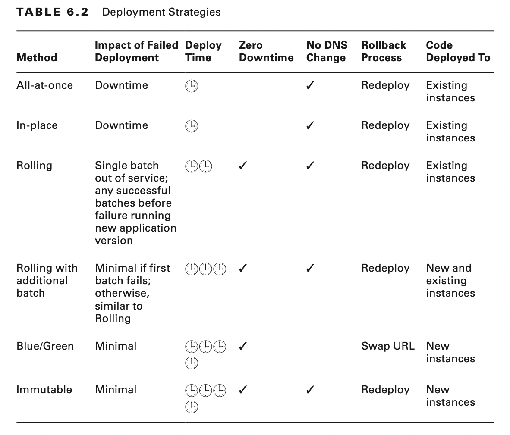

# Deployment Strategies

# Deployments on the AWS Cloud

The AWS Cloud environment offers several deployment options and several ways to provision AWS services to set up highly
available and reliable applications.

Ideally, deployments are seamless streams of automated processes that create, build, deploy, monitor, and modify code
throughout the entire software development lifecycle (SDLC).

## Phases of the Release Lifecycle

Nearly all traditional release lifecycles are composed of five major phases.
Source, Build, Test, Production, and Monitor.

## Environment Variables

The SDLC in a traditional infrastructure contains manual implementations to release, test, and deploy code, in addition
to the corresponding required documentation.

You can choose an AWS service to automate deployments seamlessly, saving you hours that you would normally spend
managing your infrastructure and code.

Your configurations can include Auto Scaling groups, security groups, Amazon Elastic Compute Cloud (Amazon EC2)
instances, other AWS resources, and AWS Identity and Access Management (IAM) roles to manage resources from AWS
deployment services.

## Software Development Lifecycle with AWS Cloud

Each of the AWS services you use in a deployment has its own configuration, or service-specific settings, which affect
your deployment implementation.

## Continuous Integration/Continuous Deployment

The CI/CD pipeline helps developers implement continuous builds, tests, and code deployments with multiple AWS
resources and a continuous integration server.

You can integrate AWS Elastic Beanstalk with the CI/CD pipeline as one of the deployment resources.

Continuous integration (CI) is the software development practice in which you continu- ously integrate (or check in) all
code changes into a main branch of a central repository.

Continuous delivery (CD) is the software development practice in which all code changes are automatically prepared and
always deployable (ready to go into production) at a single step.

Continuous delivery extends continuous integration to include testing production-like stages and running verification
testing against those deployments.

Continuous deployment extends continuous delivery and is the automated release of software to customers, from check-in
through production, without human intervention.

An important distinction between continuous delivery and continuous deployment is that in continuous deployment, changes
are automatically released to production after build/test stages; there is no manual approval step.

**AWS CodePipeline**

AWS CodePipeline is a service for fast and reliable application updates. You can model and visualize the software
release process. To build, test, and deploy your code every time there is a code change, integrate this service with
third-party tools and AWS.

**AWS CodeCommit**

AWS CodeCommit is a secure, highly scalable, managed source-control service that hosts private Git repositories. It
enables you to store and manage assets (such as documents, source code, and binary files) privately in the AWS Cloud.

**AWS COdeBuild**

AWS CodeBuild compiles source code, runs tests, and produces ready- to-deploy software packages. There is no need to
manage build servers.

**AWS CodeDeploy**

WS CodeDeploy automates code deployments to any instance. It handles the complexity of updating your applications, which
avoids downtime during application deployment. It deploys to Amazon EC2 or on-premises servers, in any language and on
any operating system. It also integrates with third-party tools and AWS.

## Deploying Highly Available and Scalable Applications

Elastic Load Balancing (ELB) supports three types of load balancers: Application Load Balancers, Network Load Balancers,
and Classic Load Balancers. You select a load balancer based on your application needs.

**The Application Load Balancer** provides advanced request routing targeted at delivery of modern application
architectures, including microservices and container-based applications.

The Application Load Balancer operates at the request level (Layer 7) to route HTTP/HTTPS traffic to its targets: Amazon
EC2 instances, containers, and IP addresses based on the content of the request. It is ideal for advanced load balancing
of HTTP and HTTPS traffic.

**The Network Load Balancer** operates at the connection level (Layer 4) to route TCP traffic to targets: Amazon EC2
instances, containers, and IP addresses based on IP protocol data.

It is the best option for load balancing of TCP traffic because it’s capable of handling millions of requests per second
while maintaining ultra-low latencies.

**The Classic Load Balancer** provides basic load balancing across multiple Amazon EC2 instances and operates at both
the request level and the connection level.

The flow for deploying highly available and scalable applications includes the following components:

- Multiple availability Zones and AWS Regions
- Health check and failover mechanism.
- Stateless application that stores the session state in a cache server or database.
- AWS services that help you to achieve your goal. For example, Auto Scaling helps you maintain high availability and
  scalability.

Elastic Load Balancing and Auto Scaling are designed to work together.

## Deploying and Maintaining Applications

With AWS Elastic Beanstalk, you do not have to worry about managing the infrastructure for your application.

AWS OpsWorks is a configuration and deployment management tool for your Chef or Puppet resource stacks. Specifically,
OpsWorks for Chef Automate enables you to manage the lifecycle of your application in layers with Chef recipes.

AWS CloudFormation is infrastructure as code. The service helps you model and set up AWS resources so that you can spend
less time managing them. It is a template-based tool, with formatted text files in JSON or YAML.

Use AWS CloudFormation templates to provision and configure your stack resources.

### Automatically Adjust Capacity

Use AWS Auto Scaling to monitor the AWS resources that are part of your application. The service automatically adjusts
capacity to maintain steady, predictable performance.

### Auto Scaling Groups

An Auto Scaling group contains a collection of Amazon EC2 instances that share similar characteristics. This collection
is treated as a logical grouping to manage the scaling of instances.

An Auto Scaling group launches enough Amazon EC2 instances to meet its desired capacity. The Auto Scaling group
maintains this number of instances by performing periodic health checks on the instances in the group. If an instance
becomes unhealthy, the group terminates the unhealthy instance and launches another instance to replace it.

# AWS Elastic Beanstalk

AWS Elastic Beanstalk is an AWS service that you can use to deploy applications, services, and architecture. It provides
provisioned scalability, load balancing, and high availability. It uses common languages, including Java, .NET, PHP,
Node.js, Python, Ruby, Go, and Docker, on common-type web servers, such as Apache, NGINX, Passenger, and IIS.

- Elastic Beanstalk charges only for the resources you use to run your application.
- Elastic Beanstalk is a solution that enables the automated deployments and management of applications on the AWS
  Cloud.
- Elastic Beanstalk can launch AWS resources automati- cally with Amazon Route 53, AWS Auto Scaling, Elastic Load
  Balancing, Amazon EC2, and Amazon Relational Database Service (Amazon RDS) instances, and it allows you to customize
  additional AWS resources.

Deploy applications without worrying about managing the underlying technologies, including the following:

**Components**

- Environments
- Application versions
- Environment configurations

**Permission Model**

- Service role
- Instance profile.

With Elastic Beanstalk, you can also create repeatable environments and reduce redundancy, thus rapidly updating
environments and facilitating service-managed application stacks. You can deploy multiple environments in minutes and
use various automated deployment strategies.

AWS Elastic Beanstalk allows you to focus on building your application.

## Implementation Responsibilities

### Developer Teams

Using AWS Elastic Beanstalk, you build full-stack environments for web and worker tiers. The service provides a
preconfigured infrastructure.

- Single-instance (development, low cost)
- Load balanced, AWS Auto-Scaling (production)

### Elastic Beanstalk Responsibilities

Elastic Beanstalk provisions the necessary infrastructure resources, such as the load balancer, Auto Scaling group,
security groups, and database (optional). It also provides a unique domain name for your application (for example,
yourapp.elasticbeanstalk.com).

## Working with Your Source Repository

By using Elastic Beanstalk with the AWS CodeCommit repository, you extract from a current branch on CodeCommit.

Elastic Beanstalk can either retrieve the source bundle from a source repository or download the bundle from an Amazon
Simple Storage Service (Amazon S3) bucket.

You can use the IAM role to grant Elastic Beanstalk access to all services.

You can also work with different hosting services, such as GitHub or Bitbucket, with your code source.

## Concepts

### Application

Elastic Beanstalk focuses on managing your applications as environments and all of the resources to run them. Each
application that launches in the service is a logical collection of environment variables and components, application
versions, and environment configurations.

### Application Versions

Application versions are iterations of the application’s deployable code. Application versions in Elastic Beanstalk
point to an Amazon S3 object with the code source package. An application can have many versions, with each version
being unique. You can deploy and access any application version at any time. For example, you may want to deploy
different versions for different types of tests.

### Environment

Each Elastic Beanstalk environment is a separate version of the application, and that version’s AWS Cloud components
deploy onto AWS resources to support that version. Each environment runs one application version at a time, but you can
run multiple environments, with the same application on each, along with its own customizations and resources.

### Environment Tier

To launch an environment, you must first choose an environment tier. Elastic Beanstalk provisions the required resources
to support both the infrastructure and types of requests the application will support.

### Environment Configuration

You can change your environment to create, modify, delete, or deploy resources and change the settings for each. Your
environment configuration saves to a configuration template exclusive to each environment and is accessible by either
the Elastic Beanstalk application programming interface (API) calls or the service’s command line interface (EB CLI).

### Docker Containers

You can also use Docker containers with Elastic Beanstalk to run your applications from a container.
A single container deployment launches a single Docker image, and your application uses a single container configuration
for a single Amazon EC2 instance.

A multicontainer deployment uses the Amazon ECS to launch a cluster of containers with Docker images.

## AWS Elastic Beanstalk Command Line Interface

Elastic Beanstalk has its own command line interface separate from the AWS CLI tool.

**eb init application-name**

Sets default values for Elastic Beanstalk applications with the EB CLI configuration wizard.

**eb create**

Creates a new environment and deploys an application version to it.

**eb deploy**

Deploys the application source bundle from the initialized project directory to the running application.

**eb clone**

Clones an environment to a new environment so that both have identical environment settings.

**eb codesource**

Configures the EB CLI to deploy from an AWS CodeCommit repository, or disables AWS CodeCommit integration and uploads
the source bundle from your local machine.

## Customizing Environment Configurations

You can use Elastic Beanstalk to customize the platforms used to support your application and your infrastructure. To do
so, create a configuration file in the ebextensions directory (or .ebextensions) to include with your web application’s
source code.

Elastic Beanstalk generates logs that you can view to troubleshoot your environments and resources. The logs display
Amazon EC2 operational logs and logs that are specific to servers running for your applications.

## Integrating with Other AWS Services

Elastic Beanstalk automatically integrates or manages other AWS services with application code to provision efficient
working environments.

To grant access between any integrated service and Elastic Beanstalk, you must configure permissions in IAM.

### Amazon S3

You can use Amazon S3 to store static content you want to integrate with your application and point directly to objects
you store in Amazon S3 from your application or from other resources. In addition to setting permissions in IAM
policies, take advantage of presigned URLs for controlled Amazon S3 GET and PUT operations.

### Amazon CloudFront

You can integrate your Elastic Beanstalk environment with Amazon CloudFront, which provides content delivery and
distribution through the use of edge locations throughout the world.

After you deploy your application on Elastic Beanstalk, use the Amazon CloudFront content delivery network (CDN) to
cache static content from your application.

### AWS Config

With AWS Config, you can visualize configuration history and how configurations evolve over time. Tracking changes helps
you to fulfill compliance obligations and meet auditing requirements. You can integrate AWS Config directly with your
application and its versions or your Elastic Beanstalk environment. You can customize AWS Config to record changes per
resource, per region, or globally.

### Amazon RDS

Elastic Beanstalk can create a database and store and retrieve data for any of your environments. Each service has its
own features to handle scaling, capacity, performance, and availability.

### Amazon ElastiCache

For caching capabilities, you can integrate Amazon ElastiCache service clusters with the Elastic Beanstalk environment.

## AWS Identity and Access Management Roles

Elastic Beanstalk integrates with AWS Identity and Access Management (IAM) roles to enable access to the services you
require to run your architecture.

You use IAM roles to automate the management of allocated services for your application through Elastic Beanstalk.

For IAM to manage the policies for the account better, create policies at the account level.

# Deployment Strategies

A deployment is the process of copying content and executing scripts on instances in your deployment group. To
accomplish this, AWS CodeDeploy performs the tasks outlined in the AppSpec configuration file. For both Amazon EC2
on-premises instances and AWS Lambda functions, the deployment succeeds or fails based on whether individual AppSpec
tasks complete successfully.

A serverless application is typically a combination of AWS Lambda and other AWS services.

## All-at-Once and In-Place Deployments

An all-at-once deployment applies updates to all your instances at once. When you execute this strategy, you experience
downtime, as all instances receive the change at the same time.

This is an appropriate strategy for simple, immediate update requirements when it’s not critical to have your
application always available, and you’re comfortable with the site being offline for a short duration.
To enable all-at-once updates, set a deployment policy either in the AWS Management Console or in the command line (
DeploymentPolicy).

When you perform an in-place deployment, AWS CodeDeploy stops currently running applications on the target instance,
deploys the latest revision, restarts applications, and validates successful deployment.

AWS Lambda does not support in-place deployments.

## Rolling Deployments

A rolling deployment applies changes to all of your instances by rolling the updates from one instance to another.
Elastic Beanstalk can deploy configuration changes in batches. This approach reduces possible downtime during
implementation of the change and allows available instances to run while you deploy.

Rolling updates include changes for Auto Scaling group configurations, Amazon EC2 instance configurations, and Amazon
VPC settings.

It is an effective method for updating an application version on fleets of instances through the Elastic Beanstalk
service.

You can select Rolling or Rolling with additional batch. By using Rolling with additional batch, you can launch a new
batch of instances before you begin to take instances out of service for your rolling updates.

## Blue/Green Deployment

When high availability is critical for applications, you may want to choose a blue/green deployment, where your newer
environment will be separate from your existing environment.

The running production environment is considered the blue environment, and the newer environment with your update is
considered the green environment.

When your changes are ready and have gone through all tests in your green environment, you can swap the CNAMEs of the
environments to redirect traffic to the newer running environment. This strategy provides an instantaneous update with
typically zero downtime.

When you deploy to AWS Lambda functions, blue/green deployments publish new versions of each function.

## Immutable Deployment

An immutable deployment is best when an environment requires a total replacement of instances, rather than updates to an
existing part of an infrastructure.

This approach implements a safety feature for updates and rollbacks. Elastic Beanstalk creates a temporary Auto
Scaling group behind your environment’s load balancer to contain the new instances with the updates you apply. If the
update fails, the rollback process terminates the Auto Scaling group. Immutable instances implement a number of health
checks.

During this type of deployment, your capacity doubles for a short dura- tion between the updates and terminations of
instances. Before you use this strategy, verify that your instances have a low on-demand limit and enough capacity to
support immutable updates.

## Container Deployments

Elastic Beanstalk enables you to launch your applications with Docker containers. With a Docker container, you can
create a runtime environment with all of the dependencies, packages, and tools that your application may require to
run.

By using Docker with Elastic Beanstalk, you have the infrastructure for capacity provisioning, scalability, load
balancing, and health monitoring for the instances that run on containers.

# Monitoring and Troubleshooting

After you launch your code, check on its performance and availability. You can monitor statistics and view information
about the health of your application, its environment, and specific services from the AWS Management Console.

AWS Management Console, the AWS Elastic Beanstalk Monitoring page shows aggregated statistics and graphs for your
applications and resources.

Metrics gathered by the resources in your environment are published to Amazon CloudWatch in five-minute intervals.

By default, Elastic Beanstalk displays Amazon EC2, Auto Scaling, and Elastic Load Balancing metrics for your application
environments. These metrics are available to you on your AWS Elastic Beanstalk Monitoring page as soon as you deploy
your application environment.

## Basic Health Monitoring

To access the health status from the AWS Management Console, select the Elastic Beanstalk service and then select the
tab for your specific application environment.

To access the health status from the EB CLI, enter the eb health command.

## Enhanced Health Monitoring

There are two types of reporting: the default health information about your resources and the enhanced health reporting
that provides you more information for monitoring health.

You can use the enhanced health reporting feature to gather additional resource data and display graphs and statistics
of environment health in greater detail. This is important when you deploy multiple versions of your application and
when you need to analyze factors that could be degrading your application’s availability or performance.

By default, health monitoring on Elastic Beanstalk does not publish metrics to Amazon CloudWatch, so you are not charged
for the metrics.

Elastic Beanstalk integrates with AWS CloudTrail to capture Elastic Beanstalk API calls as log files that you can store
in an Amazon S3 bucket.

# Summary

In this chapter, you learned about the features of Elastic Beanstalk, how to automate deployments for your multi-tier
architectures, and different deployment strategies. You also discovered options for configuring your environments and
managing your resources with services such as IAM, Amazon VPC, Amazon EC2, and Amazon S3.

# Exam Essentials

**Know how to deploy AWS Elastic Beanstalk.**

Know how to deploy an application AWS Elastic Beanstalk and what platforms it supports. To complete the exam
successfully, you should also understand how the architectures and services interact with the web, application, and
database tiers. Focus on foundational services and how you create and work with Elastic Beanstalk.

**Know about ebextensions.**

Understand ebextensions and the part they play in the ser- vice configuration. Be able to recognize the stacks you
create and how to change them.

**Know about Elastic Beanstalk resources.**

Understand how to manage resources with Elastic Beanstalk, including IAM. Understand the definitions and differentiate
between the functions of the default IAM service role and the instance profile, which are automatically created.
Understand permissions for your AWS resources in your environment.

**Know Elastic Beanstalk deployment strategies.**

Understand what deployment strategies you can use, their differences, and which ones would be best for different use
cases and other resources. Know which strategy offers less downtime and which is best suited for complex changes.

**Know about Elastic Beanstalk components.**

Understand all of the components of Elastic Beanstalk, including applications, environments, versions, configurations,
and the AWS resources it launches and with which it integrates. Know how to retain or dispose
of resources as needed.

**Know about Elastic Beanstalk different environment tiers.**

Know the differences between the single-instance tier and the web-server environment tier and when to choose one over
the other. Understand the services and features used for both.
