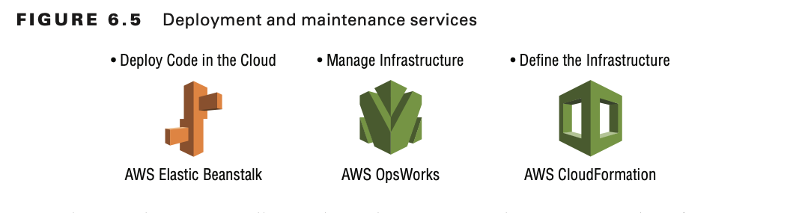

# Deployment Strategies

# Deployments on the AWS Cloud

The AWS Cloud environment offers several deployment options and several ways to provision AWS services to set up highly
available and reliable applications.

Ideally, deployments are seamless streams of automated processes that create, build, deploy, monitor, and modify code
throughout the entire software development lifecycle (SDLC).

## Phases of the Release Lifecycle

Nearly all traditional release lifecycles are composed of five major phases.
Source, Build, Test, Production, and Monitor.

## Environment Variables

The SDLC in a traditional infrastructure contains manual implementations to release, test, and deploy code, in addition
to the corresponding required documentation.

You can choose an AWS service to automate deployments seamlessly, saving you hours that you would normally spend
managing your infrastructure and code.

Your configurations can include Auto Scaling groups, security groups, Amazon Elastic Compute Cloud (Amazon EC2)
instances, other AWS resources, and AWS Identity and Access Management (IAM) roles to manage resources from AWS
deployment services.

## Software Development Lifecycle with AWS Cloud

Each of the AWS services you use in a deployment has its own configuration, or service-specific settings, which affect
your deployment implementation.

## Continuous Integration/Continuous Deployment

The CI/CD pipeline helps developers implement continuous builds, tests, and code deployments with multiple AWS
resources and a continuous integration server.

You can integrate AWS Elastic Beanstalk with the CI/CD pipeline as one of the deployment resources.

Continuous integration (CI) is the software development practice in which you continu- ously integrate (or check in) all
code changes into a main branch of a central repository.

Continuous delivery (CD) is the software development practice in which all code changes are automatically prepared and
always deployable (ready to go into production) at a single step.

Continuous delivery extends continuous integration to include testing production-like stages and running verification
testing against those deployments.

Continuous deployment extends continuous delivery and is the automated release of software to customers, from check-in
through production, without human intervention.

An important distinction between continuous delivery and continuous deployment is that in continuous deployment, changes
are automatically released to production after build/test stages; there is no manual approval step.

**AWS CodePipeline**

AWS CodePipeline is a service for fast and reliable application updates. You can model and visualize the software
release process. To build, test, and deploy your code every time there is a code change, integrate this service with
third-party tools and AWS.

**AWS CodeCommit**

AWS CodeCommit is a secure, highly scalable, managed source-control service that hosts private Git repositories. It
enables you to store and manage assets (such as documents, source code, and binary files) privately in the AWS Cloud.

**AWS COdeBuild**

AWS CodeBuild compiles source code, runs tests, and produces ready- to-deploy software packages. There is no need to
manage build servers.

**AWS CodeDeploy**

WS CodeDeploy automates code deployments to any instance. It handles the complexity of updating your applications, which
avoids downtime during application deployment. It deploys to Amazon EC2 or on-premises servers, in any language and on
any operating system. It also integrates with third-party tools and AWS.

## Deploying Highly Available and Scalable Applications

Elastic Load Balancing (ELB) supports three types of load balancers: Application Load Balancers, Network Load Balancers,
and Classic Load Balancers. You select a load balancer based on your application needs.

**The Application Load Balancer** provides advanced request routing targeted at delivery of modern application
architectures, including microservices and container-based applications.

The Application Load Balancer operates at the request level (Layer 7) to route HTTP/HTTPS traffic to its targets: Amazon
EC2 instances, containers, and IP addresses based on the content of the request. It is ideal for advanced load balancing
of HTTP and HTTPS traffic.

**The Network Load Balancer** operates at the connection level (Layer 4) to route TCP traffic to targets: Amazon EC2
instances, containers, and IP addresses based on IP protocol data.

It is the best option for load balancing of TCP traffic because it’s capable of handling millions of requests per second
while maintaining ultra-low latencies.

**The Classic Load Balancer** provides basic load balancing across multiple Amazon EC2 instances and operates at both
the request level and the connection level.

The flow for deploying highly available and scalable applications includes the following components:

- Multiple availability Zones and AWS Regions
- Health check and failover mechanism.
- Stateless application that stores the session state in a cache server or database.
- AWS services that help you to achieve your goal. For example, Auto Scaling helps you maintain high availability and
  scalability.

Elastic Load Balancing and Auto Scaling are designed to work together.

## Deploying and Maintaining Applications

With AWS Elastic Beanstalk, you do not have to worry about managing the infrastructure for your application.

AWS OpsWorks is a configuration and deployment management tool for your Chef or Puppet resource stacks. Specifically,
OpsWorks for Chef Automate enables you to manage the lifecycle of your application in layers with Chef recipes.

AWS CloudFormation is infrastructure as code. The service helps you model and set up AWS resources so that you can spend
less time managing them. It is a template-based tool, with formatted text files in JSON or YAML.

Use AWS CloudFormation templates to provision and configure your stack resources.

### Automatically Adjust Capacity

Use AWS Auto Scaling to monitor the AWS resources that are part of your application. The service automatically adjusts
capacity to maintain steady, predictable performance.

### Auto Scaling Groups

An Auto Scaling group contains a collection of Amazon EC2 instances that share similar characteristics. This collection
is treated as a logical grouping to manage the scaling of instances.

An Auto Scaling group launches enough Amazon EC2 instances to meet its desired capacity. The Auto Scaling group
maintains this number of instances by performing periodic health checks on the instances in the group. If an instance
becomes unhealthy, the group terminates the unhealthy instance and launches another instance to replace it.