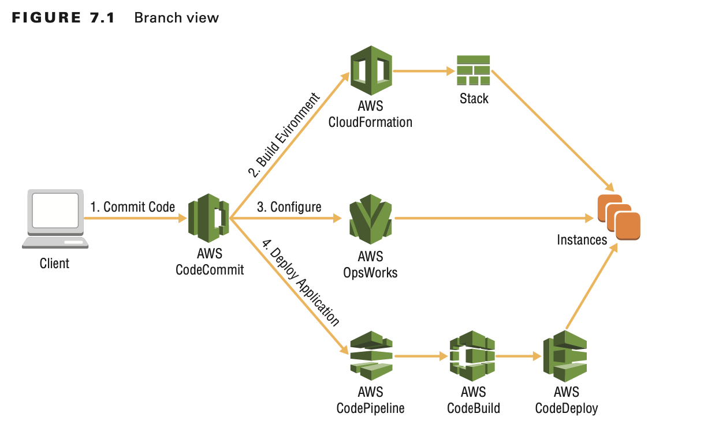
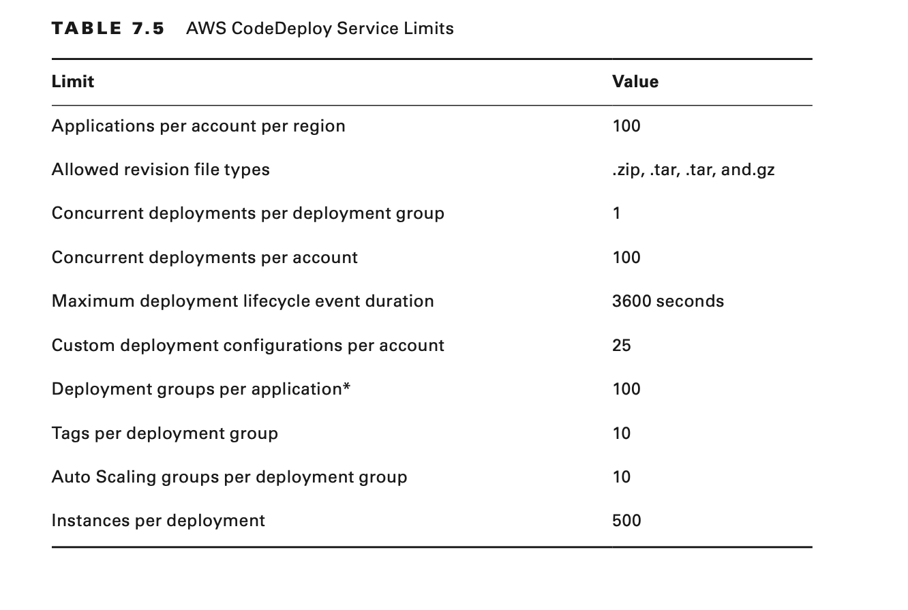

# Introduction to AWS Code Services

## Continuous Delivery with AWS CodePipeline

You start with AWS CodePipeline to create a continuous integration/continuous deployment pipeline (CI/CD) that
integrates various sources, tests, deployments, or other components.

AWS CodePipeline implements AWS CodeCommit as a source in that it acts as the initialization point of your deployment
process.

AWS CodeBuild allows you to pull code and packages from various sources to create publishable build artifacts.

AWS CodeDeploy allows you to deploy compiled artifacts to infrastructure in your environment.

AWS CodePipeline is not limited to deploying application code; it can also be used to provision, configure, and manage
infrastructure.

## Benefits of Continuous Delivery

By automating tests, they are consistently run against every change made to a code repository.

Second, developers are no longer tasked with completing steps other than checking in code changes. After the change has
been pushed to a source repository, initiation of the build/test process automatically begins.

Third, the fact that changes are tested immediately after check-in ensures that more bugs are caught earlier in the
development process.

Lastly, continuous delivery ensures that quality changes are delivered faster. This increases quality with decreased
time to market.

# Using AWS CodePipeline to Automate Deployments

AWS CodePipeline is a continuous integration and continuous delivery service for fast and reliable application and
infrastructure updates. AWS CodePipeline builds, tests, and deploys your code every time there is a code change, based
on the release process models you define.
This enables you to deliver features and updates rapidly and reliably. You can easily build an end-to-end solution with
prebuilt plugins for popular third-party services like GitHub, or you can integrate your own custom plugins into any
stage of your release process. With AWS CodePipeline, you pay only for what you use. There are no up-front fees or
long-term commitments.

## What Is AWS CodePipeline?

AWS CodePipeline is the underpinning of CI/CD processes in AWS.

AWS CodePipeline automatically detects and moves into the source stage. The code change (revision) passes to the build
stage, where changes are built into a package or product ready for deployment.

AWS CodePipeline provides a number of built-in integrations to other AWS services, such as AWS CloudFormation, AWS
CodeBuild, AWS CodeCommit, AWS CodeDeploy, Amazon Elastic Container Service (ECS), Elastic Beanstalk, AWS Lambda, AWS
OpsWorks Stacks, and Amazon Simple Storage Service (Amazon S3).

You define workflow steps through a visual editor within the AWS Management Console or via a JavaScript Object
Notation (JSON) structure for use in the AWS CLI or AWS SDKs.

AWS CodePipeline provides a dashboard where you can review real-time progress of revisions, attempt to retry failed
actions, and review version information about revisions that pass through the pipeline.

## AWS CodePipeline Concepts

**Pipeline**

A pipeline is the overall workflow that defines what transformations software changes will undergo.
You cannot change the name of a pipeline. If you would like to change the name, you must create a new pipeline.

**Revision**

A revision is the work item that passes through a pipeline. It can be a change to your source code or data stored in AWS
CodeCommit or GitHub or a change to the version of an archive in Amazon S3.

**Stage**

A stage is a group of one or more actions. Each stage must have a unique name. Should any one action in a stage fail,
the entire stage fails for this revision.

**Action**

An action defines the work to perform on the revision. You can configure pipeline actions to run in series or in
parallel. If all actions in a stage complete successfully for a revision, it passes to the next stage in the pipeline.

A pipeline must have two or more stages. The first stage includes one or more source actions only. Only the first stage
may include source actions.

Every action in the same stage must have a unique name.

**Source**

The source action defines the location where you store and update source files. Modifications to files in a source
repository or archive trigger deployments to a pipeline.

AWS CodePipeline supports these sources for your pipeline:

- Amazon S3
- AWS CodeCommit
- GitHub

A single pipeline can contain multiple source actions. If a change is detected in one of the sources, all source actions
will be invoked.

**Build**

You use a build action to define tasks such as compiling source code, running unit tests, and performing other tasks
that produce output artifacts for later use in your pipeline.

AWS CodePipeline supports the integrations for the following build actions:

- AWS CodeBuild
- CloudBees
- Jenkins
- Solano CI
- TeamCity

**Test**

You can use test actions to run various tests against source and compiled code, such as lint or syntax tests on source
code, and unit tests on compiled, running applications. AWS CodePipeline supports the following test integrations:

- AWS CodeBuild
- BlazeMeter
- Ghost Inspector
- Hewlett Packard Enterprise (HPE) StormRunner Load
- Nouvola
- Runscope

**Deploy**

The deploy action is responsible for taking compiled or prepared assets and installing them on instances, on-premises
servers, serverless functions, or deploying and updating infrastruc- ture using AWS CloudFormation templates

- AWS CloudFormation
- AWS CodeDeploy
- Amazon Elastic Container Service
- AWS Elastic Beanstalk
- OpsWork Stacks
- Xebia Labs

**Approval**

An approval action is a manual gate that controls whether a revision can proceed to the next stage in a pipeline.

Publish approval notifications ; Amazon Simple Notification Service (Amazon SNS) sends notices to one or more targets
that approval is pending.

**Invoke**

You can customize the invoke action within AWS CodePipeline if you leverage the power and flexibility of AWS Lambda.
Invoke actions execute AWS Lambda functions, which allows arbitrary code to be run as part of the pipeline execution.

- Backing up data volumes, Amazon S3 buckets, or databases
- Interacting with third-party products, such as posting messages to Slack channels
- Running through test interactions with deployed web applications, such as executing a test transaction on a shopping
  site
- Updating IAM Roles to allow permissions to newly created resources

**Artifact**

Artifacts are actions that act on a file or set of files. Artifacts can pass between actions and stages in a pipeline to
provide a final result or version of the files. For example, an artifact that passes from a build action would deploy to
Amazon EC2 during a deploy action.

**Transition**

Transitions connect stages in a pipeline and define which stages should transition to one another. When all actions in a
stage complete successfully, the revision passes to the next stage(s) in the pipeline.

**Managing Approval Actions**

You can use approvals to review changes manually before final release into production, or as a code review step.

# Using AWS CodeCommit as a Source Repository

AWS CodeCommit is a fully managed source control service that makes it easy for companies to host secure and highly
scalable private Git repositories.

AWS CodeCommit eliminates the need to operate your own source control system or worry about scaling its infrastructure.

## What Is AWS CodeCommit?

AWS CodeCommit is a cloud-based, highly available, and redundant version control service. AWS CodeCommit leverages the
Git framework, and it is fully compatible with existing tooling. There are a number of benefits to this service, such as
the following:

- Automatic encryption in-transit and at rest.
- Scaling to handle rapid release cycles and large repositories.
- Access control to the repository using IAM users, IAM roles, and IAM policies.
- Hypertext Transfer Protocol Secure (HTTPS) and Secure Shell (SSH) connectivity.

## AWS CodeCommit Concepts

**Credentials**

When you interact with AWS, you specify your AWS security credentials to verify who you are and whether you have
permission to access the resources that you request.

**HTTPS**

HTTPS connectivity to a Git-based repository requires a username and password, which pass to the repository as part of a
request. To use AWS CodeCommit with HTTPS credentials, you must first add them to an IAM user with sufficient
permissions to interact with the repository.

**SSH**

With SSH authentication, there is no need to install the AWS CLI to connect to your repository.

**Use the Credential Helper**

The previous HTTPS and SSH authentication methods both rely on additional credentials aside from IAM access/secret keys.
It is also possible to authenticate to AWS CodeCom- mit with IAM credentials and the AWS CodeCommit credential helper.

**Development Tools and Integrated Development Environment**

AWS CodeCommit integrates automatically with any development tools that support IAM credentials. Additionally, after you
set up HTTPS Git credentials, you are able to use any tools that support this authentication mechanism instead.

- AWS Cloud9
- Eclipse
- Intellij
- Visual Studio

**Repository**

A repository (repo) is the foundation of AWS CodeCommit. This is the location where you store source code files, track
revisions, and merge contributions (commits).

**Files**

A file is a piece of data that is subject to version control by AWS CodeCommit. AWS CodeCommit tracks any modifications
made to this file on a per-line level

**Pull Requests**

Pull requests are the primary vehicle on which you review and merge code changes between branches. Unlike branch
merging, pull requests allow multiple users to comment on changes before they merge with the destination branch.

**Commits**

Commits are point-in-time changes to contents of files in a repository.

**Branches**

Branches are ways to separate and organize groups of commits. This allows developers to organize work in a meaningful
fashion, separating changes into logical groups based on the feature or bug-fix being developed.

## Using AWS CodeCommit with AWS CodePipeline

You can use AWS CodeCommit as a source action in your pipeline. This allows you to utilize a highly available, redundant
version control system as the initialization point of your CI/CD pipeline.

When you select AWS CodeCommit as the source provider, you must provide a repository name and branch. If you use AWS
CodeCommit, it creates an Amazon CloudWatch Events rule and an IAM role to monitor the repository and branch for
changes.

### What Is AWS CodeBuild?

AWS CodeBuild enables you to define the build environment to perform build tasks and the actual tasks that it will
perform. AWS CodeBuild comes with prepackaged build environments for most common workloads and build tools (Apache
Maven, Grade, and others), and it allows you to create custom environments for any custom tools or processes.

### AWS CodeBuild Concepts

AWS CodeBuild initiates build tasks inside a build project, which defines the environmental settings, build steps to
perform, and any output artifacts. The build container’s operating system, runtime, and build tools make up the build
environment.

### Build Projects

Build projects define all aspects of a build. This includes the environment in which to per- form builds, any tools to
include in the environment, the actual build steps to perform, and outputs to save.

### Build Specification (buildspec.yml)

The buildspec.yml file can provide the build specification to your build projects in the AWS CodeBuild console, the AWS
CLI, or the AWS SDK when you create the build project, or as part of your source repository in a YAML-formatted
buildspec.yml file.

### Artifacts

The artifacts mapping specifies where AWS CodeBuild will place output artifacts, if any.

### Cache

If you configure caching for the build project, the cache map specifies which files to upload to Amazon S3 for use in
subsequent builds.

### Build Environments

A build environment is a Docker image with a preconfigured operating system, programming language runtime, and any
other tools that AWS CodeBuild uses to perform build tasks and communicate with the service, along with other metadata
for the environment, such as the compute settings.

### Builds

When you initiate a build, AWS CodeBuild copies the input artifact(s) into the build environ- ment. AWS CodeBuild uses
the build specification to run the build process, which includes any steps to perform and outputs to provide after the
build completes. Build logs are made available to Amazon CloudWatch Logs for real-time monitoring.

## AWS CodeBuild Service Limits

- Build projects per region per account* 1000
- Build timeout 8 hours
- Concurrently running builds* 20

# Using AWS CodeDeploy to Deploy Applications

AWS CodeDeploy is a service that automates software deployments to a variety of compute services, such as Amazon EC2,
AWS Lambda, and instances running on-premises.

AWS CodeDeploy makes it easier for you to release new features rapidly, helps you avoid downtime through application
deployment, and handles the complexity to update your applications.

You can use AWS CodeDeploy to automate software deployments and eliminate the need for error-prone manual operations.

## What Is AWS CodeDeploy?

AWS CodeDeploy standardizes and automates deployments of any types of content or configuration to Amazon EC2 instances,
on-premises servers, or AWS Lambda functions.

Because of its flexibility, it is not restricted to deploy only application code, and it can perform various
administrative tasks that are part of your deployment process.

You can automate deployment of AWS CodeDeploy with AWS Lambda functions through traffic switching.

## AWS CodeDeploy Concepts

### Revision

A revision is an artifact that contains both application files to deploy and an AppSpec configuration file.
Application files can include compiled libraries, configuration files, installation packages, static media, and other
content.

When you deploy to AWS Lambda, a revision contains only the AppSpec file. It contains information about the functions
to deploy, as well as the steps to validate that the deployment was successful.

### Deployments

A deployment is the process of copying content and executing scripts on instances in your deployment group. To
accomplish this, AWS CodeDeploy performs the tasks outlined in the AppSpec configuration file.

There are two types of deployments supported by AWS CodeDeploy: in-place and blue/green.

**In-Place Deployments**

In in-place deployments, revisions deploy to new infrastructure instead of an existing one. After deployment completes
successfully, the new infrastructure gradually replaces old code in a phased rollout. After all traffic routes to the
new infrastructure, you can keep the old code for review or discard it.

On-premises instances do not support blue/green deployments.

**Blue/Green Deployments**

When you deploy to AWS Lambda functions, blue/green deployments publish new versions of each function, after which
traffic shifting routes requests to the new function versions according to the deployment configuration that you
define.

### Stop Deployments

You can stop deployments via the AWS CodeDeploy console or AWS CLI. If you stop deployments to Amazon EC2 on-premises
instances, this can result in some deployment groups being left in an undesired deployment state.

### Rollbacks

AWS CodeDeploy achieves automatic rollbacks by redeploying the last working revision to any instances in the deployment
group (this will generate a new deployment ID).

By default, AWS CodeDeploy will not overwrite any files that were not created as part of a deployment. You can override
this setting for new deployments.

### Deployment Group

A deployment group designates the Amazon EC2 on-premises instances that a revision deploys.
When you deploy to AWS Lambda functions, this specifies what functions will deploy new versions.

### Deploy to Amazon EC2 Auto Scaling Groups

When you deploy to Amazon EC2 Auto Scaling groups, AWS CodeDeploy will automatically run the latest successful
deployment on any new instances created when the group scales out.

### Deployment Configuration

You use deployment configurations to drive how quickly Amazon EC2 on-premises instances update by AWS CodeDeploy. You
can configure deployments to deploy to all instances in a deployment group at once or subgroups of instances at a time,
or you can create an entire new group of instances (blue/green deployment).

## Amazon EC2 On-Premises Deployment Configurations

When you deploy to Amazon EC2 on-premises instances, you can configure either in-place or blue/green deployments.

**In-Place deployments**

These deployments recycle currently running instances and deploy revisions on existing instances.

**Blue/Green deployments**

These deployments replace currently running instances with sets of newly created instances.

### CodeDeployDefault.AllAtOnce

For in-place deployments, AWS CodeDeploy will attempt to deploy to all instances in the deployment group at the same
time.

For blue/green deployments, AWS CodeDeploy will attempt to deploy to the entire set of replacement instances at the same
time and follows the same success criteria as in-place deployments

### CodeDeployDefault.HalfAtATime

For in-place deployments, up to half of the instances in the deployment group deploy at the same time (rounded down).
Success criteria for this deployment configuration requires that at least half of the instances (rounded up) deploy
successfully.

Blue/green deployments use the same rules for the replacement environment, with the exception that the deployment will
fail if less than half of the instances in the replacement environment successfully handle rerouted traffic.

### CodeDeployDefault.OneAtATime

For in-place and blue/green deployments, this is the most stringent of the built-in deployment configurations, as it
requires all instances to deploy the new application revision successfully, with the exception of the final instance in
the deployment. For deployment groups with only one instance, the instance must complete successfully for the deployment
to complete.

## AWS Lambda Deployment Configurations

AWS CodeDeploy handles updates to AWS Lambda functions differently than to Amazon EC2 or on-premises instances.

You can configure AWS CodeDeploy to deploy instances only in a blue/green fashion.
AWS Lambda does not support in-place deployments.

### Canary

Traffic shifts in two percentage-based increments. The first increment routes to the new function version, and it is
monitored for the number of minutes you define. After this time period, the remainder of traffic routes to the new
version if the initial increment of request executes.

### Linear

Traffic can be shifted in a number of percentage-based increments, with a set number of minutes between each increment.
During the waiting period between each increment, the requests routed to the new function versions must complete
successfully for the deployment to continue.

### All-at-Once

All traffic is shifted at once to the new function versions.

### Application

An application is a logical grouping of a deployment group, revision, and deployment configuration. This serves as a
reference to the entire set of objects needed to complete a deployment to your instances or functions.

### AppSpec File

The AppSpec configuration file is a JSON or YAML file that manages deployments on in- stances or functions in your
environment. The actual format and purpose of an AppSpec file differs between Amazon EC2/on-premises and AWS Lambda
deployments.

### Amazon EC2 On-Premises AppSpec

For Amazon EC2 on-premises deployments, the AppSpec file must be YAML formatted
and follow the YAML specifications for spacing and indentation. You place the AppSpec file (appspec.yml) in the root of
the revision’s source code directory structure (it cannot be in a subfolder).

When you deploy to Amazon EC2 on-premises instances, the AppSpec file defines the following:

- A mapping of files from the revision and location on the instance
- The permissions of files to deploy
- Scripts to execute throughout the lifecycle of the deployment

### AWS Lambda AppSpec

When you deploy to AWS Lambda functions, the AppSpec file can be in JSON or YAML format, and it specifies the function
versions to deploy as well as other functions to execute for validation testing.

AWS Lambda deployments do not use the AWS CodeDeploy agent.

### AWS CodeDeploy Agent

The AWS CodeDeploy agent is responsible for driving and validating deployments on Amazon EC2 on-premises instances.

## AWS CodeDeploy Service Limits

## Using AWS CodeDeploy with AWS CodePipeline

AWS CodeDeploy can integrate automatically with AWS CodePipeline as a deployment action to deploy changes to Amazon EC2
on-premises instances or AWS Lambda functions.

You can configure applications, deployment groups, and deployments directly in the AWS CodePipeline console when you
create or edit a pipeline, or you can do this ahead of time with the AWS CodeDeploy console or the AWS CLI or AWS SDK.

# Summary

In this chapter, you learned about these deployment services:

- AWS CodePipeline
- AWS CodeCommit
- AWS CodeBuild
- AWS CodeDeploy

AWS CodePipeline drives application deployments starting with a source repository (AWS CodeCommit), performing builds
with AWS CodeBuild, and finally deploying to Amazon EC2 instance or AWS Lambda functions using AWS CodeDeploy. You can
use AWS CloudFormation to provision and manage infrastructure in your environment. By integrating this with AWS
CodePipeline, you can automate the entire process of creating development, testing, and production environments into a
fully hands-off process.

# Exam Essentials

**Know the difference between continuous integration, continuous delivery, and continuous deployment.**

- Continuous integration is the practice where all code changes merge into a repository.
- Continuous delivery is the practice where all code changes are prepared for release.
- Continuous deployment is the practice where all code is prepared for release and automatically released to production
  environments.

**Know the basics of AWS CodePipeline.**

AWS CodePipeline contains the steps in the continuous integration and deployment pipeline (CI/CD) workflow, driving
automation between different tasks after assets have been committed to a repository or saved in a bucket. AWS
CodePipeline uses stages, which correspond to different steps in a workflow. Within each stage, different actions can
perform tasks in series or in parallel. Transitions between stages can be automatic or require manual approval by an
authorized user.

**Understand how revisions can move through a pipeline.**

Revisions move automatically between stages in a pipeline, provided that all actions in the preceding stage complete. If
a manual approval is required, the revision will not proceed until an authorized user allows it to do so. When two
changes are pushed to a source repository in a short time span, the latest of the two changes will proceed through the
pipeline.

**Know the different pipeline actions that are available.**

A pipeline stage can include one or more actions: build, test, deploy, and invoke. You can also create custom actions.

**Know how to deploy a cross-account pipeline.**

The account containing the pipeline must create a KMS key that can be used by both AWS CodePipeline and the other
account. The pipeline account must also specify a bucket policy on the assets bucket that the pipeline uses, which
allows the second account to access assets. The AWS CodePipeline service IAM role must include a policy that allows it
to assume a role in the second account. The second account must have a role that can be assumed by the pipeline account,
which allows the pipeline account to deploy resources and access the assets bucket.

**Know the basic concepts of AWS CodeCommit.**

AWS CodeCommit is a Git-based repository service. It is fully compatible with existing Git tooling. AWS CodeCommit
provides various benefits, such as encryption in transit and at rest; automatic scaling to handle increases in
activity; access control using IAM users, roles, and policies; and HTTPS/SSH connectivity. AWS CodeCommit supports
normal Git workflows, such as pull requests.

**Know how to use the credential helper to connect to repositories.**

It is possible to connect to AWS CodeCommit repositories using IAM credentials. The AWS CodeCommit credential helper
translates an IAM access key and secret access key into valid Git credentials. This requires the AWS CLI and a Git
configuration file that specifies the credential helper.

**Know the basics of AWS CodeBuild.**

AWS CodeBuild allows you to perform long-running build tasks repeatedly and reliably without having to manage the
underlying infrastructure. You are responsible only for specifying the build environment settings and the actual tasks
to perform.

**Understand how AWS CodeDeploy works with Amazon EC2 Auto Scaling groups.**

When you deploy to Amazon EC2 Auto Scaling groups, AWS CodeDeploy will automatically run the last successful deployment
on any new instances that you add to the group. If the deployment fails on the instance, it will be terminated and
replaced (to maintain the desired count of healthy instances). If two deployment groups for separate AWS CodeDeploy
applications specify the same Auto Scaling group, issues can occur. If both applications deploy at roughly the same time
and one fails, the instance will be terminated before success/failure can be reported for the second application
deployment. This will result in AWS CodeDeploy waiting until the timeout period expires before taking any further
action.