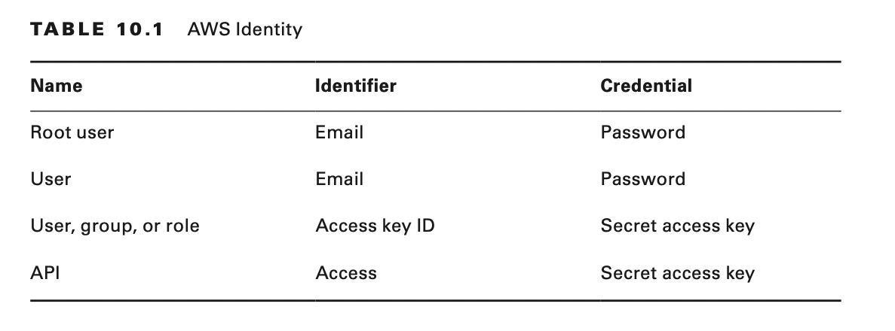

# Introduction to Authentication and Authorization

Authentication is the process or action that verifies the identity of a user or process. Authorization is a security
mechanism that determines access levels or permissions related to system resources including files, services, computer
programs, data, and application features. The authentication and authorization process grants or denies user access to
network resources based on the identity.

AWS Identity and Access Management (IAM) allows you to create identities (users, groups, or roles) and control access to
various AWS services through the use of policies. IAM serves as an identity provider (IdP).

The following are the benefits of integrating an existing IdP:

- Users are no longer required to manage multiple sets of credentials.
- There are fewer credentials to administer.
- Credentials are centrally managed.
- It is easier to establish and enforce compliance standards.

As an IdP, AWS is responsible for storing identities and providing the mechanism for authentication. You can use AWS as
an IdP for the following:

- AWS services
- Applications running on AWS infrastructure
- Applications running on non-AWS infrastructure, such as web or mobile applications

There are multiple benefits for using AWS as the IdP. AWS provides a managed service, eliminates single points of
failure, is highly available, and can scale as needed. AWS also provides a number of tools, such as Amazon CloudWatch
and AWS CloudTrail, to manage, control, and audit this service.

Using a third party to provide identity services is known as federation.

# Different Planes of Control

There are two different planes of access used to manage and access AWS services: a control plane and a data plane.

The control plane permits access to perform operations on a particular AWS instance.

AWS can control access to this plane through various AWS application programming interface (AWS API) operations.
The data plane permits access to the application running on AWS.
The data plane permits access to sign in to the compute instance using Secure Shell (SSH) or Remote Desktop Protocol (
RDP) and to make changes to the guest operating system or to the application itself.

# Identity and Authorization

AWS establishes identity in several different ways.

AWS establishes authorization by user-executed APIs. AWS controls operations and tasks through APIs. Policies are
JavaScript Object Notation (JSON) documents that show attribute-value pairs. Every policy document requires a minimum of
three attribute-value pairs: effect, action, and resource.

Effect has the API value of either ALLOW or DENY. The entity (whether a user, group, or role) is either granted the
permission to execute that API or denied the permission to execute that API.

Action determines whether the API is allowed or denied. Actions can be determined by an individual API, a grouping of
APIs for the same service using a wildcard (for example, S3:* includes all Amazon Simple Storage Service (Amazon S3
APIs), or APIs for different services.

Resource determines where the API is being allowed or denied. For example, with Amazon S3, you can allow the execution
of an API in a particular bucket, object, or particular group of objects (using the wildcard *).

## Federation Defined

A federation consists of two components: identity provider and identity consumer.

Each component plays a different role in the process of federation.An identity provider
stores identities, provides a mechanism for authentication, and provides a course level of authorization. An identity
consumer stores a reference to the identity, providing authorization at a greater granularity than the identity
provider.

## Federation with AWS

Federation with AWS allows for two things. First, it allows you to use AWS as an IdP to gain access to both AWS and
non-AWS resources.

Amazon Cognito is an AWS service that acts as an IdP.

Second, you can use non-AWS resources like Security Assertion Markup Language (SAML) 2.0, OpenID Connect (OIDC), or
Microsoft Active Directory as the IdP to facilitate single sign-on (SSO).

## Custom Build an Identity Provider

Custom builds were the original method of federation within AWS, but they have since been supplanted by SAML, OIDC, and
Microsoft Active Directory.

## Cross-Account Access

When you need to access resources across multiple AWS accounts, cross-account access enables you to do so by using only
one set of credentials. You can grant users access to resources in company accounts without having to maintain multiple
user entities, and your users do not have to remember multiple passwords.

## Security Assertion Markup Language

Security Assertion Markup Language (SAML) provides federation between an IdP and a service provider (SP) when you are in
an AWS account and a trust relationship has been established between the IdP and the SP.

You interact only with the IdP, and all authentication and authorization occurs between you and the IdP.

## OpenID Connect

OpenID Connect (OIDC) is the successor to SAML. OIDC is easier to configure than SAML and uses tokens rather than
assertions to provide access. Most use cases for OIDC involve external versus internal users.

## Microsoft Active Directory

Microsoft Active Directory is the identity provider for a majority of corporations. You use the Active Directory forest
trusts to establish trust between an Active Directory domain controller and AWS Directory Service for Microsoft Active
Directory (AWS Managed Microsoft AD).

## AWS Single Sign-On

AWS Single Sign-On (AWS SSO) is an AWS service that manages SSO access. AWS SSO allows users to sign in to a user portal
with their existing corporate credentials and access both AWS accounts and business accounts. You can have multiple
permission sets, allowing for greater granularity and control over access.

## AWS CLI Access

You can sign in to the AWS SSO user portal with your existing corporate credentials and receive all AWS CLI credentials
for your AWS accounts from a central location.

## Management with AWS Organizations

AWS SSO enables management of SSO access and user permissions for your AWS accounts managed through AWS Organizations.
Additional setup in the individual accounts is not required.

## Integration with Microsoft Active Directory

AWS SSO integrates with Microsoft Active Directory through the Directory Service, enabling you to sign in to the user
portal using your Active Directory credentials.

# AWS Security Token Service

AWS Security Token Service (AWS STS) creates temporary security credentials and provides trusted users with those
temporary security credentials. The trusted users then access AWS resources with those credentials. Temporary security
credentials work similarly to long-term access key credentials, but with the following differences:

- Temporary security credentials consist of an access key ID, a secret access key, and a security token.
- Temporary security credentials are short-term, and you configure them to remain valid for a duration between a few
  minutes to several hours. After the credentials expire, AWS no longer recognizes them or allows any kind of access
  from API requests made with them.
- Temporary security credentials are not stored with you; they are generated dynamically and provided to you upon
  request. You can request new credentials before or after the temporary security credentials expire, if you still have
  permission to do so.

Because of these differences, temporary credentials offer the following advantages:

- You do not have to distribute or embed long-term AWS security credentials with an application.
- You can provide users access to your AWS resources without defining an AWS identity for them. Temporary credentials
  are the basis for AWS roles and identity federation.
- The temporary security credentials have a limited lifetime. You do not have to rotate or explicitly revoke them when
  the user no longer requires them.
- After temporary security credentials expire, they cannot be reused. You can specify how long the credentials are
  valid, up to a maximum limit.

AWS STS IdPs come from different sources, including the following:

- IAM users from another account
- Microsoft Active Directory
- Users of IdPs that are SAML 2.0–based
- Web IdPs
- Customer identity brokers

Use Amazon Cognito to authenticate for mobile applications. Amazon Cognito supports the same IdPs as AWS STS. However,
it also supports unauthenticated (or guest) access and provides a means for synchronizing user data between multiple
devices owned by the same user.

# Amazon Cognito

Amazon Cognito is a service that allows you to manage sign-in and permissions for mobile and web applications through
two services: Amazon Cognito Sync store and Amazon Cognito Sync.

With Amazon Cognito Sync store, you can authenticate users using third-party social identity providers or create your
own identity store. With Amazon Cognito Sync, you can synchronize identities across multiple devices and the web.

Amazon Cognito is a managed service, providing scaling, redundancy, and high availability. You provide authentication
with Amazon Cognito in one of three ways:

- Your own identity store
- Social identity providers such as Amazon or Facebook
- SAML-based identity solutions

Amazon Cognito provides a variety of mechanisms to secure the application. You can configure guest access, multifactor
authentication, and confirmation of account with Short Message Service (SMS) or email, among other mechanisms. Amazon
Cognito integrates with AWS CloudTrail to track creations, deletions, and configuration changes. You can also use Amazon
CloudWatch alarms to monitor for a specific activity and receive Amazon Simple Notification Service (Amazon SNS) or
email notifications, if that activity occurs.

Amazon Cognito uses identity for user pools and identity pools. You use Amazon Cognito to access the AWS Management
Console, AWS CLI, and AWS SDKs.

## Microsoft Active Directory as Identity Provider

Many enterprises already use Microsoft Active Directory as their identity store. Integrating Active Directory, rather
than configuring a new identity store, simplifies administrative overhead. AWS Managed Microsoft AD provides multiple
ways to use Amazon Cloud Directory and Microsoft Active Directory with other AWS services.

AWS Directory Service provides multiple directory choices for customers who want to use an existing Microsoft Active
Directory or Lightweight Directory Access Protocol (LDAP)–aware applications in the cloud.

There are four different ways to implement Microsoft Active Directory in an AWS infrastructure.

- Run Microsoft Active Directory on Amazon EC2 with an AWS account.
- Use Active Directory Connector (AD Connector) to connect AWS services with an on- premises Microsoft Active Directory.
- Create a Simple Active Directory (Simple AD) that provides basic Active Directory compatibility.
- Deploy AWS Managed Microsoft AD.

## Microsoft Active Directory on Amazon EC2 with AWS Account

AWS provides a comprehensive set of services and tools for deploying Microsoft Windows– based workloads in its secure
cloud infrastructure. Active Directory Domain Services (AD DS) and Domain Name System (DNS) are core Windows services
that provide the foundation for many enterprise-class Microsoft-based solutions, including Microsoft SharePoint,
Microsoft Exchange, and .NET applications.

## Active Directory Connector

Active Directory Connector (AD Connector) connects your existing on-premises Microsoft Active Directory with compatible
AWS applications.

AD Connector is not compatible with Amazon Relational Database Service (Amazon RDS) SQL Server.

## Simple Active Directory

Simple Active Directory (Simple AD) is a Microsoft Active Directory that is compatible with AWS Directory Service and is
powered by Samba 4. Simple AD is a standalone directory in the cloud, where you create and manage identities and
manage access to applications. You can use many familiar Active Directory–aware applications and tools that require
basic Active Directory features.

## AWS Managed Microsoft AD

AWS Managed Microsoft AD is an actual Microsoft Windows Server Active Directory, managed by AWS in the AWS Cloud. It
enables you to migrate a broad range of Active Directory–aware applications to the AWS Cloud.

# Summary

This chapter discussed the concepts of identity and authorization and how you can use AWS services to provide them. You
learned that identity and authorization can operate at different planes of access—the control plane and the data plane.
You also learned that these planes differ in terms of paths used, protocols configured, services managed, and
credentials deployed.

In addition, you learned about the various AWS services and where you use identity and authorization, including the
following:

- AWS SSO
- AWS STS
- Amazon Cognito
- AWS Managed Microsoft AD

# Exam Essentials

**Understand what federation is.**

Know the difference between federation and SSO. Understand when you would use federation and when you would use SSO.

**Understand the role of an identity provider (IdP).**

Know what an IdP does, how it operates, and how it interacts with an identity consumer.

**Know the different federation services that AWS offers.**

Understand which services act as IdPs, which act as identity consumers, and which act as SSO.

**Understand AWS Directory Service options.**

Know the use cases for Microsoft Active Directory, Cloud Directory, and Amazon Cognito.

**Understand how policies work.**

Know the structure of policies and how to apply them.

**Recognize the role of policies in controlling access to AWS resources.**

Know how to use AWS services to control access to non-AWS resources and how to use non-AWS services to control access to
AWS resources.

**Understand the difference between the data plane and control plane with regard to pro- tocols and commands.**

Know how AWS STS and AWS SSO work and how to implement these services.