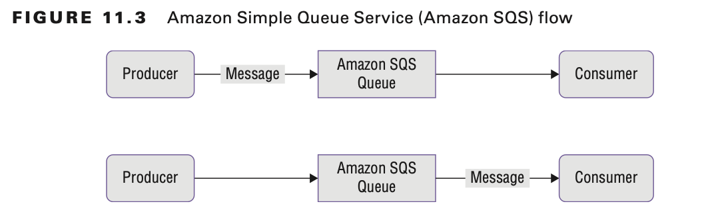

# Introduction to Refactor to Microservices

Microservices architecture is a method to design and build software applications as a suite of modular services, each
performing a specific functional task, which deploy and access application components via well-defined standard
application programming interfaces (APIs).

Containers are software-defined execution environments that you can rapidly provision and independently deploy in server
and serverless environments.

To refactor to microservices is to separate the application components into separate microservices so that each
microservice has its own data store, scales independently, and deploys on its own infrastructure.

To refactor to microservices requires a message infrastructure so that the microservices can communicate with each
other. Message queues communicate between applications.

# Amazon Simple Queue Service

Message-oriented middleware (MoM) supports messaging types in which the messages that are produced (producers) can
broadcast and publish to multiple message consumers, also known as message subscribers.

Amazon Simple Queue Service (Amazon SQS) is a fully managed message queuing service that makes it easy to decouple and
scale microservices, distributed systems, and serverless applications to assist in event-driven solutions.

Amazon SQS both moves data between distributed application components and helps you to decouple these components. Amazon
SQS is the best option for cloud-designed applications that need unlimited scalability, capacity, throughput, and high
availability.

Amazon SQS temporarily stores messages from a message producer while they wait for a message consumer to process the
message.

The producer is the component that sends the message. The consumer is the component that pulls the message off the
queue. The queue passively stores messages and does not notify you of new messages.

With Amazon SQS, multiple producers can write messages, and multiple consumers can process the messages. One of the
consumers processes each message, and when a consumer processes a message, they remove it from the queue.

## Use Amazon SQS Queue to Alleviate Log Server Failures

If you replace the log server with an Amazon SQS queue with multiple log servers, you can remove this point of failure.

There are several benefits to using the Amazon SQS queue:

- If you need to take a sign-in server offline for maintenance, the service does not interrupt. The messages remain in
  the queue until the sign-in server comes back online.
- If the number of messages grows, you can scale your sign-in service and add more servers.
- Amazon SQS automatically scales to handle an increase in incoming messages.
- Messages remain in order and deliver only one message.
- Messages can be sent to the dead-letter queue.
- Messages have a visibility timeout, a message retention period, and a receive-message wait time.
- Messages can have a long polling interval or a short polling interval (default).

The Amazon SQS is a distributed cluster of servers. There is no limit on the number of producers that can write to the
queue, and there is no limit on the number of messages that the queue can store.

## Amazon SQS Parameters

An Amazon SQS message has three basic states:

- Sent to a queue by a producer
- Received from the queue by a consumer
- Deleted from the queue

## Dead-Letter Queue

Amazon SQS supports dead-letter queues, which other queues (source queues) can target for messages that cannot process (
be consumed) successfully. Dead-letter queues are useful when you debug your application or message system because the
queues let you isolate problematic messages to determine why their process did not succeed.

Sometimes messages do not process because of a variety of possible issues, such as erroneous conditions within the
producer or consumer application or an unexpected state change that causes an issue with your application code.

AWS recommends that you set the retention period of a dead-letter queue to be longer than the retention period of the
original queue.

## Benefits of Dead-Letter Queues

The main task of a dead-letter queue is to handle message failure. Use a dead-letter queue to set aside and isolate
messages that cannot be processed correctly to determine why their processes failed. The dead-letter queue enables you
to do the following:

- Configure an alarm for any messages delivered to a dead-letter queue.
- Examine logs for exceptions that might have caused messages to be delivered to a dead-letter queue.
- Analyze the contents of messages delivered to a dead-letter queue to diagnose software or the producer’s or consumer’s
  hardware issues.
- Determine whether you have given your consumer sufficient time to process messages.

## Standard Queue Message Failures

Standard queues continue to process messages until the expiration of the retention period.
This ensures continuous processing of messages, which minimizes the chances of your queue being blocked by messages that
cannot process.

Amazon SQS standard queues work by using scalability and throughput. To achieve this, they trade off two qualities:

- Order is not guaranteed.
- Messages can appear twice.
- 

