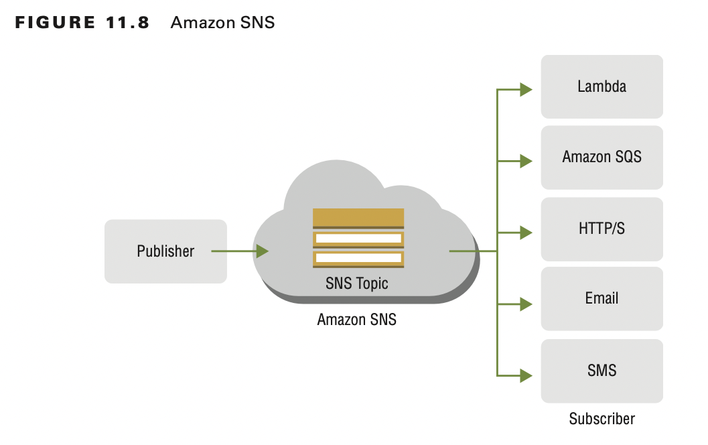

# Introduction to Refactor to Microservices

Microservices architecture is a method to design and build software applications as a suite of modular services, each
performing a specific functional task, which deploy and access application components via well-defined standard
application programming interfaces (APIs).

Containers are software-defined execution environments that you can rapidly provision and independently deploy in server
and serverless environments.

To refactor to microservices is to separate the application components into separate microservices so that each
microservice has its own data store, scales independently, and deploys on its own infrastructure.

To refactor to microservices requires a message infrastructure so that the microservices can communicate with each
other. Message queues communicate between applications.

# Amazon Simple Queue Service

Message-oriented middleware (MoM) supports messaging types in which the messages that are produced (producers) can
broadcast and publish to multiple message consumers, also known as message subscribers.

Amazon Simple Queue Service (Amazon SQS) is a fully managed message queuing service that makes it easy to decouple and
scale microservices, distributed systems, and serverless applications to assist in event-driven solutions.

Amazon SQS both moves data between distributed application components and helps you to decouple these components. Amazon
SQS is the best option for cloud-designed applications that need unlimited scalability, capacity, throughput, and high
availability.

Amazon SQS temporarily stores messages from a message producer while they wait for a message consumer to process the
message.

The producer is the component that sends the message. The consumer is the component that pulls the message off the
queue. The queue passively stores messages and does not notify you of new messages.

With Amazon SQS, multiple producers can write messages, and multiple consumers can process the messages. One of the
consumers processes each message, and when a consumer processes a message, they remove it from the queue.

## Use Amazon SQS Queue to Alleviate Log Server Failures

If you replace the log server with an Amazon SQS queue with multiple log servers, you can remove this point of failure.

There are several benefits to using the Amazon SQS queue:

- If you need to take a sign-in server offline for maintenance, the service does not interrupt. The messages remain in
  the queue until the sign-in server comes back online.
- If the number of messages grows, you can scale your sign-in service and add more servers.
- Amazon SQS automatically scales to handle an increase in incoming messages.
- Messages remain in order and deliver only one message.
- Messages can be sent to the dead-letter queue.
- Messages have a visibility timeout, a message retention period, and a receive-message wait time.
- Messages can have a long polling interval or a short polling interval (default).

The Amazon SQS is a distributed cluster of servers. There is no limit on the number of producers that can write to the
queue, and there is no limit on the number of messages that the queue can store.

## Amazon SQS Parameters

An Amazon SQS message has three basic states:

- Sent to a queue by a producer
- Received from the queue by a consumer
- Deleted from the queue

## Dead-Letter Queue

Amazon SQS supports dead-letter queues, which other queues (source queues) can target for messages that cannot process (
be consumed) successfully. Dead-letter queues are useful when you debug your application or message system because the
queues let you isolate problematic messages to determine why their process did not succeed.

Sometimes messages do not process because of a variety of possible issues, such as erroneous conditions within the
producer or consumer application or an unexpected state change that causes an issue with your application code.

AWS recommends that you set the retention period of a dead-letter queue to be longer than the retention period of the
original queue.

## Benefits of Dead-Letter Queues

The main task of a dead-letter queue is to handle message failure. Use a dead-letter queue to set aside and isolate
messages that cannot be processed correctly to determine why their processes failed. The dead-letter queue enables you
to do the following:

- Configure an alarm for any messages delivered to a dead-letter queue.
- Examine logs for exceptions that might have caused messages to be delivered to a dead-letter queue.
- Analyze the contents of messages delivered to a dead-letter queue to diagnose software or the producer’s or consumer’s
  hardware issues.
- Determine whether you have given your consumer sufficient time to process messages.

## Standard Queue Message Failures

Standard queues continue to process messages until the expiration of the retention period.
This ensures continuous processing of messages, which minimizes the chances of your queue being blocked by messages that
cannot process.

Amazon SQS standard queues work by using scalability and throughput. To achieve this, they trade off two qualities:

- Order is not guaranteed.
- Messages can appear twice.

## Monitoring Amazon SQS Queues Using Amazon CloudWatch

Amazon CloudWatch monitors your AWS resources and the applications you run on AWS in real time. You can use CloudWatch
to collect and track metrics, which are variables that you can measure for your resources and applications.

CloudWatch alarms send notifications or automatically make changes to the resources you monitor based on rules that you
define, for example, when a message is sent to the dead-letter queue.

If you must pass messages to other users, create an Amazon SQS queue, subscribe all the administrators to this queue,
and then configure Amazon CloudWatch Events to send a message on a daily cron schedule into the Amazon SQS queue.

CloudWatch provides a reliable, scalable, and flexible monitoring solution with no need to set up, manage, and scale
your own monitoring systems and infrastructure.

# Amazon Simple Notification Service

Amazon Simple Notification Service (Amazon SNS) is a flexible, fully managed producer/ consumer (publisher/subscriber)
messaging and mobile notifications web service that coordinates the delivery of messages to subscribing endpoints and
clients. Amazon SNS coordinates and manages the delivery or sending of messages to subscriber endpoints or clients to
assist in event-driven solutions.

Amazon SNS is based on the publish-subscribe model, and it allows the message producer to send a message to a topic
that has multiple subscribers that choose to receive the same message. The message is delivered to multiple subscribers,
which can then consume the message to trigger subsequent processes. A topic allows multiple receivers of the mes- sage
to subscribe dynamically for identical copies of the same notification.

By default, Amazon SNS offers 10 million subscriptions per topic and 100,000 topics per account. To request a higher
limit, contact AWS Support.

There are two types of clients in Amazon SNS: producers (publishers) and consumers (subscribers).

Producers communicate asynchronously with subscribers by producing and sending a message to a topic, which, in the
context of Amazon SNS, is a logical access point and communication channel.

Subscribers, such as web servers, email addresses, Amazon SQS queues, and AWS Lambda functions, consume or receive the
message or notification over one of the supported protocols, such as Amazon SQS, HTTPS, email, Short Message Service (
SMS), and AWS Lambda, when the consumer subscribes to the topic.

Amazon SNS supports the following endpoints:

- AWS Lambda
- Amazon SQS
- HTTP and HTTPS
- Email
- SMS
- Mobile PushRecords

## Transport Protocols

Amazon SNS supports notifications over multiple transport protocols. You can select trans- ports as part of the
subscription requests.

**HTTP, HTTPS:** Subscribers specify a URL as part of the subscription registration; notifications are delivered through
an
HTTP POST to the specified URL.

**Email, Email-JSON:** Messages are sent to registered addresses as email. Email-JSON sends notifications as a JSON
object,
while Email sends text-based email.

**Amazon SQS:** Users specify an Amazon SQS standard queue as the endpoint. Amazon SNS enqueues a notification message
to the specified queue (which subscribers can then process with Amazon SQS APIs, such as ReceiveMessage and
DeleteMessage). Amazon SQS does not support FIFO queues.

**SMS:** Messages are sent to registered phone numbers as AWS SMS text messages.

## Billing, Limits, and Restrictions

Amazon SNS includes a Free Tier, which allows you to use Amazon SNS free of charge for the first 1 million Amazon SNS
requests, and with no charges for the first 100,000 notifications over HTTP, no charges for the first 100 notifications
over SMS, and no charges for the first 1,000 notifications over email.

By default, Amazon SNS offers 10 million subscriptions per topic and 100,000 topics per account.

# Amazon Kinesis Data Firehose

Amazon Kinesis Data Firehose can replace the CoDA service to ingest data. In many busi- ness applications, you require a
real-time pipeline, but you do not require latency of a few seconds.

Data that arrives at the Amazon Kinesis Data Firehose is automatically delivered to both Amazon S3 and the other
destinations.

Amazon Kinesis Data Firehose also handles dynamically scaling the underlying shards of the stream based on the amount of
traffic.

With Amazon Kinesis Data Firehose, you do not need to write consumer applications or manage resources. Configure data
producers to send data to Amazon Kinesis Data Firehose, and it will automatically deliver the data to the destination
you specify.

# Amazon Kinesis Data Analytics

Amazon Kinesis Data Analytics enables you to process and analyze streaming data with standard structured query
language (SQL). It also enables you to run SQL code against streaming sources to perform time-series analytics, feed
real-time dashboards, and create real-time metrics.

# Amazon Kinesis Video Streams

Use the Amazon Kinesis Video Streams service to push device video content into AWS and then onto the cloud to process
that content and detect patterns in it.

You can use Amazon Kinesis Video Streams to build computer vision and machine learning applications.

# Amazon DynamoDB Streams

mazon DynamoDB Streams integrates with Amazon DynamoDB to publish a message every time a change is made in a table. When
you insert, delete, or update an item, Amazon DynamoDB produces an event, which publishes it to the Amazon DynamoDB
Streams, as shown in Figure 11.13. To use this table-level feature, enable Amazon DynamoDB Streams on the table.

# AWS IoT Device Management

AWS IoT Device Management is a cloud-based service that makes it easy for customers to manage IoT devices securely
throughout their lifecycle. Customers can use AWS IoT Device Management to onboard device information and configuration,
organize their device inventory, monitor their fleet of devices, and remotely manage devices deployed across many
locations. This remote management includes over-the-air (OTA) updates to device software.

## Message Broker

The AWS IoT message broker is a publish/subscribe broker service that enables you to send messages to and receive
messages from IoT.

AWS IoT does not send and receive messages across AWS accounts and regions.

## Device Shadow

The AWS IoT device shadow is an always-available representation of the device, which allows communications back from
cloud applications to the IoT devices. Cloud applications can update the device shadow even when the underlying IoT
device is offline. Then when the device is brought back online, it synchronizes its final state with a query to the AWS
IoT service for the current state of the instances.

## Amazon MQ

Amazon MQ is a managed message broker service for Apache ActiveMQ that makes it easy to migrate to a message broker on
the cloud. Amazon MQ is a managed Apache Active MQ that runs on Amazon EC2 instances that you select.

Amazon MQ makes it easy to migrate to a message broker on the cloud. A message broker allows software applications and
components to communicate with the use of various programming languages, operating systems, and formal messaging
protocols.

A single-instance broker is composed of one broker in one Availability Zone. The broker communicates with your
application and with an AWS storage location.

An active/standby broker for high availability consists of two brokers in two different Availability Zones, which you
configure in a redundant pair. These brokers communicate synchronously with your application and with a shared storage
location.

Amazon SQS and Amazon SNS are queue and topic services that are highly scalable, simple to use, and do not require you
to set up message brokers. AWS recommends these services for new applications that can benefit from nearly unlimited
scalability and simple APIs.

# AWS Step Functions

The AWS Step Functions service enables you to launch and develop workflows that can run for up to several months, and it
allows you to monitor the progress of these workflows.

You can coordinate the components of distributed applications and microservices by using visual workflows to build
applications quickly, scale and recover reliably, and evolve application easily.

# Summary

This chapter covered the different services to refactor larger systems into smaller components that can communicate
with each other through infrastructure services. To be successful, the refactoring infrastructure must exist, which
enables the different components to communicate with each other. You also now know about the different infrastructure
communication services that AWS provides for different use cases.

# Exam Essentials

**Know how refactoring to microservices is beneficial and what services it includes.**

This includes the use of the Amazon Simple Queue Service (Amazon SQS), Amazon Simple Notification Service (Amazon SNS),
Amazon Kinesis Data Streams, Amazon Kinesis services, Amazon DynamoDB Streams, AWS Internet of Things (IoT), Amazon
Message Query (Amazon MQ), and AWS Step Functions.

**Know about the Amazon Simple Queue Service.**

Know that the Amazon Simple Queue Service (Amazon SQS) is a fully managed message queuing service that makes it easy to
decouple and scale microservices, distributed systems, and serverless applications. There will be questions about the
dead-letter queue and how to pass messages with Amazon CloudWatch.

**Know about the Amazon Simple Notification Service.**

Familiarize yourself with the Amazon Simple Notification Service (Amazon SNS) and how it is a flexible, fully managed
producer/consumer (publisher/subscriber) messaging and mobile notifications web service for coordinating the delivery of
messages to subscribing to endpoints and clients. Amazon SNS coordinates and manages the delivery or sending of messages
to subscriber endpoints or clients.

**Know about Amazon Kinesis Data Streams.**

Study how Amazon Kinesis Data Streams is a service for ingesting large amounts of data in real time and for performing
real-time analytics on the data. Producers write data into Amazon Kinesis Data Streams, and consumers read data from it.
Be familiar with the use of multiple applications, high throughput, real-time analytics, and open source tools that
Kinesis supports. There will be questions about producer and consumer options on the exam.

**Know about Amazon Kinesis Data Firehose.**

Familiarize yourself with Amazon Kinesis Data Firehose latency. Amazon Kinesis Data Firehose also handles automatic
scaling of the underlying shards of the stream based on the amount of traffic.

**Know about Amazon Kinesis Data Analytics.**

There will also be questions about how Amazon Kinesis Data Analytics enables you to process and analyze streaming data
with standard SQL. Make sure that you know which destinations it supports.

**Know about Amazon Kinesis Video Streams.**

Know that the Amazon Kinesis Video Streams service allows you to push device video content into AWS and then onto the
cloud to process that content and detect patterns in it. You can also use Amazon Kinesis Video Streams to build computer
vision and machine learning applications.

**Know about AWS Internet of Things (AWS IoT).**

Make sure that you know that AWS IoT Device Management is a cloud-based device management service that makes it easy for
customers to manage IoT devices securely throughout their lifecycle. Memorize information on the rules engine,
message, broker, and device shadow.

**Know about Amazon MQ.**

Know that the primary use for Amazon MQ is to enable customers who use Apache Active MQ to migrate to the cloud. A
message broker allows software applications and components to communicate with various programming languages,
operating systems, and formal messaging protocols. Know how the Amazon SQS and Amazon SNS differ from Amazon MQ.

**Know about AWS Step Functions.**

The exam includes questions that require a thorough understanding of AWS Step Functions. Ensure that you know each
step in the state machine, task state, Choice state, Parallel state, and end state. Remember the inputs and outputs in
the step functions.

**Know how state information flows and how to filter it.**

Understand how this information flows from state to state and learn how to filter and manipulate this data to design and
implement workflows effectively in AWS Step Functions.
