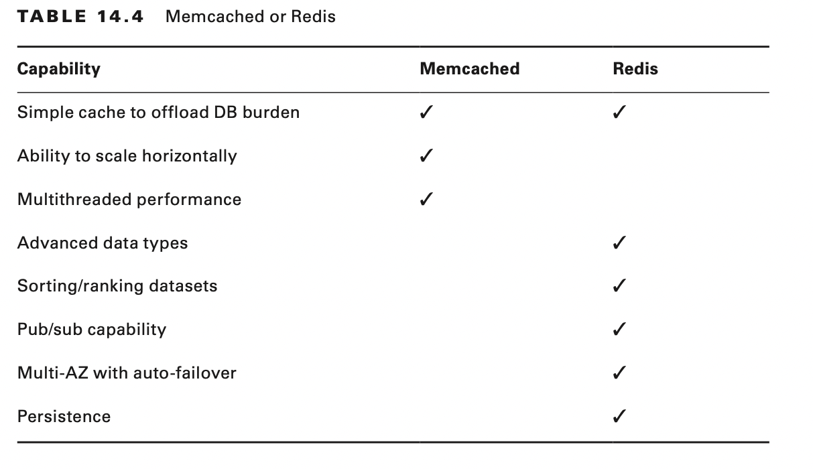

# Stateless Application Patterns

# Introduction to the Stateless Application Pattern

Scalability is an important consideration when you create and deploy applications that are highly available, and
stateless applications are easier to scale.

When users or services interact with an application, they often perform a sequence of interactions that form a session.
A stateless application is one that requires no knowledge of previous interactions and stores no session information.
Given the same input, an application can provide the same response to any user.

A stateless application can scale horizontally because requests can be serviced by any of the available compute
resources, such as Amazon Elastic Compute Cloud (Amazon EC2) instances or AWS Lambda functions.

# Amazon DynamoDB

DynamoDB provides fast and predictable performance with seamless scalability. It enables you to offload the
administrative burdens of operating and scaling a distributed database, including hardware provisioning, setup and
configuration, replication, software patching, or cluster scaling. Also, DynamoDB offers encryption at rest, which
reduces the operational tasks and complexity involved in protecting sensitive data.

You can use global tables to keep DynamoDB tables synchronized across AWS Regions, and you can access this service using
the DynamoDB console, the AWS Command Line Interface (AWS CLI), a generic web services Application Programming
Interface (API), or any programming language that the AWS software development kit (AWS SDK) supports.

## Primary Key, Partition Key, and Sort Key

When you create a table, you must configure both the table name and the primary key of the table. The primary key
uniquely identifies each item in the table so that no two items have the same key. DynamoDB supports two different kinds
of primary keys: a partition key and sort key.

A partition key is a simple primary key, composed of only a partition key attribute. The partition key of an item is
also known as its hash attribute. The term hash attribute derives from the use of an internal hash function in DynamoDB
that evenly distributes data items across partitions based on their partition key values. DynamoDB uses the partition
key’s value as input to an internal hash function.

In a table that has only a partition key, no two items can have the same partition key value.

You can also create a primary key as a composite primary key, consisting of a partition key (first attribute) and a sort
key (second attribute).

The sort key of an item is also known as its range attribute. The term range attribute derives from the way that
DynamoDB stores items with the same partition key physically close together, in sorted order, by the sort key value.

Each primary key attribute must be a scalar, meaning that it can hold only a single value. The only data types allowed
for primary key attributes are string, number, or binary. There are no such restrictions for other, nonkey attributes.

The primary key that uniquely identifies each item in a DynamoDB table can be either simple (partition key only) or
composite (partition key combined with a sort key). Partition key values determine the logical partitions in which a
table’s data is stored, which affects the table’s underlying physical partitions. Efficient partition key design keeps
your workload spread evenly across these partitions.

## Using Write Shards to Distribute Workloads Evenly

A shard is a uniquely identified group of stream records within a stream. To distribute writes better across a partition
key space in DynamoDB, expand the space. You can add a random number to the partition key values to distribute the items
among partitions, or you can use a number that is calculated based on what you want to query

## Amazon DynamoDB Tables

DynamoDB global tables provide a fully managed solution for deploying a multiregion, multi-master database, without
having to build and maintain your own replication solution. When you create a global table, you configure the AWS
Regions where you want the table to be available. DynamoDB performs all of the necessary tasks to create identical
tables in these regions and propagate ongoing data changes to all of the regions.

DynamoDB global tables are ideal for massively scaled applications, with globally dispersed users. In such an
environment, you can expect fast application performance. Global tables provide automatic multi-master replication to
AWS Regions worldwide, so you can deliver low-latency data access to your users no matter where they are located.

## Provisioned Throughput

With DynamoDB, you can create database tables that store and retrieve any amount of data and serve any level of request
traffic. You can scale your table’s throughput capacity up or down without downtime or performance degradation, and
you can use the AWS Management Console to monitor resource utilization and performance metrics.

For any table or global secondary index, the minimum settings for provisioned throughput are one read capacity unit
and one write capacity unit.

You can apply all of the available throughput of an account to a single table or across multiple tables.

## Requesting Throttle and Burst Capacity

If your application performs reads or writes at a higher rate than your table can support, DynamoDB begins to throttle
those requests. When DynamoDB throttles a read or write, it returns a ProvisionedThroughputExceededException to the
caller. The application can then take appropriate action, such as waiting for a short interval before retrying the
request.

The AWS SDKs provide built-in support for retrying throttled requests; you do not need to write this logic yourself. The
DynamoDB console displays CloudWatch metrics for your tables so that you can monitor throttled read requests and write
requests. If you encounter excessive throttling, consider increasing your table’s provisioned throughput settings.

In some cases, DynamoDB uses burst capacity to accommodate reads or writes in excess of your table’s throughput
settings. With burst capacity, unexpected read or write requests can succeed where they otherwise would be throttled.
Burst capacity is available on a best effort basis, and DynamoDB does not verify that this capacity is always
available.

## Amazon DynamoDB Secondary Indexes: Global and Local

A secondary index is a data structure that contains a subset of attributes from a table. The index uses an alternate key
to support Query operations in addition to making queries against the primary key. You can retrieve data from the index
using a Query. A table can have multiple secondary indexes, which give your applications access to many different Query
patterns.

You can create one or more secondary indexes on a table. DynamoDB does not require indexes, but indexes give your
applications more flexibility when you query your data. After you create a secondary index on a table, you can read or
scan data from the index in much the same way as you do from the table.

DynamoDB supports the following kinds of indexes:

Global secondary index A global secondary index is one with a partition key and sort key that can be different from
those on the table.

Local secondary index A local secondary index is one that has the same partition key as the table but a different sort
key.

You can define up to five global secondary indexes and five local secondary indexes per table. You can also scan an
index as you would a table.

When you create an index, you define an alternate key (partition key and sort key) for the index. You also define the
attributes that you want to project from the base table into the index. DynamoDB copies these attributes into the index
along with the primary key attributes from the base table. You can Query or Scan the index like a table.

# Amazon DynamoDB Streams

Amazon DynamoDB Streams captures data modification events in DynamoDB tables. The data about these events appear in the
stream in near real time and in the order that the events occurred.

Each event represents a stream record. When you enable a stream on a table, DynamoDB captures information about every
modification to data items in the table.

A stream record contains information about a data modification to a single item in a DynamoDB table including the
primary key attributes of the items.

Stream records have a lifetime of 24 hours, after which they are deleted automatically from the stream.

A DynamoDB stream is a time-ordered flow of information of item-level modifications (create, update, or delete) to items
in a DynamoDB table.

DynamoDB Streams does the following:

- Each stream record appears exactly once in the stream.
- For each item that is modified in a DynamoDB table, the stream records appear in the same sequence as the actual
  modifications to the item.

## DynamoDB Cross-Region Replication

You can create tables that automatically replicate across two or more AWS Regions with full support for multi-master
writes. Using cross-region replication, you can build fast, massively scaled applications for a global user base without
having to manage the replication process.

## DynamoDB Stream Endpoints

AWS maintains separate endpoints for DynamoDB and DynamoDB Streams. To work with database tables and indexes, your
application must access a DynamoDB endpoint.

## AWS Lambda Triggers in DynamoDB Streams

DynamoDB integrates with AWS Lambda, so you can create triggers (code that executes automatically) that automatically
respond to events in DynamoDB Streams. With triggers, you can build applications that react to data modifications in
DynamoDB tables.

## Amazon DynamoDB Auto Scaling

Amazon DynamoDB automatic scaling actively manages throughput capacity for tables and global secondary indexes. With
automatic scaling, you can define a range (upper and lower limits) for read and write capacity units and define a target
utilization percentage within that range. DynamoDB automatic scaling seeks to maintain your target utilization, even as
your application workload increases or decreases.

## Burst Capacity

DynamoDB provides some flexibility in your per-partition throughput provisioning by providing burst capacity.

DynamoDB currently retains up to 5 minutes (300 seconds) of unused read and write capacity.

To enable DynamoDB automatic scaling, you create a scaling policy. This scaling policy specifies the table or global
secondary index that you want to manage, which capacity type to manage (read or write capacity), the upper and lower
boundaries for the provisioned throughput settings, and your target utilization.

When you create a scaling policy, Application Auto Scaling creates a pair of CloudWatch alarms on your behalf. Each pair
represents your upper and lower boundaries for provisioned throughput settings. These CloudWatch alarms are triggered
when the table’s actual utilization deviates from your target utilization for a sustained period of time.

## Optimistic Locking with Version Number

Optimistic locking is a strategy to ensure that the client-side item that you are updating or deleting is the same as
the item in DynamoDB. If you use this strategy, then all writes on your database are protected from being accidentally
overwritten.

## DynamoDB Tags

You can label DynamoDB resources with tags. Tags allow you to categorize your resources in different ways: by purpose,
owner, environment, or other criteria. Tags help you to identify a resource quickly based on the tags that you have
assigned to it, and they help you to see your AWS bills broken down by tags.

## DynamoDB Items

A DynamoDB item is a collection of attributes that is uniquely identifiable among all other entities in the table, and
each item has a name and a value. An attribute value can be a scalar, a set, or a document type.

## On-Demand Backup and Restore

You can create on-demand backups and enable point-in-time recovery for your DynamoDB tables. DynamoDB on-demand backups
enable you to create full backups of your tables for long-term retention and archival for regulatory compliance.

In addition, on-demand backup and restore operations do not affect performance or API latencies. Backups are preserved
regardless of table deletion. You can create table backups using the console, the AWS CLI, or the DynamoDB API.

## Point-in-Time Recovery

You can enable point-in-time recovery (PITR) and create on-demand backups for your DynamoDB tables. Point-in-time
recovery helps protect your DynamoDB tables from accidental write or delete operations. With point-in-time recovery,
you do not have to worry about creating, maintaining, or scheduling on-demand backups. DynamoDB maintains incremental
backups of your table. In addition, point-in-time operations do not affect performance or API latencies. You can enable
point-in-time recovery using the AWS Management Console, AWS CLI, or the DynamoDB API.

# Amazon ElastiCache

Amazon ElastiCache is a web service that makes it easy to set up, manage, and scale distributed in-memory cache
environments on the AWS Cloud. It provides a high- performance, resizable, and cost-effective in-memory cache while
removing the complexity associated with deploying and managing a distributed cache environment.

You can use ElastiCache to store the application state. Applications often store session data in memory, but this
approach does not scale well.

You can use ElastiCache to store the application state. Applications often store session data in memory, but this
approach does not scale well. To address scalability and provide a shared data storage for sessions that can be
accessible from any individual web server, abstract the HTTP sessions from the web servers themselves. A common solution
is to leverage an in-memory key-value store. ElastiCache supports the following open-source in-memory caching engines:

- Memcached is an open source, high-performance, distributed memory object caching system that is widely adopted by and
  protocol-compliant with ElastiCache.
- Redis is an open source, in-memory data structure store that you can use as a database cache and message broker.
  ElastiCache supports Master/Slave replication and Multi- AZ replication that you can use to achieve cross-Availability
  Zone redundancy.

ElastiCache is an in-memory cache. Caching frequently used data is one of the most important performance optimizations
that you can make in your applications. Compared to retrieving data from an in-memory cache, querying a database is a
much more expensive operation. By storing frequently accessed data in-memory, you can greatly improve the speed and
responsiveness of read-intensive applications.

## Considerations for Choosing a Distributed Cache

In a distributed session cache, the sessions are divided by the number of nodes in the cache cluster. In the event of a
failure, only the sessions that are stored on the failed node are affected.
If reducing risk is more important than cost, adding additional nodes to reduce further the percentage of stored
sessions on each node may be ideal even when fewer nodes are sufficient.

There are a number of ways to store sessions in key-value stores. Many application frameworks provide libraries that can
abstract some of the integration required to Get/Set those sessions in memory. In other cases, you can write your own
session handler to persist the sessions directly.

Use Memcached if you require the following:

- Use a simple data model
- Run large nodes with multiple cores or threads
- Scale out or scale in
- Partition data across multiple shards
- Cache objects, such as a database

Use Redis if you require the following:

- Work with complex data types
- Sort or rank in-memory datasets
- Persist the key store
- Replicate data from the primary to one or more read replicas for read-intensive applications
- Automate failover if the primary node fails
- Publish and subscribe (pub/sub): the client is informed of events on the server
- Back up and restore data

## ElastiCache Terminology

This section describes some of the key terminology that ElastiCache uses.

## Nodes

A node is the smallest building block of an ElastiCache deployment. A node is a fixed-size chunk of secure,
network-attached RAM. Each node runs an instance of Memcached or Redis, depending on which you select when you create
the cluster.

## Clusters

Each ElastiCache deployment consists of one or more nodes in a cluster. When you create a cluster, you may choose from
many different nodes based on the requirements of both your solution case and your capacity. One Memcached cluster can
be as large as 20 nodes. Redis clusters consist of a single node; however, you can group multiple clusters into a Redis
replication group.

**Replication group**

A replication group is a collection of Redis clusters with one primary read/write cluster and up to five secondary,
read-only clusters called read replicas.

Each read replica maintains a copy of the data from the primary cluster. Asynchronous replication mechanisms keep the
read replicas synchronized with the primary cluster. Applications can read from any cluster in the replication group.
Applications can write only to the primary cluster. Read replicas enhance scalability and guard against data loss.

**Endpoint**

An endpoint is the unique address your application uses to connect to an ElastiCache node or cluster. Memcached and
Redis have the following characteristics with respect to endpoints:

- A Memcached cluster has its own endpoint and a configuration endpoint.
- A standalone Redis cluster has an endpoint to connect to the cluster for both reads and writes.
- A Redis replication group has two types of endpoints.
    - The primary endpoint connects to the primary cluster in the replication group.
    - The read endpoint points to a specific cluster in the replication group.

## Cache Scenarios

ElastiCache caches data as key-value pairs. An application can retrieve a value corresponding to a specific key. An
application can store an item in cache by a specific key, value, and an expiration time. Time to live (TTL) is an
integer value that specifies the number of seconds until the key expires.

A cache hit occurs when an application requests data from the cache, the data is both present and not expired in the
cache, and it returns to the application. A cache miss occurs if an application requests data from the cache, and it is
not present in the cache (returning a null). In this case, the application requests and receives the data from the
database and then writes the data to the cache.

### Strategies for Caching

The strategy or strategies that you want to implement for populating and maintaining your cache depend on what data you
are caching and the access patterns to that data. For example, you would likely not want to use the same strategy for a
top-10 leaderboard on a gaming site, Facebook posts, and trending news stories.

**Lazy Loading**

Lazy loading loads data into the cache only when necessary. Whenever your application requests data, it first makes the
request to the ElastiCache cache. If the data exists in the cache and it is current, ElastiCache returns the data to
your application. If the data does not exist in the cache or the data in the cache has expired, your application
requests the data from your data store, which returns the data to your application. Your application then writes the
data received from the store to the cache so that it can be retrieved more quickly the next time that it is requested.

**Advantages of Lazy Loading**

- Only requested data is cached.
    - Because most data is never requested, lazy loading avoids filling up the cache with data that is not requested.
- Node failures are not fatal.
    - When a new, empty node replaces a failed node, the application continues to function, though with increased
      latency. As requests are made to the new node, each missed cache results in a query of the database and adding the
      data copy to the cache so that subsequent requests are retrieved from the cache.

**Disadvantages of Lazy Loading**

- There is a cache miss penalty.
    - Each cache miss results in three trips:
        - Initial request for data from the cache
        - Querying of the database for the data
        - Writing the data to the cache
    - This can cause a noticeable delay in data getting to the application.
- Stale Data
    - The application may receive stale data because another application may have updated the data in the database
      behind the scenes.

**Write-Through**

The write-through strategy adds data or updates data in the cache whenever data is written to the database.

**Advantages of Write-Through**

- The data in the cache is never stale.
    - Because the data in the cache updates every time it is written to the database, the data in the cache is always
      current.

**Disadvantages of Write-Through**

- Write Penalty
    - Every write involves two trips: a write to the cache and a write to the database.
- Missing Data
    - When a new node is created either to scale up or replace a failed node, the node does not contain all data. Data
      continues to be missing until it is added or updated in the database. In this scenario, you might choose to use a
      lazy caching approach to repopulate the cache.
- Unused data
    - Because most data is never read, there can be a lot of data in the cluster that is never read.
- Cache churn
    - The cache may be updated often if certain records are updated repeatedly.

## Data Access Patterns

Retrieving a flat key from an in-memory cache is faster than the most performance-tuned database query. Analyze the
access pattern of the data before you determine whether you should store it in an in-memory cache.

## Scaling Your Environment

As your workloads evolve over time, you can use ElastiCache to change the size of your environment to meet the
requirements of your workloads. To meet increased levels of write or read performance, expand your cluster horizontally
by adding cache nodes. To scale your cache vertically, select a different cache node type.

**Scale horizontally**

ElastiCache functionality enables you to scale the size of your cache environment horizontally. This functionality
differs depending on the cache engine you select. With Memcached, you can partition your data and scale horizontally to
20 nodes or more. A Redis cluster consists of a single cache node that handles read and write trans- actions. You can
create additional clusters to include a Redis replication group. Although you can have only one node handle write
commands, you can have up to five read replicas handle read-only requests.

**Scale vertically**

The ElastiCache service does not directly support vertical scaling of your cluster. You can create a new cluster with
the desired cache node types and begin redirecting traffic to the new cluster.

## Replication and Multi-AZ

Replication is an effective method for providing speedy recovery if a node fails and for serving high quantities of read
queries beyond the capacities of a single node. ElastiCache clusters running Redis support both. In contrast, cache
clusters running Memcached are standalone in-memory services that do not provide any data redundancy-protection
services. Cache clusters running Redis support the notion of replication groups. A replication group consists of up to
six clusters, with five of them designated as read replicas. By using a replication group, you can scale horizontally by
developing code in the application to offload reads to one of the five replicas.

## Backup and Recovery

ElastiCache clusters that run Redis support snapshots. Use snapshots to persist your data from your in-memory key-value
stores to disk. Each snapshot is a full clone of the data that you can use to recover to a specific point in time or to
create a copy for other purposes. Snapshots are not available to clusters that use the Memcached caching engine. This is
because Memcached is a purely in-memory, key-value store, and it always starts empty. ElastiCache uses the native backup
capabilities of Redis and generates a standard Redis database backup file, which is stored in Amazon S3.

## Control Access

The primary way to configure access to your ElastiCache cluster is by restricting connectivity to your cluster through
a security group. You can define a security group and add one or more inbound rules that restrict the source traffic.
When a cache cluster is deployed inside a virtual private cloud, every node is assigned a private IP address within one
or more subnets that you choose.

You cannot access individual nodes from the internet or from Amazon EC2 instances outside of the Amazon Virtual Private
Cloud (Amazon VPC).

ou can use the access control lists (ACLs) to constrain network inbound traffic.

Access to manage the configuration and infrastructure of the cluster is controlled separately from access to the
actual Memcached or Redis service endpoint. Using the IAM service, you can define policies that control which AWS users
can manage the ElastiCache infrastructure.

The ability to configure the cluster and govern the infrastructure is handled independently from access to the actual
cache cluster endpoint, which is managed by using the IAM service. Using IAM, you can set up policies that determine
which users can manage the ElastiCache infrastructure