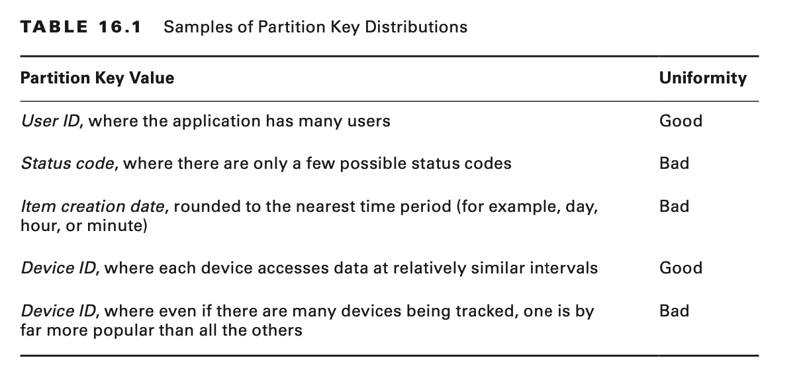

# Optimization

# Introduction to Optimization

Creating a software system is a lot like constructing a building. If the foundation is not solid, structural problems
can undermine the integrity and function of the building.The AWS Well-Architected Tool helps you understand the pros and
cons of decisions that you make while building systems on AWS.

By using the tool, you will learn architectural best practices for designing and operating reliable, secure, efficient,
and cost-effective systems in the AWS Cloud.

When architecting technology solutions, if you neglect the five pillars of operational excellence, security,
reliability, performance efficiency, and cost optimization, it can become challenging to build a system that delivers on
your expectations and requirements. Incorporating these pillars into your architecture helps you to produce stable and
efficient systems.

# Cost Optimization: Everyone’s Responsibility

All teams help manage cloud costs, and cost optimization is everyone’s responsibility. Make sure that costs are known
from beginning to end, at every level, and from executives to engineers. Ensure that project owners and budget holders
know what their upfront and ongoing costs are. Business decision makers must track costs against budgets and understand
return on investment (ROI).

Encourage everyone to track their cost optimization daily so that they can establish a habit of efficiency and see the
daily impact of their cost savings over time.

## Tagging

By tagging your AWS resources, you can assign custom metadata to instances, images, and other resources. For example,
you can categorize resources by owner, purpose, or environment, which helps you organize them and assign cost
accountability. When you apply tags to your AWS resources and activate the tags, AWS adds this information to the Cost
and Usage reports.

### Tag on Creation

You can make tagging a part of your build process and automate it with AWS management tools, such as AWS Elastic
Beanstalk and AWS OpsWorks.

### Enforce Tag Use

Using AWS Identity and Access Management (IAM) policies, you can enforce tag use to gain precise control over access to
resources, ownership, and accurate cost allocation.

# Reduce AWS Usage

Set a continuous practice to review your consumption of AWS resources, and understand the factors that contribute to
cost. Use various AWS monitoring tools to provide visibility, control, and cost optimization.

## Delete Unnecessary EBS Volumes

Stopping an Amazon Elastic Compute Cloud (Amazon EC2) instance leaves any attached Amazon Elastic Block Store (Amazon
EBS) volumes operational. You continue to incur charges for these volumes until you delete them.

## Stop Unused Instances

Stop instances used in development and production during hours when these instances are not in use and then start them
again when their capacity is needed. Assuming a 50-hour workweek, you can save 70 percent of costs by automatically
stopping dev/test/production instances during nonbusiness hours.

## Delete Idle Resources

Consider the following best practices to reduce costs associated with AWS idle resources, such as unattached Amazon EBS
volumes and unused Elastic IP addresses:

- The easiest way to reduce operational costs is to turn off instances that are no longer being used. If you find
  instances that have been idle for more than two weeks, it’s safe to stop or even terminate them.
- Terminating an instance, however, automatically deletes attached EBS volumes and requires effort to re-provision if
  the instance is needed again. If you decide to delete an EBS volume, consider storing a snapshot of the volume so that
  it can be restored later if needed.

## Update Outdated Resources

As AWS releases new services and features, it is a best practice to review your existing architectural decisions to
ensure that they remain cost effective and stay evergreen. As your requirements change, be aggressive in decommissioning
resources, components, and workloads that you no longer require.

## Delete Unused Keys

Each customer master key (CMK) that you create in AWS Key Management Service (AWS KMS), regardless of whether you use it
with KMS-generated key material or key material imported by you, incurs a cost you until you delete it. Before deleting
a CMK, you might want to know how many ciphertexts were encrypted under that key. Knowing how a CMK was used in the past
might help you decide whether you will need it in the future by using AWS CloudTrail usage logs. After you are sure that
you want to delete a CMK in AWS KMS, schedule the key deletion.

## Delete Old Snapshots

If your architecture suggests a backup policy that takes EBS volume snapshots daily or weekly, then you will quickly
accumulate snapshots. To reduce storage costs, check for “stale” snapshots—ones that are more than 30 days old—and
delete them. Deleting a snapshot has no effect on the volume. You can use the AWS Management Console or AWS Command Line
Interface (AWS CLI) for this purpose.

# Right Sizing

Right sizing is the process of matching instance types and sizes to performance and capac- ity requirements at the
lowest possible cost. To achieve cost optimization, right sizing must become an ongoing process within your
organization. Even if you right size workloads initially, performance and capacity requirements can change over time,
which can result in underused or idle resources.

## Select the Right Use Case

As you monitor current performance, identify the following usage needs and patterns so that you can take advantage of
potential right-sizing options:

**Steady State**

The load remains constant over time, making forecasting simple. Consider using Reserved Instances to gain significant
savings.

**Variable, but predictable**

The load changes on a predictable schedule. Consider using AWS Auto Scaling.

**Dev, test, production**

Development, testing, and production environments can usually be turned off outside of work hours.

**Temporary**

Temporary workloads that have flexible start times and can be interrupted are good candidates for Spot Instances instead
of On-Demand Instances.

## Select the Right Instance Family

When you launch an instance, the instance type that you specify determines the hardware of the host computer used for
your instance. Each instance type offers different compute, memory, and storage capabilities, and they are grouped in
instance families based on these capabilities. Depending on the AWS offering, you can determine the right instance
family for your infrastructure.

### Amazon Elastic Cloud Compute

Following are the different options for CPU, memory, and network resources:

- General purpose (includes A1, T2, M3, and M4 instance types)
- Compute optimized (includes the C3 and C4 instance types)
- Memory optimized (includes the X1, R3, and R4 instance types)
- Storage optimized (includes the I3 and D2 instance types)
- Accelerated computing (includes the P2, G3, and F1 instance types)

### Amazon Relational Database Service

- Standard performance (includes the M3 and M4 instance types)
- Burstable performance (includes T2 instance types)
- Memory optimized (includes the R3 and R4 instance types)

## Select the Right Instance Compatibility

- Virtualization type
- Network
- Platform

# Using Instance Reservations

## AWS Pricing for Reserved Instances

Amazon EC2 Reserved Instances allow you to commit to usage parameters. To unlock an hourly rate that is up to 75 percent
lower than On-Demand pricing, you can commit to a one-year or three-year duration at the time of purchase.

There are three payment options for Reserved Instances:

- No Upfront
- Partial Upfront
- All Upfront

## Amazon EC2 Reservations

Amazon EC2 Reserved Instances provide a reservation of resources and capacity when used in a specific Availability Zone
within an AWS Region:

- With Reserved Instances, you commit to a period of usage (one or three years) and save up to 75 percent over
  equivalent On-Demand hourly rates.
- For applications that have steady state or predictable usage, Reserved Instances can provide significant savings
  compared to using On-Demand Instances, without requiring a change to your workload.

### Convertible Reserved Instances

Convertible Reserved Instances are provided for a one-year or three-year term, and they enable conversion to different
families, new pricing, different instance sizes, different platforms, or tenancy during the period.

Use Convertible Reserved Instances when you are uncertain about instance needs in the future, but you are still
committed to using Amazon EC2 instances for a three-year term in exchange for a significant discount.

### Reserved Instance Marketplace

Use the Reserved Instance Marketplace to sell your unused Reserved Instances and buy Reserved Instances from other AWS
customers.

# Amazon Relational Database Service Reservations

Reserved DB instances are not physical instances; they are a billing discount applied to the use of certain on-demand DB
instances in your account. Discounts for reserved DB instances are tied to instance type and AWS Region.

All Reserved Instance types are available for Amazon Aurora, MySQL, MariaDB, PostgreSQL, Oracle, and SQL Server database
engines.

Reserved Instances can also provide significant cost savings for mission-critical applications that run on Multi-AZ
database deployments for higher availability and data durability. Reserved Instances can minimize your costs up to 69
percent over On-Demand rates when used in steady state.

The Reserved Instance discounted rate also applies to usage of both Single-AZ and Multi-AZ configurations for the same
database engine and instance family.

# Using Spot Instances

Amazon EC2 Spot Instances offer spare compute capacity in the AWS Cloud at steep dis- counts compared to On-Demand
Instances.

You can use Spot Instances to save up to 90 percent on stateless web applications, big data, containers, continuous
integration/continuous delivery (CI/CD), high performance computing (HPC), and other fault-tolerant workloads. Or, scale
your workload throughput by up to 10 times and stay within the existing budget

## Spot Fleets

Use Spot Fleets to request and manage multiple Spot Instances automatically, which provides the lowest price per unit
of capacity for your cluster or application, such as a batch-processing job, a Hadoop workflow, or an HPC grid
computing job. You can include the instance types that your application can use. You define a target capacity based on
your application needs (in units, including instances, vCPUs, memory, storage, or network throughput) and update the
target capacity after the fleet is launched. Spot Fleets enable you to launch and maintain the target capacity and to
request resources automatically to replace any that are disrupted or manually terminated.

## Amazon EC2 Fleets

With a single API call, Amazon EC2 Fleet enables you to provision compute capacity across different instance types,
Availability Zones, and across On-Demand, Reserved Instances, and Spot Instances purchase models to help optimize scale,
performance, and cost.

## Design for Continuity

With Spot Instances, you avoid paying more than the maximum price you specified. If the Spot price exceeds your maximum
willingness to pay for a given instance or when capacity is no longer available, your instance is terminated
automatically (or stopped or hibernated, if you opt for this behavior on a persistent request).

# Using AWS Auto Scaling

Using AWS Auto Scaling, you can scale workloads in your architecture. It automatically increases the number of resources
during the demand spikes to maintain performance and decreases capacity when demand lulls to reduce cost.

## Amazon EC2 Auto Scaling

Amazon EC2 Auto Scaling helps you scale your Amazon EC2 instances and Spot Fleet capacity up or down automatically
according to conditions that you define.

AWS Auto Scaling is generally used with Elastic Load Balancing to distribute incoming application traffic across
multiple Amazon EC2 instances in an AWS Auto Scaling group. AWS Auto Scaling is triggered using scaling plans that
include policies that define how to scale (manual, schedule, and demand spikes) and the metrics and alarms to monitor in
Amazon CloudWatch.

You can use Amazon EC2 Auto Scaling to increase the number of Amazon EC2 instances automatically during demand spikes to
maintain performance and decrease capacity during lulls to reduce costs.

### Dynamic Scaling

The dynamic scaling capabilities of Amazon EC2 Auto Scaling refers to the functionality that automatically increases
or decreases capacity based on load or other metrics.

### Scheduled Scaling

Scaling based on a schedule allows you to scale your application ahead of known load changes, such as the start of
business hours, thus ensuring that resources are available when users arrive, or in typical development or test
environments that run only during defined business hours or periods of time.

### Fleet Management

Fleet management refers to the functionality that automatically replaces unhealthy instances in your application,
maintains your fleet at the desired capacity, and balances instances across Availability Zones. Amazon EC2 Auto Scaling
fleet management ensures that your application is able to receive traffic and that the instances themselves are
working properly. When AWS Auto Scaling detects a failed health check, it can replace the instance automatically.

### Instances Purchasing Options

With Amazon EC2 Auto Scaling, you can provision and automatically scale instances across purchase options, Availability
Zones, and instance families in a single application to optimize scale, performance, and cost. You can include Spot
Instances with On-Demand and Reserved Instances in a single AWS Auto Scaling group to save up to 90 percent on compute.

### Golden Images

A golden image is a snapshot of a particular state of a resource, such as an Amazon EC2 instance, Amazon EBS volumes,
and an Amazon RDS DB instance. You can customize an Amazon EC2 instance and then save its configuration by creating an
Amazon Machine Image (AMI)

## AWS Auto Scaling

AWS Auto Scaling monitors your applications and automatically adjusts capacity of all scalable resources to maintain
steady, predictable performance at the lowest possible cost. Using AWS Auto Scaling, you can set up application scaling
for multiple resources across multiple services in minutes.

AWS Auto Scaling automatically scales resources for other AWS services, including Amazon ECS, Amazon DynamoDB, Amazon
Aurora, Amazon EC2 Spot Fleet requests, and Amazon EC2 Scaling groups.

The predictive scaling feature uses machine learning algorithms to detect changes in daily and weekly patterns,
automatically adjusting their forecasts. This removes the need for the manual adjustment of AWS Auto Scaling parameters
as cyclicality changes over time, making AWS Auto Scaling simpler to configure, and provides more accurate capacity
provisioning. Predictive scaling results in lower cost and more responsive applications.

## DynamoDB Auto Scaling

DynamoDB automatic scaling uses the AWS Auto Scaling service to adjust provisioned throughput capacity dynamically on
your behalf in response to actual traffic patterns. This enables a table or a global secondary index to increase its
provisioned read and write capacity to handle sudden increases in traffic without throttling. When the workload
decreases, AWS Auto Scaling decreases the throughput so that you don’t pay for unused provisioned capacity.

## Amazon Aurora Auto Scaling

Amazon Aurora automatic scaling dynamically adjusts the number of Aurora Replicas provisioned for an Aurora DB
cluster. Aurora automatic scaling is available for both Aurora MySQL and Aurora PostgreSQL.

Amazon Aurora Serverless is an on-demand, automatic scaling configuration for the MySQL-compatible edition of Amazon
Aurora.

# Using Containers

Containers provide a standard way to package your application’s code, configurations, and dependencies into a single
object. Containers share an operating system installed on the server and run as resource-isolated processes, ensuring
quick, reliable, and consistent deployments, regardless of environment.

## Containerize Everything

Use Amazon Elastic Container Service (Amazon ECS) to build all types of containerized applications easily, from
long-running applications and microservices to batch jobs and machine learning applications. You can migrate legacy
Linux or Windows applications from on-premises to the AWS Cloud and run them as containerized applications using Amazon
ECS.

Amazon ECS maintains application availability and allows you to scale your containers up or down to meet your
application’s capacity requirements.

Amazon ECS is integrated with familiar features like Elastic Load Balancing, EBS volumes, virtual private cloud (VPC),
and AWS Identity and Access Management (IAM). Use APIs to integrate and use your own schedulers or connect Amazon ECS
into your existing software delivery process.

## Containers without Servers

AWS Fargate technology is available with Amazon ECS. With Fargate, you no longer have to select Amazon EC2 instance
types, provision and scale clusters, or patch and update each server. You do not have to worry about task placement
strategies, such as binpacking or host spread, and tasks are automatically balanced across Availability Zones. Fargate
manages the availability of containers for you.

# Using Serverless Approaches

Serverless approaches are ideal for applications whereby load can vary dynamically. Using a serverless approach means no
compute costs are incurred when there is no user traffic, while still offering instant scale to meet high demand, such
as a flash sale on an ecommerce site or a social media mention that drives a sudden wave of traffic. All of the actual
hardware and server software are handled by AWS.

Benefits gained by using AWS Serverless services include the following:

- No need to manage servers
- No need to ensure application fault tolerance, availability, and explicit fleet management to scale to peak load
- No charge for idle capacity

You can focus on product innovation and rapidly construct these applications:

- Amazon S3 offers a simple hosting solution for static content.
- AWS Lambda, with Amazon API Gateway, supports dynamic API requests using functions.
- Amazon DynamoDB offers a simple storage solution for session and per-user state.
- Amazon Cognito provides a way to handle user registration, authentication, and access control to resources.
- AWS Serverless Application Model (AWS SAM) can be used by developers to describe the various elements of an
  application.
- AWS CodeStar can set up a CI/CD toolchain with a few clicks.

## Optimize Lambda Usage

AWS Lambda provides the cloud-logic layer, and with Lambda you can run code for virtually any type of application or
backend service, all with zero administration.

A variety of events can trigger Lambda functions, enabling developers to build reactive, event-driven systems without
managing infrastructure.

Consider the following recommendations for optimizing Lambda functions:

**Optimal memory size**

The memory usage for your function is determined per invocation and can be viewed in CloudWatch Logs. By analyzing the
Max Memory Used: field in the Invocation report, you can determine whether your function needs more memory or whether
you over-provisioned your function’s memory size.

**Language runtime performance**

If your application use case is both latency-sensitive and susceptible to incurring the initial invocation cost
frequently (spiky traffic or infrequent use), then recommend one of the interpreted languages, such as Node.js or
Python.

**Optimizing code**

Much of the application performance depends on your logic and dependencies. Pay attention to reusing the objects and
using global/static variables. Keep live or reuse HTTP/session connections, and use default network environments as much
as possible.

# Optimizing Storage

AWS storage services are optimized for different storage scenarios—there is no single data storage option that is ideal
for all workloads. When evaluating your storage requirements, consider data storage options for each workload
separately.

Amazon offers three broad categories of storage services: object, block, and file storage.

## Object Storage

Amazon Simple Storage Service (Amazon S3) is highly durable, general-purpose object storage that works well for
unstructured datasets such as media content.

There are multiple tiers of storage: hot, warm, or cold data. In terms of pricing, the colder the data, the cheaper it
is to store, and the costlier it is to access when needed.

**Standard (STANDARD)**

This is the best storage option for data that you frequently access. Amazon S3 delivers low latency and high throughput,
and it is ideal for use cases such as cloud applications, dynamic websites, content distribution, gaming, and data
analytics.

**Amazon S3 Standard – Infrequent Access (STANDARD_IA)**

Use this storage option for data that you access less frequently, such as long-term backups and disaster recovery. It
offers cheaper storage over time, but higher charges to retrieve or transfer data.

**Amazon S3 Intelligent-Tiering (INTELLIGENT_TIERING)**

This storage class is designed to optimize the cost by moving data to the most cost-effective access tier automatically
without degrading the performance of the application. If an object in the infrequent access tier is accessed, it is
automatically moved back to the frequent access tier.

**Amazon S3 One Zone-Infrequent Access (ONEZONE_IA)**

This storage class provides a lower-cost option for infrequently accessed data that requires rapid access. The data is
stored in only one Availability Zone (AZ), and it saves up to 20 percent of storage costs as compared to STANDARD_IA.
Use this option for storing secondary backups of on-premises data or data that can be easily recreated.

**Amazon S3 Glacier (GLACIER)**

This option is designed for long-term storage of infrequently accessed data, such as end-of-lifecycle, compliance, or
regulatory backups. Different methods of data retrieval are available at various speeds and cost. Retrieval can take
from a few minutes to several hours.

**Amazon S3 Glacier Deep Archive (DEEP_ARCHIVE)**

This is the lowest-cost class designed for long-term retention of rarely accessed data. Data will be retained for 7–10
years and may be accessed about once or twice a year. When you need the data, you can retrieve it within 12 hours. This
storage is ideal for maintaining backups of historical regulatory or compliance data and disaster recovery backups.

## Block Storage

Amazon Elastic Block Store (Amazon EBS) volumes provide a durable block-storage option for use with Amazon EC2
instances.

There are two types of block storage: solid-state drive (SSD) storage and hard disk drive (HDD) storage.

SSD storage is optimized for transactional workloads wherein performance is closely tied to IOPS. Choose from two SSD
volume options:

**General Purpose SSD (gp2)**

Designed for general use and offers a balance between cost and performance.

**Provisioned IOPS SSD (io1)**

Best for latency-sensitive workloads that require specific minimum-guaranteed IOPS. With io1 volumes, you pay separately
for Provisioned IOPS, so unless you need high levels of Provisioned IOPS, gp2 volumes are a better match at lower cost.

HDD storage is designed for throughput-intensive workloads, such as data warehouses and log processing. There are two
types of HDD volumes:

**Throughput Optimized HDD (st1)**

Best for frequently accessed, throughput-intensive workloads.

**Cold HDD (sc1**

Designed for less frequently accessed, throughput-intensive workloads.

## File Storage

Amazon Elastic File System (Amazon EFS) provides simple, scalable file storage for use with Amazon EC2 instances. Amazon
EFS supports any number of instances at the same time. Amazon EFS is designed for workloads and applications such as big
data, media-processing workflows, content management, and web serving.

## Optimize Amazon S3

policies. Identifying the right storage class and moving less frequently accessed Amazon S3 data to cheaper storage
tiers yields considerable savings. For example, by moving data from the STANDARD to STANDARD_IA storage class, you can
save up to 60 percent (on a per-gigabyte basis) of Amazon S3 pricing. By moving data that is at the end of its lifecycle
and accessed on rare occasions from Amazon S3 Glacier, you can save up to 80 percent of Amazon S3 pricing.

## Storage Management Tools/Features

### Cost Allocation S3 Bucket Tags

To track the storage cost or other criteria for individual projects or groups of projects, label your Amazon S3 buckets
using cost allocation tags. A cost allocation tag is a key-value pair that you associate with an S3 bucket. To manage
storage data most effectively, you can use these tags to categorize your S3 objects and filter on these tags in your
data lifecycle policies.

### Amazon S3 Analytics: Storage Class Analysis

Use this feature to analyze storage access patterns to help you decide when to transition the right data to the right
storage class. This feature observes data access patterns to help you determine when to transition less frequently
accessed STANDARD storage to the STANDARD_IA storage class.

### Amazon S3 Inventory

This tool audits and reports on the replication and encryption status of your S3 objects
on a weekly or monthly basis. This feature provides CSV output files that list objects and their corresponding metadata,
and it lets you configure multiple inventory lists for a single bucket, organized by different Amazon S3 metadata tags.
You can also query Amazon S3 inventory through standard SQL by using Amazon Athena, Amazon Redshift Spectrum, and other
tools, such as Presto, Apache Hive, and Apace Spark.

### Amazon CloudWatch

Amazon S3 can also publish storage, request, and data transfer metrics to Amazon CloudWatch.

### Use Amazon S3 Select

Amazon S3 Select enables applications to retrieve only a subset of data from an object by using simple SQL expressions.

### Use Amazon Glacier Select

Amazon Glacier Select unlocks an opportunity to query your archived data easily. With Glacier Select, you can filter
directly against an Amazon S3 Glacier object by using stan- dard SQL statements.

## Optimize Amazon EBS

With Amazon EBS, you are paying for provisioned capacity and performance—even if the volume is unattached or has low
write activity. To optimize storage performance and costs for Amazon EBS, monitor volumes periodically to identify ones
that are unattached or appear to be underutilized or overutilized, and adjust provisioning to match actual usage.

## Use Monitoring Tools

AWS offers tools that help you optimize block storage.

### Amazon CloudWatch

Amazon CloudWatch automatically collects a range of data points for EBS volumes, and you can then set alarms on volume
behavior.

### AWS Trusted Advisor

AWS Trusted Advisor is another way for you to analyze your infrastructure to identify unattached, underutilized, and
overutilized EBS volumes.

## Delete Unattached Amazon EBS Volumes

To find unattached EBS volumes, look for volumes that are available, which indicates that they are not attached to an
Amazon EC2 instance. You can also look at network throughput and IOPS to determine whether there has been any volume
activity over the previous two weeks, or you can look up the last time the EBS volume was attached. If the volume is in
a nonproduction environment, hasn’t been used in weeks, or hasn’t been attached in a month, there is a good chance that
you can delete it.

## Resize or Change the EBS Volume Type

- For General Purpose SSD gp2 volumes, optimize for capacity so that you’re paying only for what you use.
- With Provisioned IOPS SSD io1 volumes, pay close attention to IOPS utilization rather than throughput, since you pay
  for IOPS directly. Provision 10–20 percent above maximum IOPS utilization.
- You can save by reducing Provisioned IOPS or by switching from a Provisioned IOPS SSD io1 volume type to a General
  Purpose SSD gp2 volume type
- If the volume is 500 GB or larger, consider converting to a Cold HDD sc1 volume to save on your storage rate.

## Delete Stale Amazon EBS Snapshots

If you have a backup policy that takes EBS volume snapshots daily or weekly, you will quickly accumulate snapshots.
Check for stale snapshots that are more than 30 days old and delete them to reduce storage costs. Deleting a snapshot
has no effect on the volume.

# Optimizing Data Transfer

Optimizing data transfer ensures that you minimize data transfer costs. Review your user presence if global or local and
how the data gets located in order to reduce the latency issues.

- Use Amazon CloudFront, a global content delivery network (CDN), to locate data closer to users. It caches data at edge
  locations across the world, which reduces the load on your resources. By using CloudFront, you can reduce the
  administrative effort in delivering content automatically to large numbers of users globally, with minimum latency.
  Depending on your application types, distribute your entire website, including dynamic, static, streaming, and
  interactive content through CloudFront instead of scaling out your infrastructure.
- Amazon S3 transfer acceleration enables fast transfer of files over long distances between your client and your S3
  bucket. Transfer acceleration leverages Amazon CloudFront globally distributed edge locations to route data over an
  optimized network path. For a workload in an S3 bucket that has intensive GET requests, you should use Amazon S3 with
  CloudFront.
- When uploading large files, use multipart uploads with multiple parts uploading at once to help maximize network
  throughput. Multipart uploads provide the following advantages:
    - Improved throughput—You can upload parts in parallel to improve throughput.
    - Quick recovery from any network issues—Smaller part size minimizes the impact of restarting a failed upload due to
      a network error.
    - Pause and resume object uploads—You can upload object parts over time. After you initiate a multipart upload,
      there is no expiry; you must explicitly complete or abort the multipart upload.
    - Begin an upload before you know the final object size—You can upload an object as you are creating it.
- Using Amazon Route 53, you can reduce latency for your users by serving their requests from the AWS Region for which
  network latency is lowest. Amazon Route 53 latency-based routing lets you use Domain Name System (DNS) to route user
  requests to the AWS Region that will give your users the fastest response.

## Caching

Caching improves application performance by storing frequently accessed data items in memory so that they can be
retrieved without accessing the primary data store. Cached information might include the results of I/O-intensive
database queries or the outcome of computationally intensive processing.

## Amazon ElastiCache

Amazon ElastiCache is a web service that makes it easy to deploy, operate, and scale an in-memory cache in the cloud. It
supports two open-source, in-memory caching engines: Memcached and Redis.

- The Memcached caching engine is popular for database query results caching, session caching, webpage caching, API
  caching, and caching of objects such as images, files, and metadata. Memcached is also a great choice to store and
  manage session data for internet-scale applications in cases wherein persistence is not critical.
- Redis caching engine is a great choice for implementing a highly available in-memory cache to decrease data access
  latency, increase throughput, and ease the load off your relational or NoSQL database and application. Redis has disk
  persistence built in, and you can use it for long-lived data.

Lazy loading is a good caching strategy whereby you populate the cache only when an object is requested by the
application, keeping the cache size manageable. Apply a lazy caching strategy anywhere in your application where you
have data that is going to be read often but written infrequently. In a typical web or mobile app, for example, a user’s
profile rarely changes but is accessed throughout the application.

## Amazon DynamoDB Accelerator (DAX)

Amazon DynamoDB Accelerator (DAX) is a fully managed, highly available, in-memory cache for Amazon DynamoDB. This
feature delivers performance improvements from milliseconds to microseconds, for high throughput. DAX adds in-memory
acceleration to your DynamoDB tables without requiring you to manage cache invalidation, data population, or clusters.

DAX is ideal for applications that require the fastest possible response time read opera- tions but that are also
cost-sensitive and require repeated reads against a large set of data. For example, consider an ecommerce system that
has a one-day sale on a popular product that would sharply increase the demand or a long-running analysis of regional
weather data that could temporarily consume all of the read capacity in a DynamoDB table.

# Relational Databases and Amazon DynamoDB

Traditional relational database management system (RDBMS) platforms store data in a normalized relational structure that
reduces hierarchical data structures to a set of common elements that are stored across multiple tables.

A relational database system does not scale well for the following reasons:

- It normalizes data and stores it on multiple tables that require multiple queries to write to disk.
- It generally incurs the performance costs of an Atomicity, Consistency, Isolation, Durability (ACID)–compliant
  transaction system.
- It uses expensive joins to reassemble required views of query results.

For this reason, when your business requires a low-latency response to high-traffic que- ries, taking advantage of a
NoSQL system generally makes technical and economic sense. Amazon DynamoDB helps solve the problems that limit
relational system scalability by avoiding them.

DynamoDB scales well for these reasons:

- Schema flexibility lets Amazon DynamoDB store complex hierarchical data within a single item.
- Composite key design lets it store related items close together on the same table.

## Apply NoSQL Design

NoSQL design requires a different mind-set than RDBMS design. For an RDBMS, you can create a normalized data model
without thinking about access patterns. You can then extend it later when new questions and query requirements arise.

NoSQL design is different:

- For DynamoDB, by contrast, design your schema after you know the questions it needs to answer. Understanding the
  business problems and the application use cases up front is essential.
- Maintain as few tables as possible in an Amazon DynamoDB application. Most well- designed applications require only
  one table.

## Keep Related Data Together

Keeping related data in proximity has a major impact on cost and performance. Instead of distributing related data items
across multiple tables, keep related items in your NoSQL system as close together as possible.

## Keep Fewer Tables

In general, maintain as few tables as possible in an Amazon DynamoDB application. Most well-designed applications
require only one table, unless there is a specific reason for using multiple tables.

## Distribute Workloads Evenly

The optimal usage of a table’s provisioned throughput depends on the workload patterns of individual items and the
partition key design.

### Designing Partition Keys

### Keep the Number of Indexes to a Minimum

Create secondary indexes on attributes that are queried often. Indexes that are seldom used contribute to increased
storage and I/O costs without improving application performance.

### Choose Projections Carefully

Because secondary indexes consume storage and provisioned throughput, keep the size
of the index as small as possible. Also, the smaller the index, the greater the performance advantage compared to
querying the full table. Project only the attributes that you regularly request. Every time you update an attribute that
is projected in an index, you incur the extra cost of updating the index as well.

### Use Sparse Indexes

For any item in a table, Amazon DynamoDB writes a corresponding index entry only if the index sort key value is present
in the item. If the sort key doesn’t appear in every table item, the index is said to be sparse.

### Avoid Scans as Much as Possible

In general, Scan operations are less efficient than other operations in DynamoDB. A Scan operation scans the entire
table or secondary index. It then filters out values to provide the result you want.

If possible, avoid using a Scan operation on a large table or index with a filter that removes many results. Also, as a
table or index grows, the Scan operation slows down.

